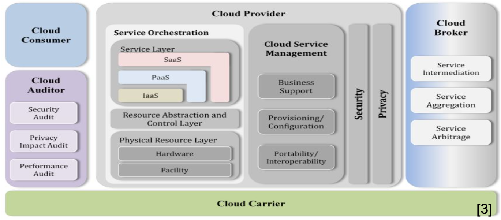

# Lecture 1 Intro

## The Right API - SaaS, PaaS, IaaS

* SaaS: service is a complete application (client-server computing)
  * First there was RPC (remote procedure call)
  * Which became REST/RMI/Thrift to reach software as a Service today
* PaaS: high-level programming model for cloud computer
  * Turing complete but resource management hidden
* SaaS: low-level computing model for cloud computer
  * Basic hardware model with all (virtual) resources exposed
* Examples: Salesforce (SaaS), Google AppEngine (PaaS), Amazon AWS (IaaS)

## Deployment Models

* Public Cloud - provider sells computing to many unrelated consumers
* Private Cloud - provider is one organization with many largely unrelated components and divisions as consumers
* Community Cloud - providers and consumers are different organizations with strong shared concerns
* Hybrid Cloud - private plus public resources combined by same consumer

## Obstacles to Cloud Computing

* Privacy & security
* Privacy in the world tends to rely on regulation
* Utility issues
* Physical utilities tend to rely on regulation
* High cost of networking combined with always remote
* Performance unpredictability in situation development/debugging

## Cloud Adoption

* Data capture and ingestion is ongoing
  * Raw data (text, image, audio, video)
  * Raw data repository
    * Object storage
    * Data lake
* Feature engineering and metadata
  * Metadata Generation
  * Raw Data -> Segmentation -> Preprocessing -> Features, Entities, Indexed -> Relations
  * Batch processing/stream processing
* Knowledge representation to ML models
  * ML model training -> iterative processing
* Inference system

## NIST Architecture

