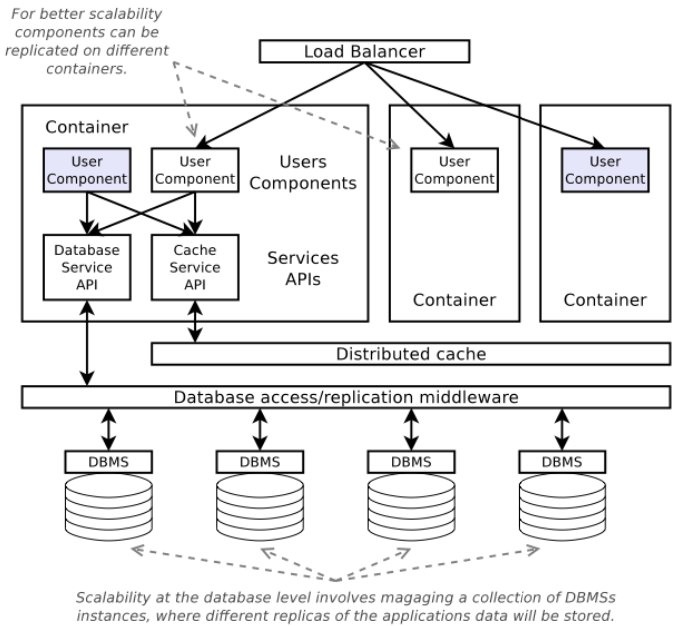

# Lecture 2 Elasticity

## Load Balance

### Load Balancing Approaches

* DNS load balancing
  * Have one IP address per server machine
  * Have DNS reorder the list for each client asking for translation of name
  * PLUS: out of band of actual TCP/HTTP requests
  * MINUS: takes a long time to change
* Having Router distribute TCP connection open packets
  * Have one IP address for entire web service
  * Have a router spread SYN packets sent to web server among different server machine
  * PLUS: router doesn't have to think too much
  * MINUS: all traffic through the router
  * MINUS: decision is for the entire life of the connection, which may be too long to do good balancing
* Having Router distribute individual requests embedded in connections
  * Again have one IP address for entire web service, going to router
  * Have router be endpoint for TCP connection and interpret the bytes
  * PLUS: most dynamic approach
  * MINUS: requires the most processing in the router

## Elasticity

### Elasticity Controller

* An elasticity controller monitors allocated machines
* When overloaded, add load capability
* When under used, reduce load capability
* Adding/reducing done by cloud framework, as directed by elasticity controller

### Scale-out & Scale-up

* Horizontal scaling (Scale-out)
  * Adding more instances
  * Most use of elasticity is done this way
* Vertical scaling (Scale-up)
  * Resizing the resources allocated to an existing instance
  * Does SaaS accept and utilize more resources on the fly?
    * More network bandwidth is easy
    * More memory is harder but possible through VM ballooning
    * Changing number of cores is even harder
  * PaaS containers might hide resource representation

### Two-tier Services

* Frontend (web) Backend (database)
* Most cycles in web servers, but want to take orders too
* Elasticity is certainly possible in IaaS - but database scaling is not simple replication of identical web server
* Router-based load balancing is an example of a network middlebox
* Scaling middleboxes is often overlooked, but may need its own tier
  * Basic approach: split the flows
  * Working with network switches & routers facilitates bandwidth allocation as well

