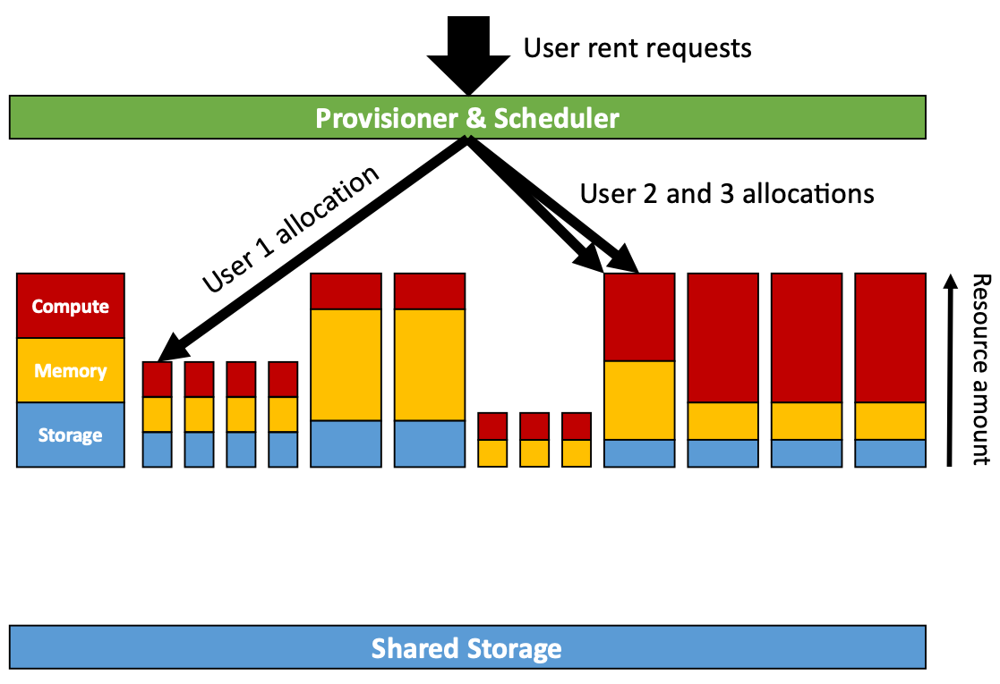
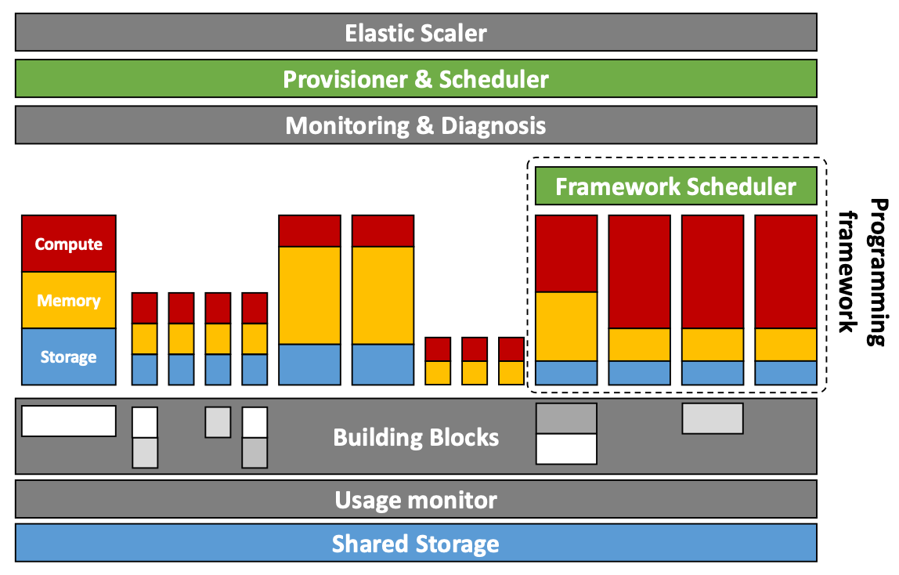

# Lecture 3 Building a Carnegie Mellon Cloud

## CMU's Dilemma

* Multiple computing resources available at CMU
* Problem: pretty much used only during deadlines
* Monetizing spare cycles
  * Option 1: rent out entire machines
    * Problem: machines are heterogeneous, and users have different demands
  * Option 2: rent out portions of machines
    * A time, space sharing approach

## The Initial CMU Cloud

### The Provisioner

* Basic
  * Compute cores, MBs memory, GBs storage
  * Network, special hardware (GPUs?)
  * AWS creates bins of these (e.g., m1.large)
* Optional features
  * Persistent storage
  * Failure domains and auto-scaling
  * elastic IP addresses
* Assignment of users to machines
  * Matching: requested resource <-> available machines
  * Bin-packing problem: satisfy max possible user requests
* Some degrees of freedom: migrating existing users
  * Cost-benefit problem: migration can increase job runtimes

### The Scheduler

* Purpose: choose which user jobs/processes to run
* Goal 1: Prioritization
* Goal 2: Oversubscription
  * Allocate more resources than available because most users under-utilize resources
* Goal 3: Workload constraints
  * Gang scheduling: must co-schedule distributed software taht runs in lock-step

### Encapsulation

* Goal: encapsulation for compute, storage, networking, and data
* We need to isolate co-located user processes
  * Use selected software/OS environment
  * Avoid issues due to environment/configuration changes
  * Avoid performance interference
  * Keep files and data private
* Ensure that users obtain resources they paid for

### Virtualization

* Goal: multiplex single physical resource among multiple software-based resources
  * Hardware, OS -> Virtual machines
  * Networks -> VLANs
  * Disks -> Virtual disks
* Does not solve performance interference issues

### Fault Tolerance

* For storage
  * Replication (within/across data centers)
  * Redundant Array of Independent Disks (RAID)
* For critical infrastructure and services
  * State-machine replication, checkpointing, logging
  * Use state-free software design

## CMU Cloud + Building Blocks

### Building Blocks

* **Storage services**: scalable, fault tolerant data stores
  * e.g., key-value stores, file systems, databases
* **Tools**: Programming models and frameworks
  * e.g., analytics, HPC cluster, training AI models
* **Automation**: Reactive systems and elastic scaling
  * e.g., monitoring and tracking, load balancers

### Elastic Scaling

* Traditional solution: provision for peak
* The Elastic scaling approach
  * Cloud monitors load
  * Add replication instances as necessary
* Cloud monitors users applications
  * Provides alerts when thresholds crossed
* Cloud provides tracing libraries
  * Analyzes traces for problen root causes