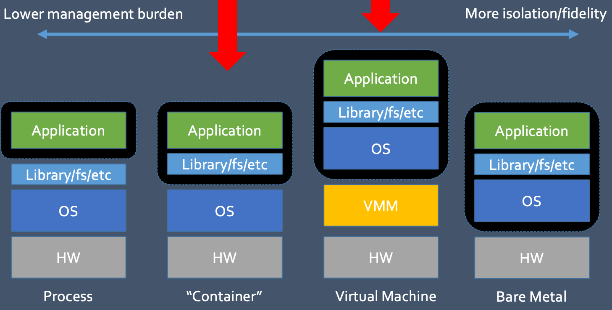

# Lecture 4 Encapsulation

## Encapsulation Options

### Option #1 Bare Metal

* Bare Metal: Give users entire machines
  * Pro: Good isolation, Software freedom, Best performance
  * Con: Limit allocation granularity, Software management tricky

### Option #2 Process

* Process: Users are allocated traditional OS processes
  * Pro: Well-understood, Good performance, Debugging easy
  * Con: Performance isolation poor, Security questionable, Software freedom poor

### Option #3 Containers

* Containers: Traditional OS hosts process containers, where each container looks like an empty OS
  * Pro: Decent software freedom, Good performance
  * Con: Possible security problems

### Option #4 Virtual Machines

* Virtual machines: Users get a software container that acts like a physical machine
  * Pro: Decent isolation properties, Good software freedom
  * Con: Performance overhead, Imperfect performance isolation

## Containers

### Linux Containers

* Need OS-based protection and namespaces to limit power of guest application
* Leverage layered file system to enable easy composition of images (e.g., OverlayFS)
* Still need platform to deploy and manage running instances (e.g., Kubernetes)

### Linux Namespaces

* Namespace: restrict what can a container see
  * Provide process level isolation of global resources
  * Processes have illusion they are the only processes in the system

### Resource Allocation: Linux CGroups

* What and how much can a container use?
  * See upper bounds on resources that can be used
  * Fair sharing of certain resources
* Examples:
  * cpu: weighted proportional share of CPU for a group
  * cpuset: cores that a group can access
  * block io: weighted proportional block IO access
  * memory: max memory limit for a group

## Virtual Machines

* Key Idea: Add software layer which emulates hardware interface
  * Fidelity
  * Isolation
  * Performance
* VM encapsulation provides broad advantages
  * Compatibility
  * Consolidation
  * State capture
  * Observability

### Privileged Operations

* For performance, most instructions may execute directly
  * Especially those that execute in user mode
* Typically, a VMM must handle guest OS attempts to execute
  * Privileged instructions
  * Instructions that write/read privileged state
* Handling privileged instructions
  * Trap-and-emulate
  * Static software re-writing
  * Dynamic software re-writing

## VMM Issues

* Managing multiple VMs
  * Multiple VMs may be handled through either partitioning or time-slicing
  * When the VMs are multiprocessor, gang-sheduling the virtual cores may improve performance
* Type I vs Type II
  * Type I advantages: performance, smaller code base
  * Type II advantages: convenience
* Ideally, isolation means that a VM behaves exactly as a PM