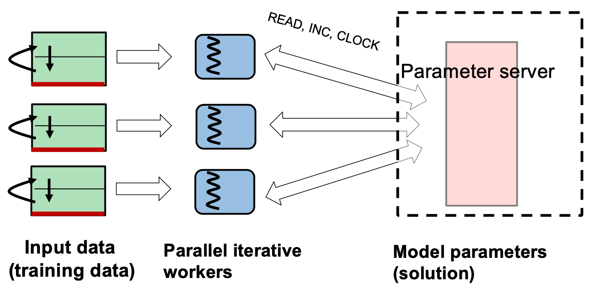

# Lecture 6 Programming Models and Frameworks: Iterative Computation

## Stages of Machine Learning

* Data collection
  * Logistics, cleaning
* Model selection
  * Domain knowledge
* Data engineering
  * Extract, transform
* Model training
  * Fit parameters to data
* Model inferencing
  * Predict/label outcome from model

## ML Model Training via MapReduce

### ML Model Training

* Givens: a bunch of input data samples and selected ML model
* Goal: determine parameter values for model that fit the samples
* ML model training usually performed by iterative search

### ML Model Training via MapReduce

1. Store engineered input data and initial model parameters in files
2. Split input data among map tasks; replicate parameters by having all read entire parameter values file
3. Each map task tests model against data inputs & outputs and computes changes in model parameters; send changes to reducers
4. Reducers combine changes from different map splits of data and write a new model parameters file (and decide if training is over)
5. If training is not over, go to (1)

### Ineffiencies with ML Model Training via MapReduce

* It may scale great, but overhead is high
* ML training just not well suited for stateless, deterministic functions
* Spark is better (10x in Spark paper) but not good

## Alternative: Parameter Servers

* Parameter Servers use a shared memory model for parameters
  * All "process input data subset" tasks can cache any/all parameters; changes are pushed to them by parameter servers
  * Reducers are replaced with atomic "add to paremeter in shared memory"
  * Less data transmitted and less task overhead
  * Input data easily repartitioning in the next iterations

### Sync During Training

* Basic MapReduce is functional: inputs are read-only, outputs are write-only
  * Read-only input is a barrier synchronization
* Parameters servers can be used sync or allowed to run async
* Async works because ML is iterative approximation, converging to optimum provided async error is bounded

## GraphLab: Early Tools for Parameter Servers

* Data is associated with vertices and edges, inherently sparse
* Update: code updates a vertex and its neighbor vertices in isolation
* Iteration: one complete pass over the input data, calculating updates (fold) then combine changes (apply)

### Consistency in GraphLab

* Many machine learning algorithms are tolerant of some data races
* Graphlab allows some updates to “overlap” (not fully lock)
* Natural for shared memory multithreaded update

### Scheduling in GraphLab

* Graphlab allows some updates to do scheduling
  * Baseline is sequential execution of each vertex’ update once per iteration
  * Sparseness allows non-overlapping updates to execute in parallel
  * Opportunity for smart schedulers to exploit more app properties