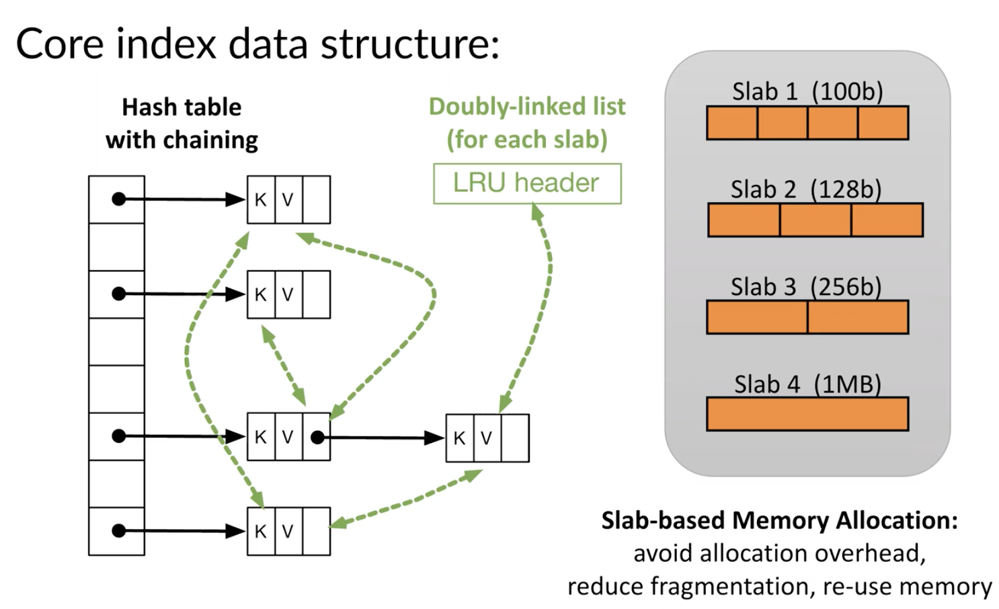
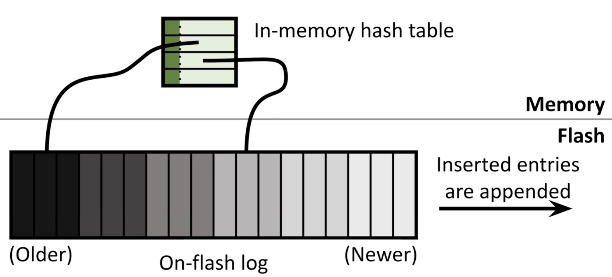
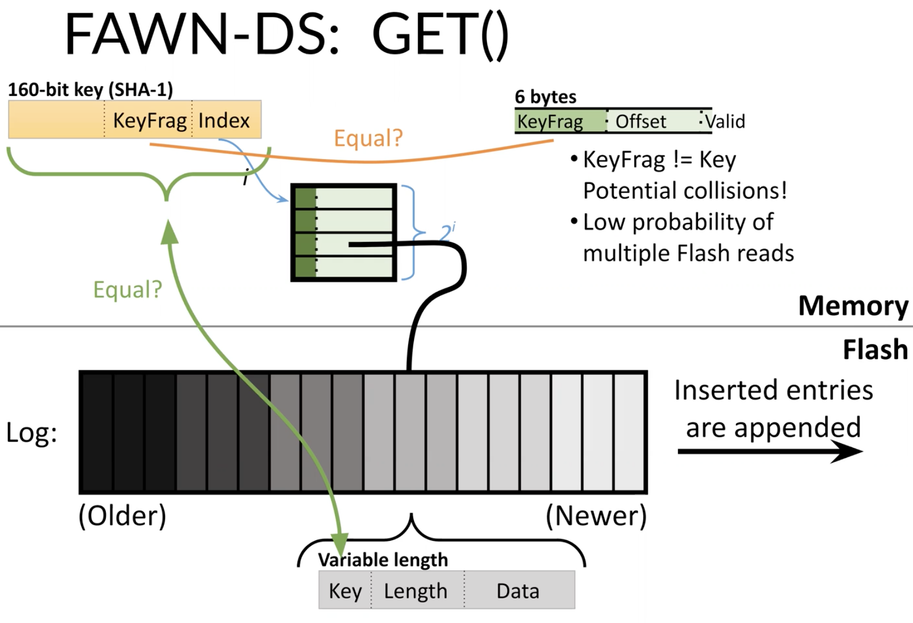
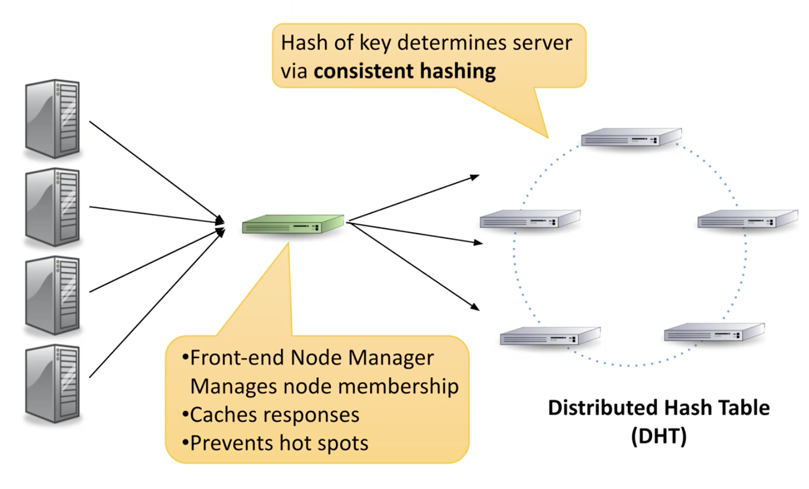

# Guest Lecture 12 Key-Value Stores

## Key-Value Store (KVS)

* Interfaces
  * `val = GET(key)`
  * `PUT(key, val)`
  * `DELETE()`
  * `INCREMENT()`
  * `COMPARE_AND_SET()`
  * Range Queries
* Usages
  * Amazon: Dynamo -> ElastiCache (memcached/redis)
  * Facebook - memcached
  * Google - LevelDB
* Multiple-node KVS
* Geographically distributed KVS
* Keys
  * Plain text (Potential for range queries)
  * Hash keys (Potentially small and fixed-size keys/Load balancing)
* Values
  * Usually opaque blob (e.g., memcached)
    * Fixed vs. variable length
  * Might have limited semantic meaning
    * e.g., for `INCREMENT()`
    * e.g., in Redis, values can be lists, sets, tables, etc
* How do KVS fit into the landscape?
  * Typical file systems
    * Hierarchical directory structure
    * Aimed at much bigger objects (files)
    * Often, allow modifications of partial objects
  * Relational Databases (RDBMS)
    * More sophisticated data model; schemas
    * Interface: SQL, joins
    * Cross-key operations, locking, transaction, secondary indices
  * Other data models / NoSQL data stores
    * Document-oriented (e.g., CouchDB, MongoDB)
    * Column-store (e.g., BigTable, Cassandra, HBase)
    * Provide more capability at the expense of complexity/performance

## KV Considerations

* DRAM: low latency/high throughput, smaller capacity, high cost/byte
* Disk: persistence, large capacity, low cost/byte
* Flash: between DRAM and Disk, different kind of beast
* Next Gen NVM: between DRAM and Flash

|                  | Unordered (hashtable)                               | Ordered (tree)                       |
| ---------------- | --------------------------------------------------- | ------------------------------------ |
| Cache (eviction) | Memcached [DRAM]                                    |                                      |
| Lossless Store   | FAWN-DS [Flash] RAMCloud [DRAM->Disk] Dynamo [Disk] | LevelDB [Disk] Masstree [DRAM->Disk] |

## Memcached

* Single node, in-memory KV store
* Often used to cache database queries
  * Key = hash of the SQL
  * Val = data returned from backend RDBMS
* Often used for small objects
  * 90% keys < 31 bytes
* Tens of millions of queries per second for large memcached clusters
* Read-mostly workloads
* Memcached design
  * Hash table with chaining, mapped to
  * Large area of memory where all of the Key-Value pairs are actually stored
  * Slab-based memory allocation
    * Avoid allocation overhead, reduce fragmentation, re-use memory
  * Doubly-linked list (for each slab) pointed to LRU header

* Problems with Memcached design
  * Single-node scalability and performance
    * Poor use of multiple threads
    * Global locks serialize access to hash table & LRU list
    * Lots of sequential pointer chasing
  * Space overhead - affects number of items stored & cost
    * 56-byte header per object
    * Poor hash table occupancy
* MemC3
  * Core hash table uses optimistic cuckoo hashing
    * Higher concurrency (Single-write/Multi-reader)
    * Better memory efficiency and cache locality (No pointers/95% hash table occupancy)
  * CLOCK-based eviction (approximates LRU)
    * Better space efficiency and concurrency

## FAWN-DS: External KV Store

* Flash friendly
  * `GET()` - Random reads
  * `PUT()` - Append (Sequential write)
* Minimize I/O
  * Low probability of multiple flash reads
* Reconstruction
  * FAWN-DS periodically checkpoints index and pointer to end of log to flash to speed recovery

## FAWN-KV: A Distributed KVS

* Chain replication ("primary-backup")
  * Three copies of data on successive nodes in ring
  * Insert at head, read from tail
  * Strong Consistency: Don't return to client until all replicas have a copy
* Other design choices: replication
  * Paxos/Raft/ZooKeeper
    * State Machine Replication (SMR)
  * Quorums
    * Write and read sets must overlap (R+W>N)
    * e.g., Amazon Dynamo - Sloppy quorums
* Latency can affect user-facing response times - this matters
  * Median vs. 99%
  * Effect of fan-out