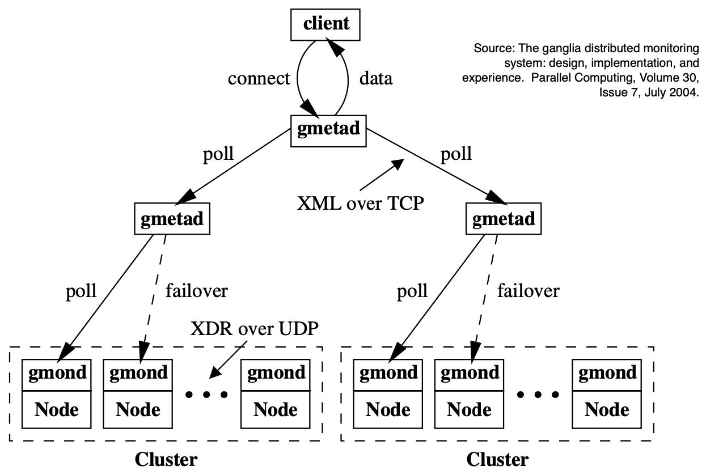
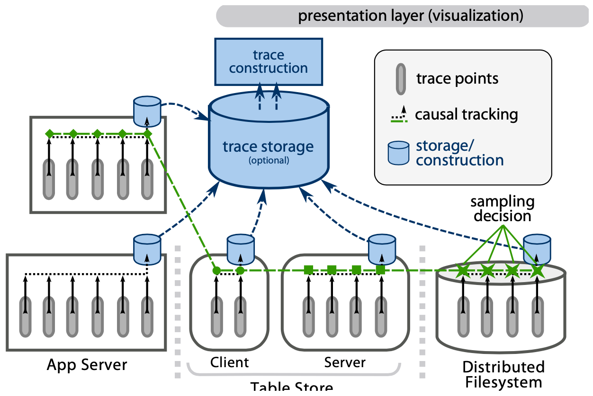
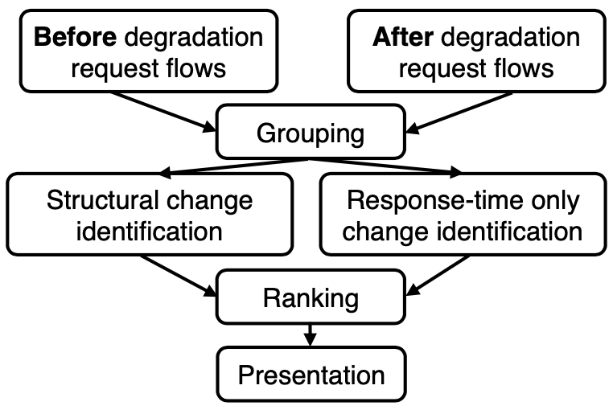

# Lecture 19 Diagnosis via Monitoring & Tracing

## Problem Diagnosis

### Monitoring via Performance Counters

* Yield counters of low-level data (e.g., CPU time, disk I/Os, etc)
  * e.g., AWS CloudWatch, Ganglia
* Pros: Lightweight, commonly available
* Cons: Blackbox; machine oriented

### Logging Events of Interest

* Yield detailed text describing system's behavior (e.g., application, OS, VM)
* Available in most systems
* Pros: White-box approach
* Cons: High overhead; machine-oriented

### End-to-end Activity Tracing

* Similar to logging, but workflow-based
  * e.g., Dapper, Stardust, X-Trace
* Pros: White-box, shows workflow
* Cons: Requires software modifications

## Monitoring

* Cloud providers and users usually do not wish to share detailed information
* As such:
  * Counters often normalized to VM capacity (e.g., percentage of AWS instance)
  * Provider logs/traces often not visible to users

### Example: Ganglia

* Designed for HPC environments
  * Paper assumes bare-metal hardware
* Collect and aggregate counters

### AWS CloudWatch

* Provides monitoring for all AWS resources
  * EC2 counters show VM-normalized values
  * Also, can monitor app-specific metrics

## End-to-end Tracing

* Currently used in Google, Bing, etc
* Traces show causality-related activity
  * Trace: set of events from different threads/machines meregd & sorted by causality
  * e.g., flow of individual requests (request flows)

### End-to-end Tracing Implementation

* Tracing infrastructure tracks trace points touched by individual requests
  * Some "start" traces
  * Others propagate trace ID created at start
* Traces obtained by stitching together trace points accessed by individual requests
  * Hard to account for async and batched work

### End-to-end Tracing Architecture

### Throtting by Sampling

* Users trace too little or too much
* Can limit user bytes added per trace span
* Request sampling to limit global overhead
  * Collect all trace points for a request or none
  * Hash trace ID to [0, 1] and keep if < threshold
  * Allow end-to-end tracing to be "always on"

## End-to-end Tracing Analysis Tools

### Example: Spectroscope

* Localize performance degradation
  * By ID'ing changed request flows
* Output:
  * Groups of before/afyer request flows
  * Some changes automatically ID'd
* Developers localize root cause by ID'ing how differences before/after degradation

