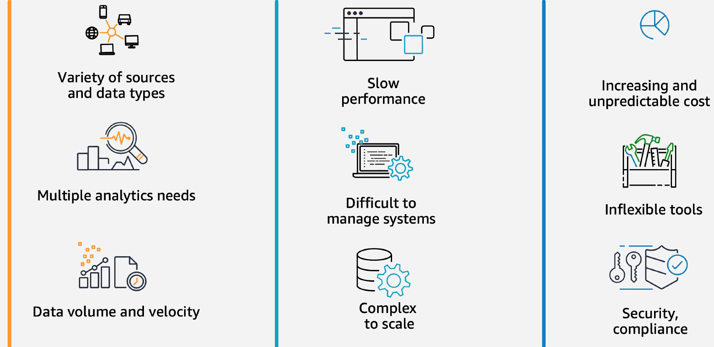
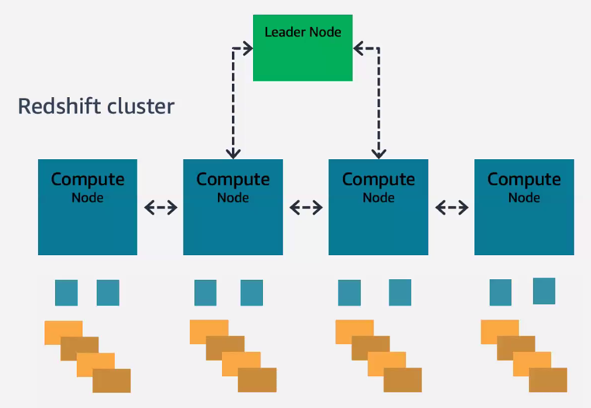
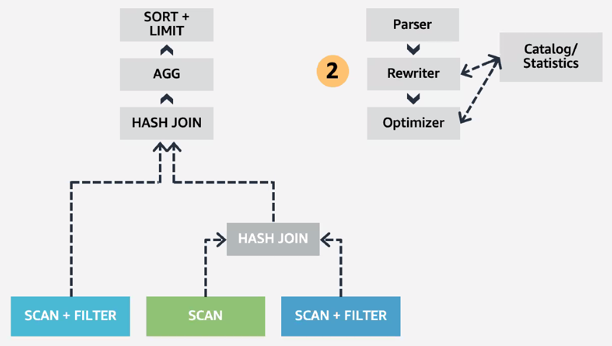
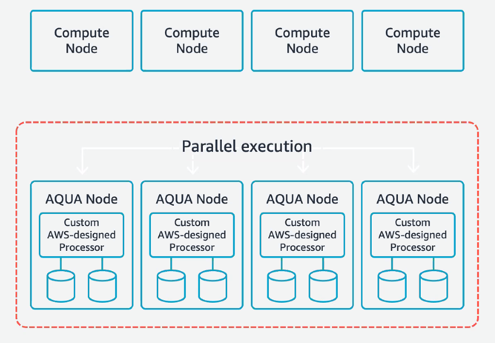
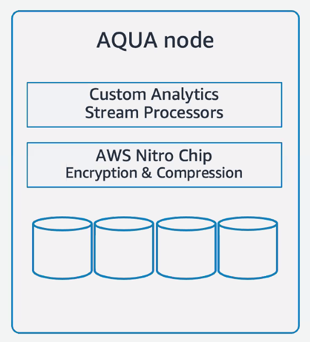

# Lecture 20 Amazon Redshift and its Practical use of Machine Learning

## Data Analytics

* Analysis based on data collected by transactional/customer-facing operations
  * It has never been easier to collect data
* Everything is quantifiable & measureable
  * It has never been easier & cheaper to store data
* Facilitate data-driven decisions and operations

## Amazon Redshift

### Components/Teams of Cloud Data Warehouse

* Data Plane
  * Upper (QP)
  * Storage
* Control Plane
* Quality Assurance (QA)
* Product Management

### Executing a Query in Redshift

### Continuous Telemetry and Benchmarking

* Short query acceleration
* Query result caching
* Compiled code caching
* Query rewrites for selective joins
* Hash join memory utilization
* 2+x higher out of box performance

### RA3 Compute Node

* Size data warehouse only based on steady state compute needs
* Scale and pay independently for compute and storage
* Automatic, no changes to any workflows, no need to manage storage
* Cross-AZ cluster recovery
  * Relocate your cluster in another Availability Zone in response to failure

### Elasticity

* Redshift Concurrency Scaling
* Spectrum Layer
  * Customer Managed S3

## AQUA (Advanced Query Accelerator)

* A new distributed and hardware-accelerated processing layer that will make Amazon Redshift 10x faster than any other cloud data warehouse without increasing cost
  * Minimize data movement over the network by pushing down operations to AQUA Nodes
  * AQUA Nodes with custom AWS-designed analytics processors to make operations

### AQUA Node

* Nitro-accelerated compression & encryption
* Custom processor for common analystics operations
  * scan (filter)
  * aggregation
  * hashing
* In-node compiler maps operations across hardware accelerators and CPU

## Using Machine Learning in Amazon Redshift

* Train
  * Easily create and train ML models using SQL quries with Amazon SageMaker
* Infer
  * Use ML models using SQL queries
  * Deploy inference models locally in Amazon Redshift
* Practical use of ML in Amazon Redshift
  * Operations at scale
    * To automate operations in 76 Availability Zones within 24 geographic regions around the world
    * Detecting errors
  * Resource management at scale
    * For lower response latency and higher utilization
  * Data warehouse tuning
    * To simplify maintenance and turbo charge performance
    * Maintain sort order of the data in Redshift tables to continuously optimize query performance
  * Workload management
    * Expert advice personalized for your cluster and workload
    * Maximize query throughput and get consistent performance