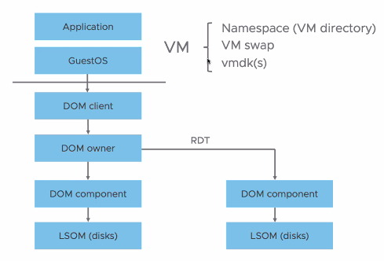
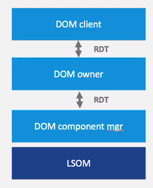

# Lecture 21 vSAN by way of RADIO

## Kubernetes and ESXi

* vSphere
  * Instead of running Pod, run kubelet and Pod VMs on ESXi Node
* A number of notions of clusters

## vSAN & Object-Based Storage

### vSAN

* Distributed, Scalable Object Storage
* Each object made up of one or more components
* Data (components) is distributed across cluster based on VM storage policy

### Object-Based Storage - A Better Way for Data Protection

* Setting failures to tolerate (FTT) to 1 with RAID-1 mirroring
  * Data mirrored to another host
  * Witness needed to determine quorum
  * Requires fewer hosts but not as space efficient as RAID-5/6
* Setting failures to tolerate (FTT) to 1 with RAID-5 erasure coding
  * Data with parity striped across hosts
  * For erasure coding,
    * FTT 1 implies RAID-5
    * FTT 2 implies RAID-6
  * Guaranteed space reduction

### Provide Awareness of Topology and Rack Designs

* Create explicit fault domains to increase availability
* Protect against rack failure

### Low Cost Local and Remote Protection

* Redundancy locally and across sites
* Upon site failures, vSAN maintains availability with local redundancy in surviving site
* Optimized site locality logic to minimize I/O traffic across sites

## vSAN Components

### Cluster Monitoring, Membership and Data SVC

* Peer-to-peer: leader election forming cluster
  * Roles: master and backup, agents
* Detect network partitions and absent hosts within cluster
* Distributed key-value store
  * Each host owns its own entries, published to all
  * Enables subscription service for all events driven by these entries on any node

### Local Log-Structured Object Manager

* Manages local storage
  * Storage organized into disk groups
  * Services
    * On-disk encryption
    * Compression
    * Deduplication of blocks within disk groups
  * Unit is a disk group for fault domains
* Critical for overall performance

### Distributed Object Manager

* Three layers
  * DOM client: on host where idsk object is accessed
  * DOM owner:
* All three layers run on each host (symmetry)
* DON owners splits/combines IOs to/from component managers

#### Reliable Data Transport (RDT)

* In-order, reliable
* Datagram, not a stream
* Hides underlying transport
  * TCP/IP
  * RDMA

### Cluster-level Object Manager

* Overall coordination of storage
  * Placement of components
  * Handling of evacuation events
  * Rebalancing
  * Rebuilding absent or degraded components
* Fault domains
  * FTT0: No redundancy
  * FTT1: Mirroring
  * FTT2: RAID5 (requires 4 nodes)
  * FTT3: RAID6 (requires 6 nodes)
  * Stretch-clusters: Primary vs. Secondary fault domains

### Management Services

* Interface to overall management plane and APIs (vCenter)
* Health checks, performance monitoring, and guards
* Maintenance mode workflows, cross-cluster operations
* What-if services
  * Impact of changes to cluster or per-object policies
* HCI Mesh - Compute/storage disaggregation
  * Enable hosts in one cluster to mount vSAN objects from another
  * Avoid stranding storage

## Challenges Going Forward

* New technologies and scale
  * Scale of hosts, data centers, network capabilities
  * Storage technologies: persistent memory, larger-scale devices
  * Offloading mechanisms
* New services
  * Distributed file system services
* New frameworks
  * Tanzu and Kubernetes: supporting containerized workloads