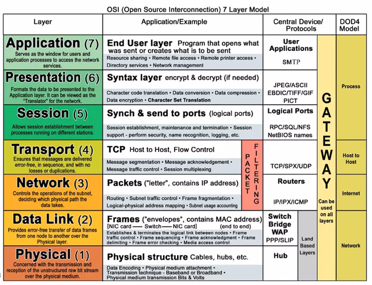
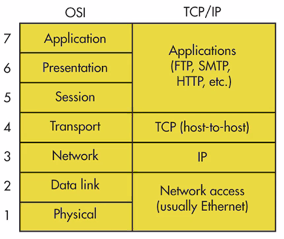
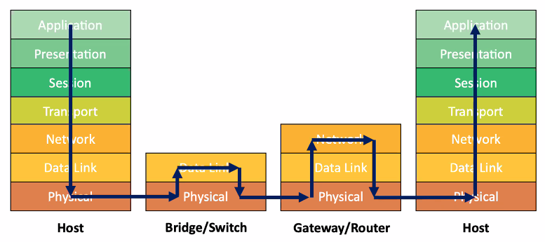
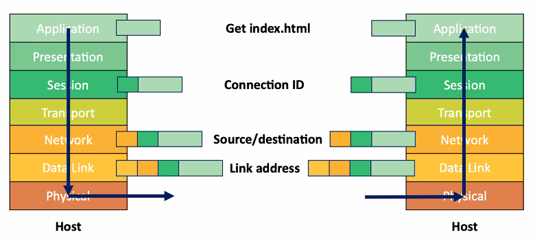
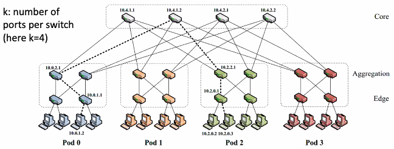
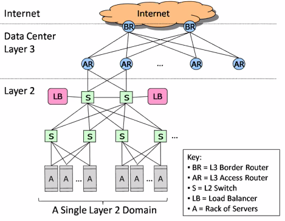

# Lecture 22 Networking

## Network Layers

### OSI 7 Layer Model

### OSI vs. TCP/IP

### Life of a Packet

### Layer Encapsulation

## Building Larger LANs: Bridges

* Extend reach of a single shared medium
* Connect two or more segments by copying data frames between them
  * Only copy data when needed -> key difference from repeaters/hubs
  * Reduce collision (sending at the same time) domain compared with single LAN
  * Separate segments can send at once -> much greater bandwidth
* Challenge: learning which packets to copy across links

### Frame Forwarding

* A machine with MAC Address lies in the direction of number port of the bridge
* For every packet, the bridge "looks up" the entry for the packet's destination MAC address and forwards the packet on that port
* Timer is used to flush old entries

### Learning Bridges

* Keep track of source address of packets arriving on every link, showing what segment hosts are on
  * Fill the the forwarding table based on this information

## Internet

### IP to MAC Address Translation

* Address Resolution Protocol (ARP)
  * Broadcast search for IP address
  * Destination responds (only to requester using unicast) with appropriate 48-bit Ethernet address
* Caching ARP Entries
  * Efficiency concern
  * Each host maintains cache of ARP entries

### Structure of the Internet

* Ad hoc interconnection of networks
  * No particular topology
  * Vastly different router and link capacities
* Send packets from source to destination by hopping through networks

### Addressing in IP

* IP addresses are names of interfaces
* Domain Name System (DNS) names are names of hosts
* DNS binds host names to interfaces
* Routing binds interface names to paths
* IP Addresses
  * Fixed length: 32 bits
  * Class A (0): 128 networks, 16M hosts
  * Class B (10): 16K networks, 64K hosts
  * Class C (110): 2M networks, 256 hosts

### Original IP Route Lookup

* Address would specify prefix for forwarding table
  * Simple lookup
* Forwarding table contains
  * List of class + network entries
  * A few fixed prefix lengths (8/16/24)
* End up with larage tables

### Tunneling - Forcing Particular Routes

* Force a packet to go through a specific point in network
* Achieved by adding an extra IP header to packet with a new destination address
* Used increasingly to deal with special routing requirements or new features
  * Mobile IP, Multicast, IPv6, research

### Extending Private Network

* Virtual Private Network (VPN)
  * Overlays private network on top of regular Internet
  * Create tunnel between client & firewall
  * Remote client appears to have direct connection to internal network

### Circuit vs. Packet Switching

* Circuit Switching
  * Fast switches can be built relatively inexpensively
  * Inefficient for bursty data
  * Predictable performance (hard QoS)
  * Requires circuit establishment before communication
* Packet Switching
  * Switch design is more complex and expensive
  * Allows statistical multiplexing
  * Difficult to provide QoS guarantees
  * Deta can be sent without signaling delay and overhead
* Virtual Circuit Switching
  * Use short connection identifiers to forward packets
  * Switches know about the connections so they can more easily implement features such as quality of service
  * VC identifies long-lived stream of data that can be scheduled

### Fat-Tree Topology

* K-ary fat tree: three-layer topology to inter-connect racks (of servers)
  * Edge switches: connected to k/2 servers and k/2 aggregate switches
  * Aggregation switches: connected to k/2 edge and k/2 core switches
* Fixed routing: increase rack-rack bandwidth
* Shaped traffic: maximize bandwidth for dynamic traffic patterns
* Why Fat-Tree?
  * Fat tree has identical bandwidth at any bisections
  * Each layer has the same aggregated bandwidth
  * Can be built using cheap devices with uniform capacity
* Great scalability: k-port switch supports $k^3/4$ servers
* But wiring complexity in large networks

## Cloud/Data Center Networking

* Large data centers have 100s or 1000s of machines
  * 10x of VMs each
  * 1000s of network boxes
* Heavy use of Layer 2
  * Cheaper, faster than IP
* Dependence on Layer 3
  * For thigns not in same Layer 2 domain

### Data Center Routing Issues

* Poor server-to-server connectivity
  * Layer 3 equipment (large buffers, marketplace factors) more expensive than Layer 2
* Static network assignment
  * Host IP addresses assigned according to physical switch connections
  * Migrating a VM changes its IP, breaks TCP and app state
* Fragmentation of resources
  * Load balancing techniques often require all IPs in same pool
  * VLANs: often policy over-loaded, hard for apps to span VLANs efficiently
* Proprietary hardware scales up, not out
  * Conventional load balancers paired up in 1+1 resiliency configs (see Fat-Tree)
  * These pairs tend to replaced togethen when load exceeds capacity

### Build Data Center VLANs

* LANs and VLANs must support broadcast
  * Easy configuration because forwarding tables self discovered
  * Same IP during VM migration between (V)LAN switches
  * Avoid big (V)LANs -> big tables, lots of broadcast traffic
    * Millions of VMs in same VLAN is rarely supported (usually 100s-1000s)
* Layer 2 solves forwarding loops with spanning tree
  * One of many paths is selected for all traffic A -> B
  * Bad for bandwidth, underutilizes paths and links
* Switches must be configured with per-VLAN bandwidth
  * Why: VLANs spanning networks force too much traffic high in tree
  * This makes changes complex, often manual
* Scalability: configure all switches/routers
  * Vertically-integrated switch/router -> Admin needs to change every configuration manually
  * Software-Defined Networking (SDN)