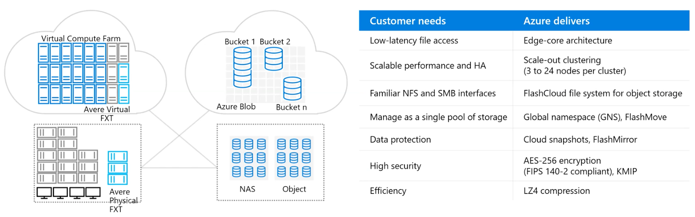
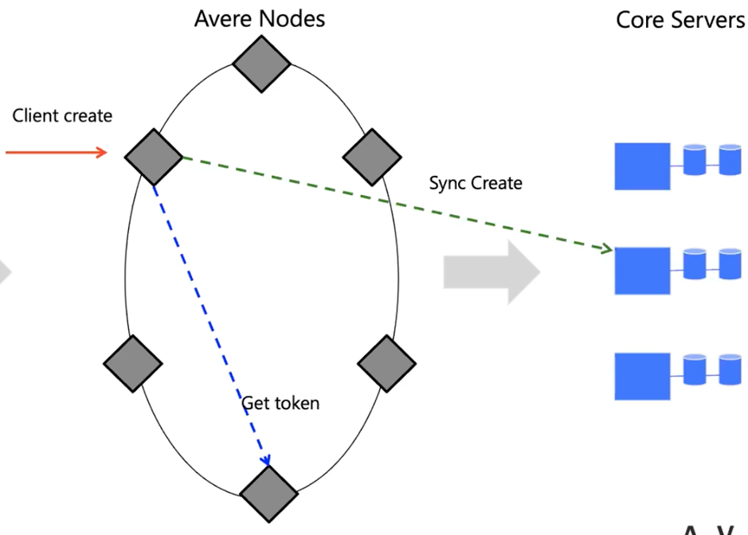
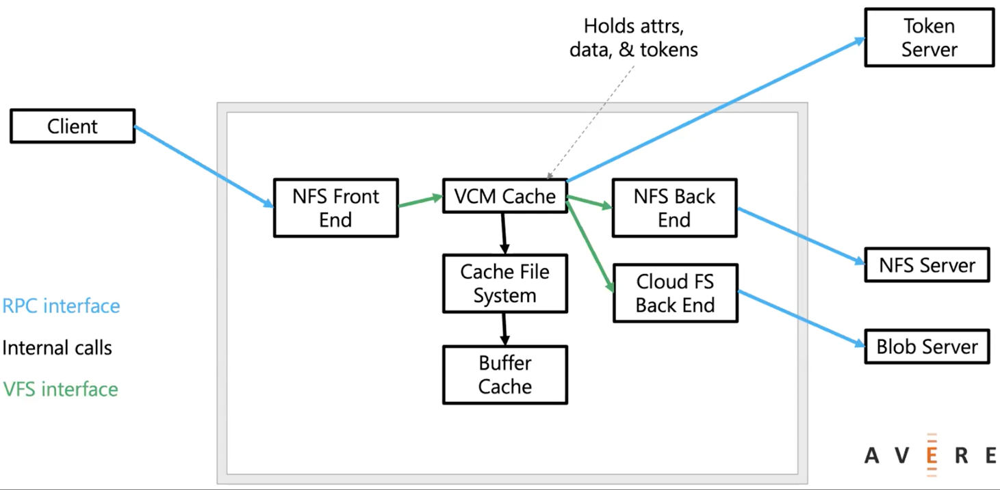

# Azure Storage Avere Technology

## High Performance Computing Applications

* All demand

## Fast Network File System (NFS) Cache

### System Overview

### Typical Operation Flow

* Obtain synchronization tokens
* Fill attributes/data caches
  * if necessary
  * based on tokens held and file modify times
  * writes cache miss data to CFS
    * CFS to hold data/attributes
      * Unix-like: inodes, indirs
      * Per-block metadata
    * read-ahead from disk when sequential IO detected
    * journaled for quick restrt
    * buffer cache holds hot data
    * tracks block status
      * flag if block from current mtime
* Large CFS buffer cache
  * memory cache for hot data
  * read from disk for warm data
* Read-ahead from back-end
  * flag if block from current mtime
* NFS backend -> pass through
* CLFS backend -> get/put/enumerate objects
* Token server
  * returns read token
  * optimistic get token
    * fails on conflict
    * client send reads to dirty node

### Token Manager

* Attribute tokens (read/write)
* Data tokens (read range, write range)
* Some tokens are persistent
  * write tokens protect modified data
  * after a crash, must prevent conflicting updates
* Token manager knows location of all cached data
* Ownership token eliminates need to store to backend
* Forwarding tokens reduce thrashing
* Sharded based on file handle for load-balancing

## Cluster for Aggregate Performance

* Two main types of HPC workloads
  * Embarrassingly parallel
    * Nodes don't to talk to each other, or very little cross-node communication
    * Usually a parameter sweep, a job splitting, or a search/comparison through data
    * Examples: Monte Carlo simulations, image/video rendering
    * Great workload for the cloud! CPU/Storage primary resources
  * Tightly coupled
    * Nodes need to talk to each other constantly
    * Requires a fast interconnection network (low latency and high throughput)
    * Examples: automative crash simulation
    * More challenging, but already possible on Azure! CPU/Network

## Key Points Regarding Applications

* Know your workload targets
* Every system has strength and weakness
* Latency, Throughput, or both
* Price/Performance or Outright performance
* Benchmarks vs. Reality
* Caching for rendering workloads is very effective