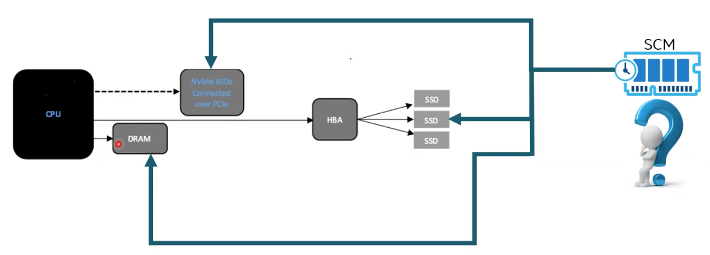
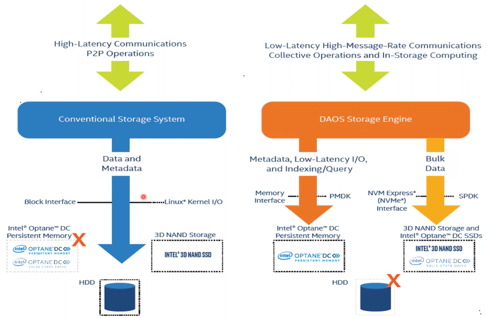
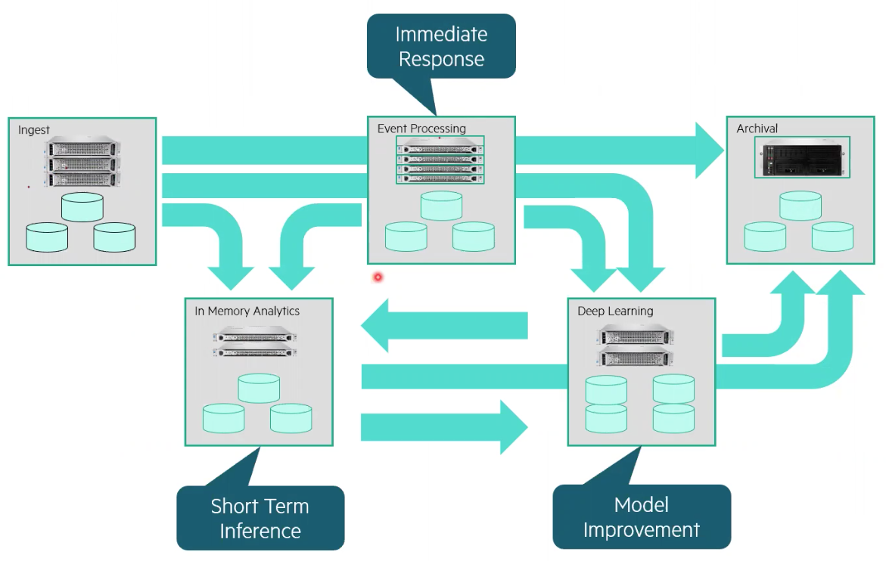

# Data Storage Past and Future @ HPE

## What Defines A Storage Systems Strength

* Bandwidth
* Latency
* Resiliency
* Price
* Security
* Scalability

## Current Storage System Architecture

* Explosive data growth
* Is Moore's Lay ending?
* How about Amdahl Law?
  * The execution of a programs's speed is a function of the number of processors executing it

### NVME & SCM

* Non-volatile Memory Express (NVME) is an open logical-device interface specification for accessing non-volatile storage media attached via Peripheral Component Interconnect Express (PCIe) bus
* Storage Class Memory (SCM) is a type of NAND flash that includes a power source to ensure that data won't be lost due to a system crash or power failure

## Emerging Data Centricity

* Bottlenecks
  * Processing power and bandwidth
  * Metadata/access inefficiencies of Object storage & retrieval
  * Wire protocol termination for disaggregated flash
* Inefficiencies
  * Inability to deliver on both Performance and Scale
  * Wasted endurance
  * Wasted memory bandwidth
  * CPU overhead of I/O and I/O virilization

## Disruptive Ideas In-Play Today

* Accelerated cache nodes with FPGA/SmartNICs/SOC
  * ASIC based
  * FPGA based
  * SOC based

## Conventional vs. DAOS Architecture

## Generalized Analytics Flow

