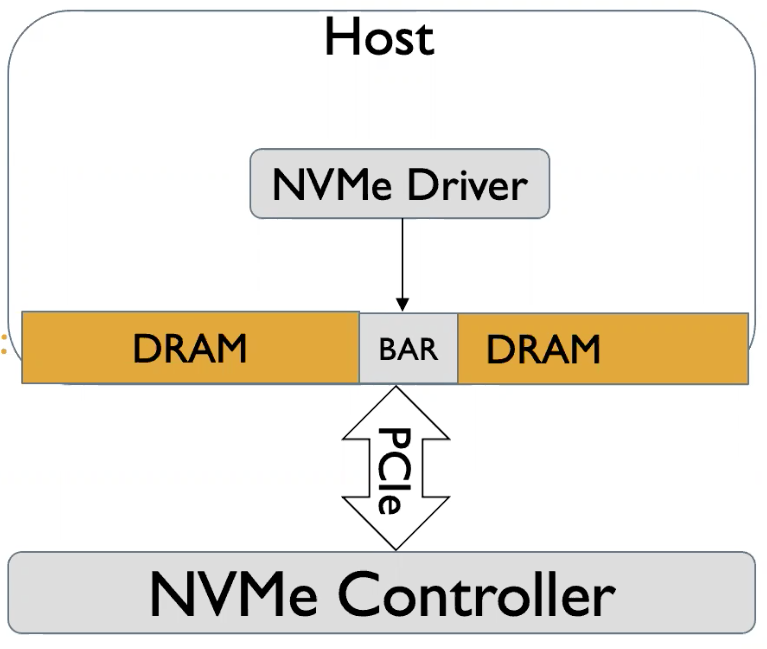
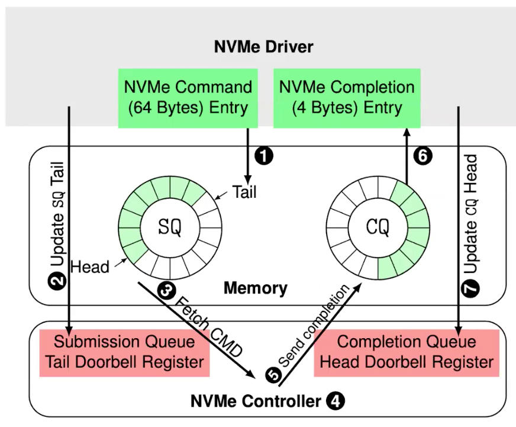
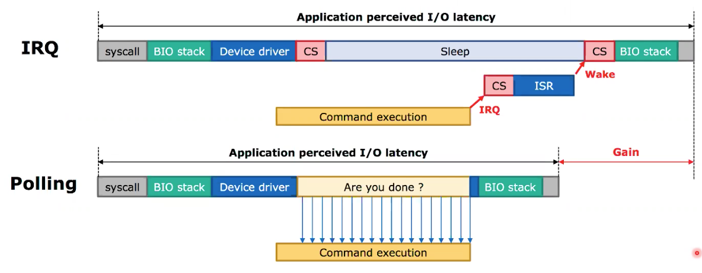
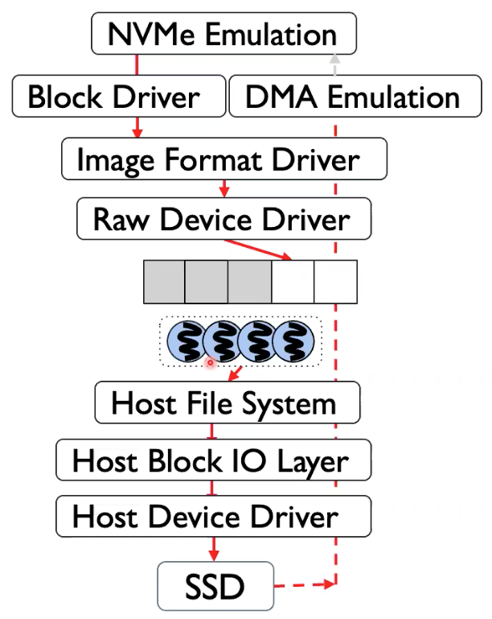
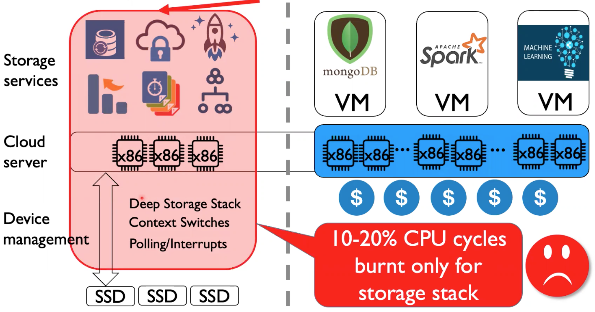
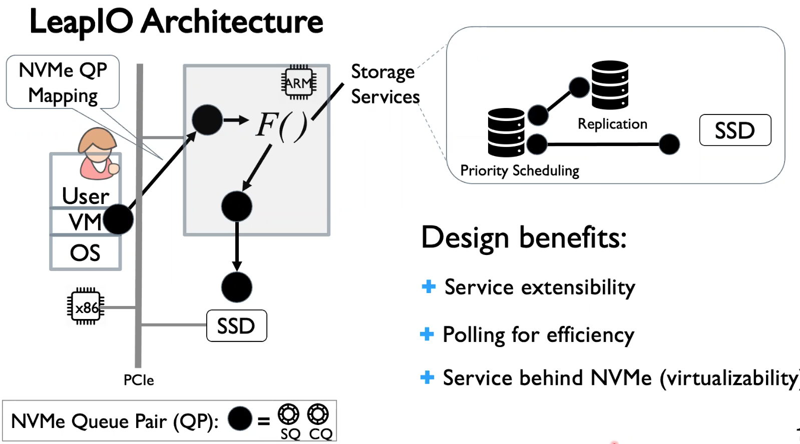
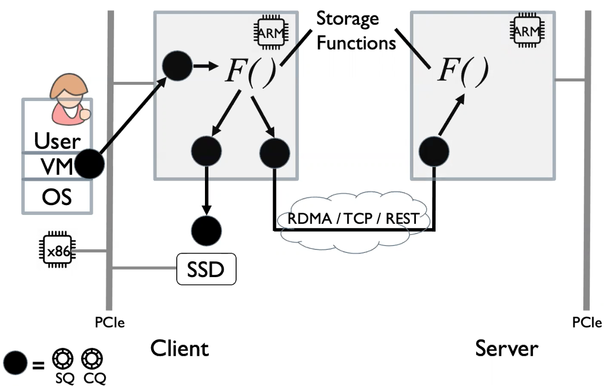

# Ins and Outs of Storage Offloading using ARM SoCs

## What is Storage

* Reliability
* Performance
* Security
* Disaggregation
* Scalability
* Versioning

## NVMe Background

* IDE -> SATA/SAS/SCSI -> NVMe
  * Read LBNs 4-7
* Why the interface matters?
  * SamSung SM95I Read IOPS
    * NVMe: 120K
    * SATA: 90K
* NVMe advantage
  * Simple/Lightweight/Efficient
  * High parallelism/performance
  * Extensible (KV-, ZNS-, Optane/Z-NAND, etc)
* The host view of an NVMe controller
  * PCIe Base Address Registers (BAR)
  * Read/Write BARs to program it

* The NVMe protocol
  * Queue Pair (QP)
    * Submission Queue (SQ)
    * Completion Queue (CQ)
  * Control/Data Separation
    * Admin Queue Pair
    * I/O Queue Pair
* Lifecycles of an I/O
  * Producer/Consumer mode
  * Queue Pair: shared memory buffer
* Status Synchronization
  * Head/Tail maintenance
  * **Doorbell register**

* Host-side I/O Completion Processing
  * Interrupt vs. Polling
  * Polling achieve better performance at the cost of increased CPU utilization

* NVMe Command Set
  * Admin Commands
    * Identify
    * Get Features
    * Set Features
    * Get Log Page
    * Create/Delete SQ/CQ
  * I/O Commands
    * Read
    * Write
    * Flush
    * Trim / Data Set Management (DSM)
    * Vendor specific
* Storage Disaggregation
  * RDMA: Remote DMA
    * Require RDMA NIC
    * Offloaded network stack
  * Resource pooling/utilization

## Storage Virtualization

* NVMe Virtualization and its Overhead
  * NVMe Drive/EBS Emulation
  * The hypervisor emulates a virtual NVMe controller
    * Software-emulation
  * I/O trap: high emulation overhead
    * VM/Host switch per I/O
  * Hypervisor I/O virtualization stack
    * Virtual SSDs to physical SSDs mapping
    * Multiple layers
    * Multiple host user/kernel switches
    * DMA Emulation: Guest -> Physical I/O address translation

## Storage Services & Management Tax

## An Offloaded System - LeapIO

* ARM Offloading for Cost-Efficiency

* Design Goals
  * Protability - How to mask hardware heterogeneity?
  * Composability - How to ensure functions easy storage function layering and composing?
  * Efficiency - How to get good performance?
  * Extensibility - How to ensure easy development of new storage services?

### LeapIO Overview

* Next Generation of Cloud Storage Stack Offload-ready to ARM SoCs
* Inside an ARM SoC
  * Broadcom StingRay ("SmartNIC")
  * Relatively Powerful
  * General Purpose -> Linux & Toolchain
  * Deployment Model -> Plug-and-Play
* LeapIO Architecture
  * Service extensibility
  * Polling for efficiency
  * Service behind NVMe (virtualization)

* **Treat Hardware Acceleration as Opportunity instead of Necessity**
* LeapIO Efficient Data Path
  * No direct ARM-x86 communication
  * Data copies across address space
  * **Unified Address Space**
* Existing ARM SoC Design Inefficiencies
  * Implications for SoC Vendors
    * Add Native DMA interface for ARM-x86 communication
    * Enable IO MMU Access from ARM for Address Translation
    * Enable SoC DRAM to x86 to enable P2P-DMA
  * Will improve with future ARM SoC Design

### LeapIO Summary

* End-to-end Offload-Ready Cloud Storage Stack
* 2-5 software overhead (30% on ARM SoC)
* Implications for SoC vendors on how to bridge the gap between ARM and x86