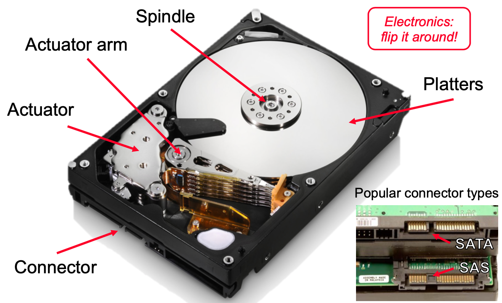
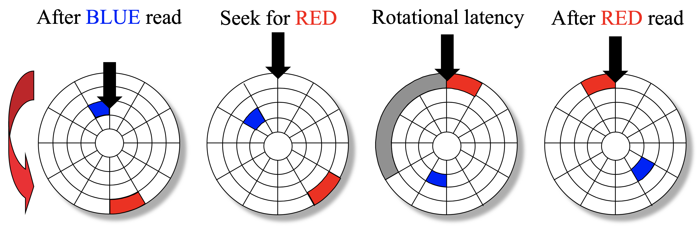
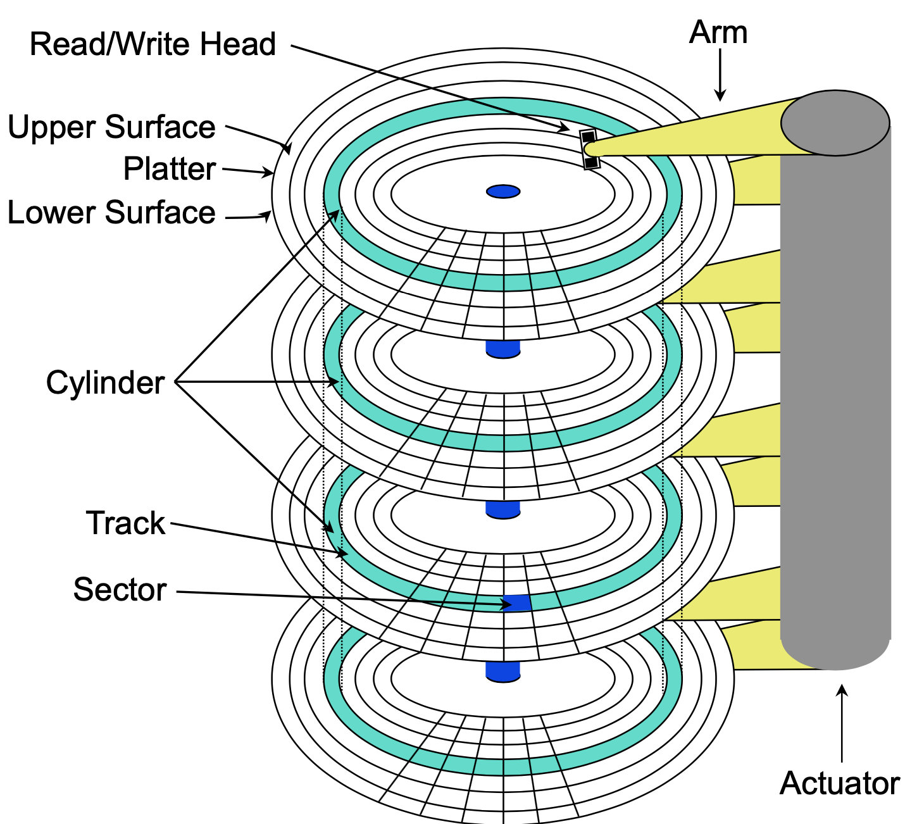
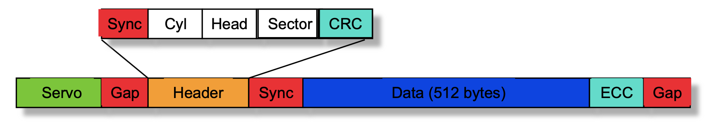

# Lecture 3 Hard Disk Drives

## Hard Disk Drive

* Disk electronics is just like a small computer: processor, memory, network I/F

* Disk structure - top view of single platter
  * Surface organized into tracks
  * Tracks organized into sectors
  * Head in position above a track
  * Rotation in counter-clockwise
  * About to read blue sector
  * Red request scheduled next
* Access Time: Seek Time + Rotational Latency + Data Transfer
* GB = 1 billion bytes = 10^9 bytes
  * That's not 2^30 or 1 GiB
  * The difference is 7%

### Tracks & Sectors

* Adjacent tracks separated by an isolation zone

* Addressable unit is a sector
* Servo = bit pattern used for centering on track
* Sector breaks down into several different fields
  * Typical data portion sizze - was 512-520 bytes, now 4096 bytes
  * Typical format
    * `sync` followed by address field (`cyl`, `head`, `sector`, `crc`)
    * `crc` used to verify `cyl`, `head`, `sector` info (but can not fix the problem)
    * `gap` followed by the data
    * `ecc` over the data to verify data and correct bit errors
    * `header`, `ecc`, `gap` typically use between 40 and 100 bytes

#### ECC

* At such high densities, problems occur frequently
* ECC detects and can allow on-the-fly correction
* When writing a sector, one ends up with one of three states (all written, all not written, sector destroyed)

### Response Time for Disk

* Response time: (requester-visible service time)
  * Queue time + Access time
* Access time: (service time for a disk access)
  * Command + Seek + Rotation + Transfer
* Seek Time
  * Time required to move head over desired track
* Rotation Latency
  * Time required for the first desired sector to reach head
  * Depends on rotation speed
    * Measured in Rotations Per Minute (RPMs)
* Media Transer Time
  * Time for needed sectors to rotate under head
* Modern disk performance characteristics
  * Seek times: 1-6ms, depending on distance
  * Rotation speeds: 4,200-15,000RPM
    * Average latency of 2-12ms
  * Data rates: 6-125MB/s, depending on zone
    * Average sector transfer time of 25 μs
    * Improving at 0-20% per year

### Firmware: Mapping LBNs

#### Zones

* Outer tracks are longer than inner ones
  * so, they can hold more data
* Increased bookkeeping for LBN-to-Physical mapping

#### Computing Physical Location from LBN

* First, figure out which zone contains the LBN
  * can simply iterate through table of per-zone startlbn values
* Then, adapt previous computations
  * lbn_zone = lbn - firstlbninzone
  * cylno = firstlbninzone + lbn / sectspercyl
  * surfaceno = (lbn % sectspercyl) / sectspertrack
  * sectno = lbn % sectspertrack

#### Defect Management

* Portions of media can become unusable
* Need to set aside physical space as spares
* Using spare space to handle defects
  * Remapping: leave everything else alone and just remap the disturbed LBNs
  * Slipping: change mapping to skip over defective regions

