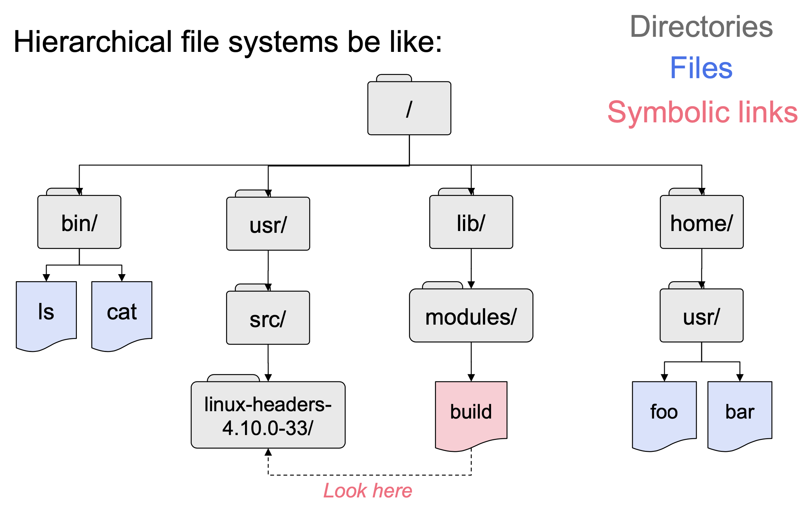
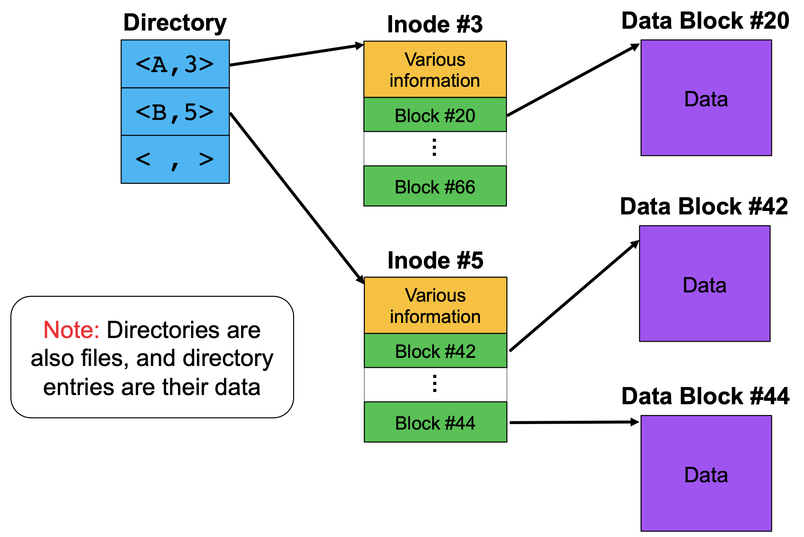
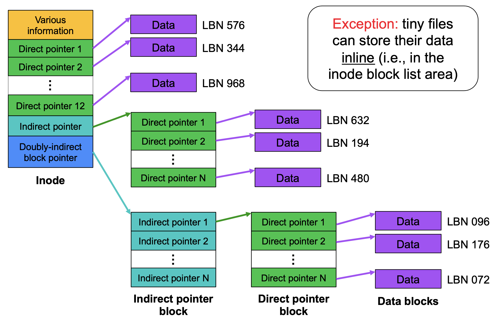
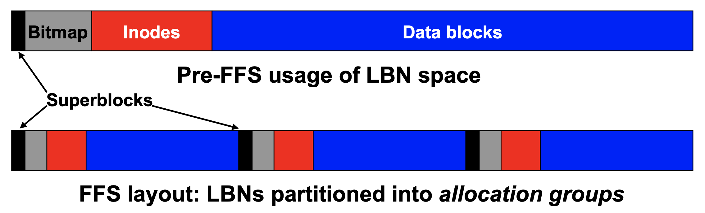
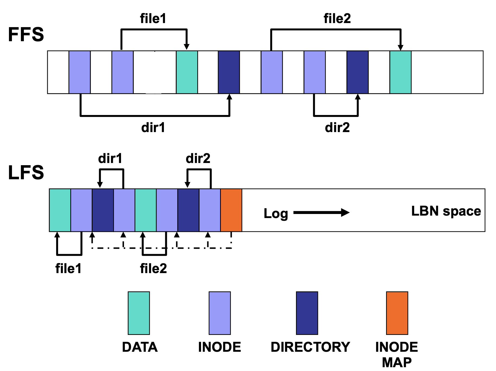

# Lecture 4 File System Storage Layout

* **What is good depends on the target workload!**

## Storage Device Interface

### Mapping LBNs to Physical Locations

* Generally done in device firmware
  * HDD firmware maps LBNs to sector
  * SSD firmware (FTL) maps LBNs to pages
  * Details usually hidden from external software

## Basic File Systems Structures

## File System Storage Layout

* **Goal**: map file system structures and data to LBNs
  * Problem 1: Keep track of available LBNs
  * Problem 2: Allocate a free block, when one is needed
* **Solution 1 (simple)**: free list
  * Maintain linked list of free blocks
  * Grab block from list when you need one
  * Problem: rarely a performant solution
* **Solution 2 (most common)**: bitmap
  * Large array of bits, one per allocatable unit
  * Scan array for “free” bits when we need a block
    * Simple: take first “free” item in array
    * Better: look for “free” regions or for particular patterns
* **Solution 3 (sometimes better)**: free extent list
  * Extent: a contiguous range of free blocks
  * Maintain sorted list(s) of “free” extents
    * Merge freed, contiguous extents into larger ones
  * Pull space from a free extent, as needed
  * Downside: fragmentation – many small unfilled extents

### FS Storage Layout for HDDs

* FS performance largely dictated by disk performance
* Two optimization drivers
  * Locality (closeness)
  * Transfer size (large transfers)

### Fast File System (FFS)

* For locality (closeness) - cylinder groups
  * called allocation groups in many moderen Fss (e.g., ext*, xfs)
  * allocate inode in same cylinder group as directory
  * allocate first data blocks in same cylinder group as inode

* For large transfers (amortization of positioning cost)
  * Large FS block size: more data per disk read/write
  * Allocate contiguous blocks when possible
    * Start allocation search from last block #
  * Prefetching: fetch more data than requested
  * Trade-off: disk may have already prefected up to a few tracks, but a large request can delay normal requests
* Performance may degrade over 50% with aging

### Want Large Transfers Even For Small Files

* Problem: small files lead to small I/Os
  * Cause: independence of files & levles of indirection
* Solution: group small files + metadata for larger I/Os

### Log-structured File System (LFS)

* All about amortization, try to achieve large writes
  * buffer and remap new versions of data into large segments
  * segment-sized writes make efficient use disk head

* Shadow paging
  * completely write a segment to replace several older blocks
  * cleaning reclaims space from fragemented segments
    * condense still-live blocks from several current segments into fewer new segments, increasing number that are empty
* Cleaning can require significant work
  * Must first determine which blocks are live
    * requires knowing what each block is
      * a "segment summary" structure embedded in each segment and can be cached or pinned in RAM
    * requires knowing whether block is still live
      * can look at inode for data blocks and inode map for inodes
  * Can be done in background / idle time
    * unless free space gets too low, then may be on-demand

### FS Storage Layout for Flash SSDs

* Can strip away mechanical performance complexity
* Most modern FTLs do LFS-like remapping into SSD blocks
* FTLs know about LBNs, not relationships among them
  * related data may be spread among SSD blocks, based on write timing
* Trick 1: set segment size = SSD block size
  * most writes fit and fill one SSD block
* Trick 2: separate hot/cold data
  * put hot data in different segments than cold data
  * benefits from knowing FS-level data relationships through inode in same segment with file data