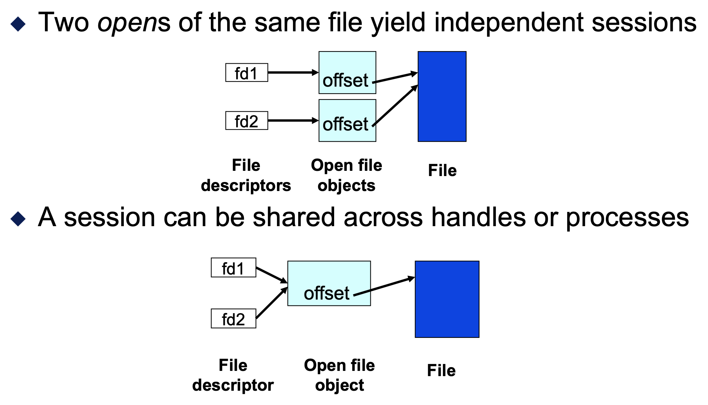
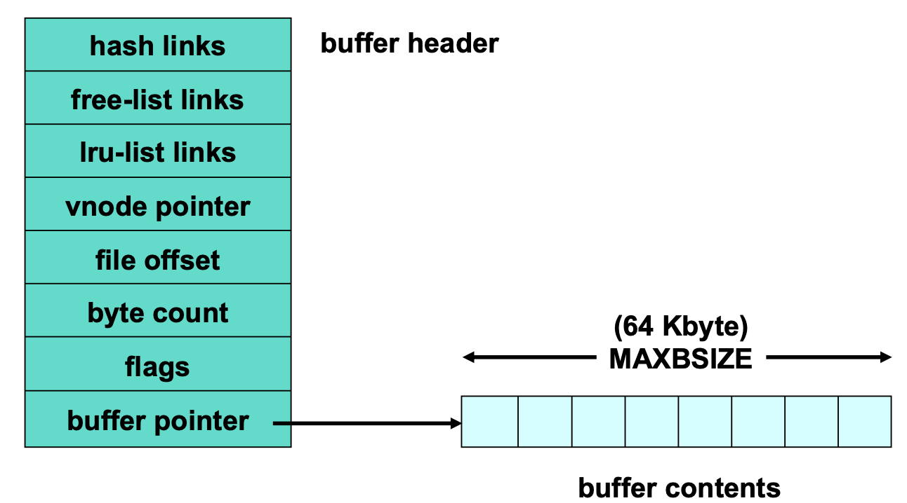
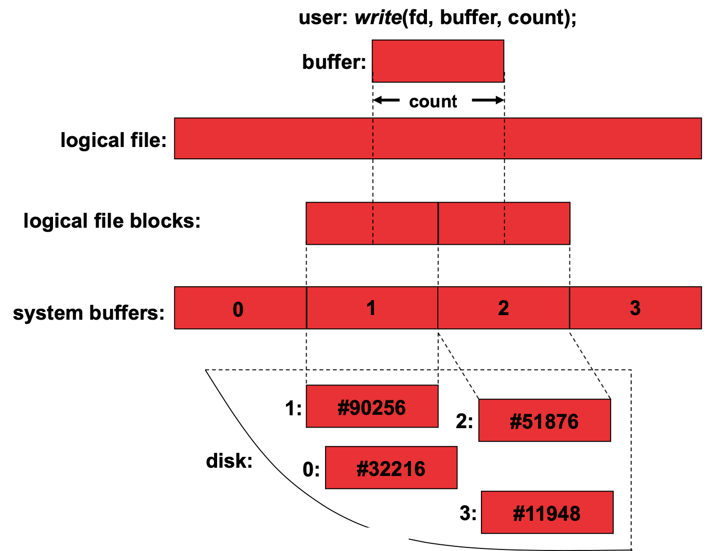
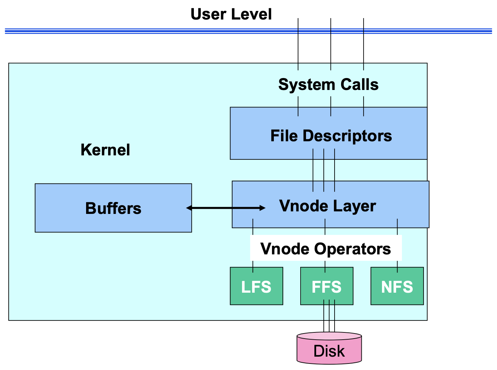
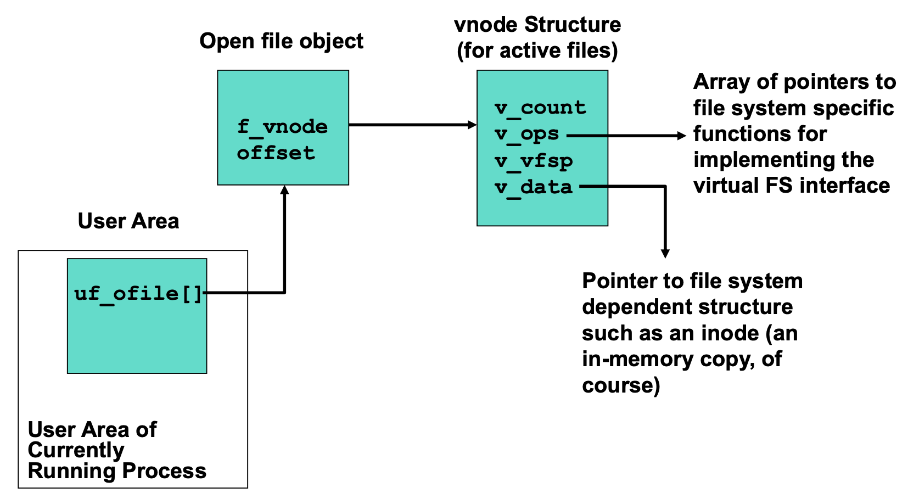
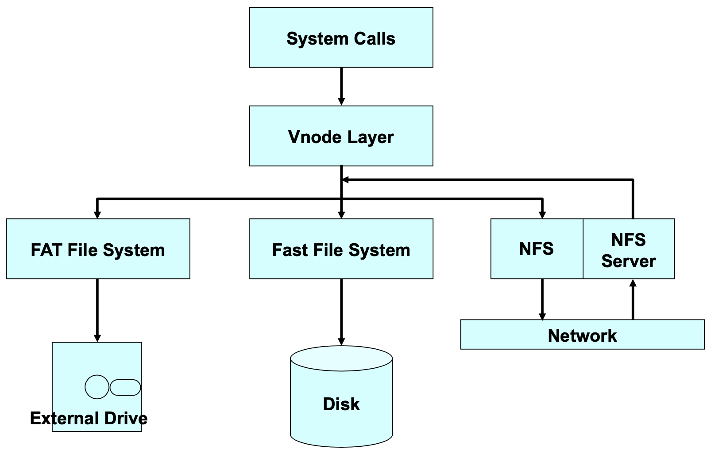
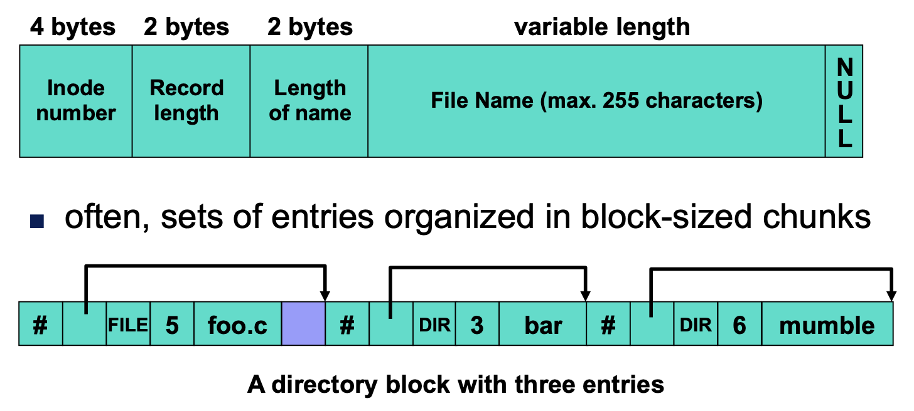
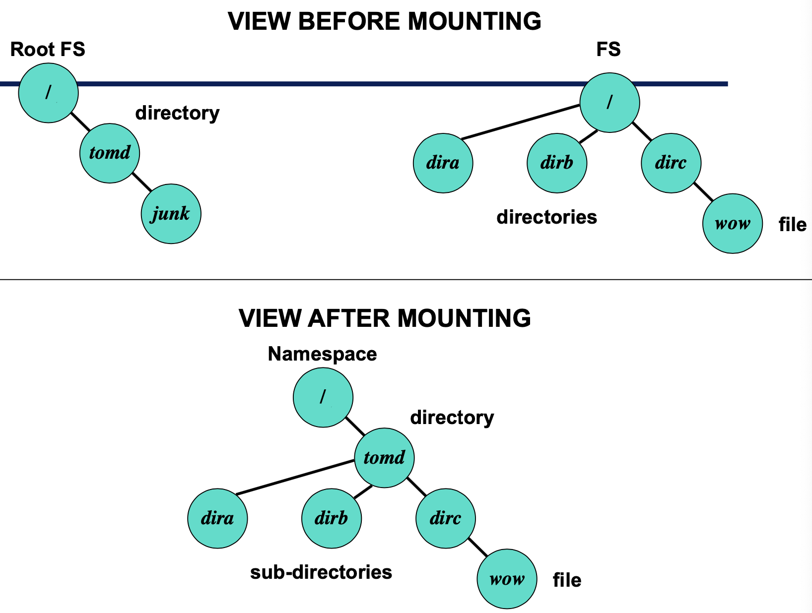
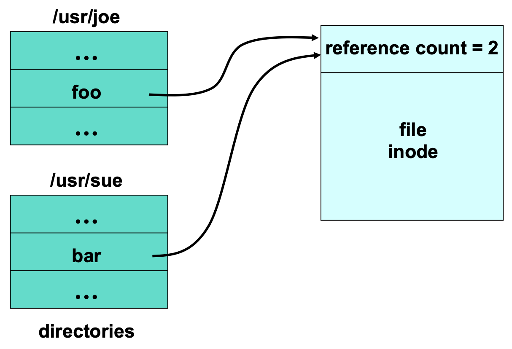
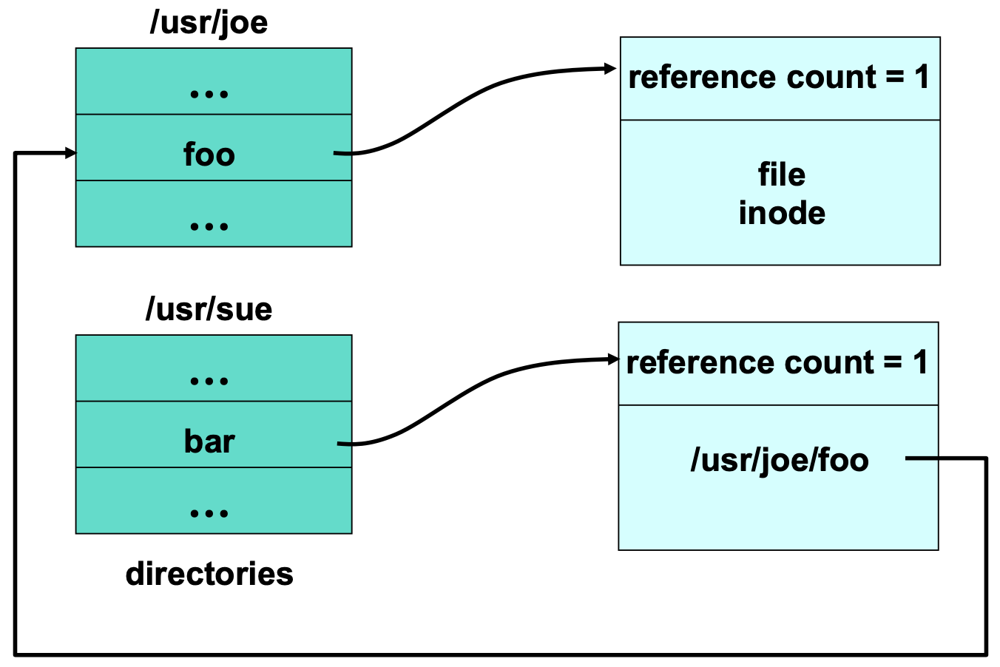

# Lecture 5 File Systems

## Application Interface and System Software

### Application Interface

* Applications see at the highest level
  * File contents: sequence of bytes
  * Basic operations: open, close, read, write
* `open` starts a session and returns a handle
  * In POSIX
    * **Handle** is a process-specific integer called a file descriptor
    * **Session** remembers current offset into file
      * For local files, session also postpones full file deletion
* `read`  and `write` access bytes at some offset in file
  * Offset explicity provided or remembered by session
* `close` ends the session and destroys the handle
* A few FSs treat `open`-to-`close` as atomic sessions
  * All or none of changes happen, isolated from other `open`s

### Accessing Open Files

### Passing Data Between Kernel and Application

* Commen approach: copy it
  * `read(fd, buffer, size)` or `write(fd, buffer, size)`
  * Application knows it can use the memory immediately and that the corresponding data is in that memory
  * Kernel has no hidden coordination with application
* Better approach: hand it off
  * `char *buffer = mmap(fd, size)`
    * read/write avoids copying to/from user-space buffer
    * processes can share (but not private writable mapping) big files
  * Downsides
    * makes file caching more complex
    * sometimes not much performance improvement: fragmentation, messing with TLB, faulting to load data in

### Managing File Data in the Kernel: Buffers

* Header describing controls and buffer containing data

### In-memory Structures vs. On-disk

* One just needs to be able to translate from one to the other
* On-disk structures should be compact
* In-memory structures should fit space/time trade-offs
* On-disk structures should avoid pointers
* In-memory structures may find pointers highly valuable

### Organization Inside the Kernel: Vnode Layer

* Virtual file system layer
  * Adding a level of indirection to support having multiple file systems at once
* Everything in kernel interacts with FS via a virtualized layer of functions

## Data Organization and Naming

### Directory and File Structure

* Hierarchies are a good way to deal with complexity
* It works well for moderate-sized data sets
* Traversing the directory hierarchy
  * the '.' and '..' entries
* Directories to translate file names to inode IDs

### Managing Namespace: mount/unmount

* One must support combining other FSs into one namespace
  * Starts with a root file system
  * Mount operation attaches one FS into the namespace
  * Unmount detaches a previously-attached file system

### Multiple FSs on One Disk

* Divide capacity into multiple partitions
* Via a partition mp at the first or second LBN
* Each partition map entry specifies start LBN for partition and length of partition
* Commonly, device drivers handle the partition map

### Difficulty with Directory Hierarchies

* Can be very difficult to scale to large sizes
* What happens when number of entries in directory grows too large?
  * Partition into subdirectories again
* What happens when data objects could fit into any of several subdirectories
  * Multiple names for such files

### Different Kinds of Names

* **Direct** vs. **indirect**
  * hard link: name translates into object identity
  * soft link: name translates into another name
* **Absolute** vs. **relative**
  * absolute: name is self-contained
  * relative: name is context-dependent

### Access by Attributes

* Other ways of describing the info
  * list of descriptive values for each file
    * e.g. file type, creator, last modification, etc
  * searching on them is a good additional way to find things
* Can be organization within file or external description

## Basic Operations

### Working Through an Open Operation

* `ing fd = open("/foo/bar", RO);`
* Translate file name to inode identifier
  * Search root directory for "foo" using vnode_lookup
  * Search directory "foo" for "bar" using vnode_lookup
  * Use directory lookup cache first for each lookup step
  * Check access rights at each step
* Create a vnode structure for inode
  * Lookup inode in inode cache; fetch from disk if necessary
  * Initialize vnode structure appropriately
* Create open file structure
  * Initialize, pointing to new vnode
* Fill in fd table entry
  * Pick unused entry in table; have it point to new open file structure
* Return corresponding index into fd table

### Working Through a Read Operation

* `int retcode = read(fd, buffer, size);`
* Index into fd table to get open file object
  * Get vnode from open file object
* Call `vnode_read(vnode, offset, buffer, size)`
* Find vnode's buffer containing offset in buffer cache
* If buffer is invalid, `vnode_getbuf` fills it
  * May read and interpret indirect blocks
  * Requests device driver to fill buffer with data
* Copy data from cached buffer to user space buffer and advance offset past data copied in file object
* Repeat last three steps until size reached
* Return to application
  * Update open file object's offset on the way

### Working Through a Write Operation

* `int retcode = write(fd, buffer, size);`
* Index into fd table to get open file object
  * Get vnode from open file table
* Call `vnode_write(vnode, offset, buffer, size)`
* Find vnode's buffer containing offset in buffer cache
* If buffer is invalid, `vnode_getbuf` fillls it
  * Or marks it valid if entire buffer will be overwritten
  * May interpret and create indirect blocks
* Copy data from user space to cache buffer and advance offset past data copied in file object + mark buffer dirty
* Repeat last three steps until size reached
* Return to application
  * Leaves buffers as dirty in buffer cache