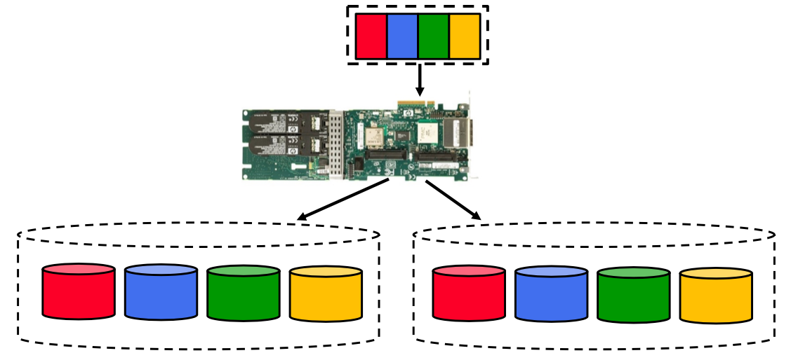
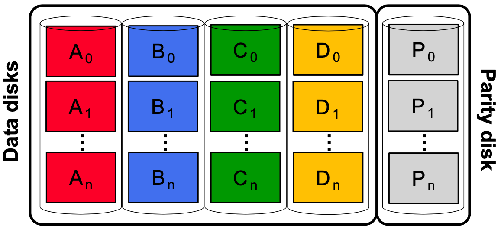
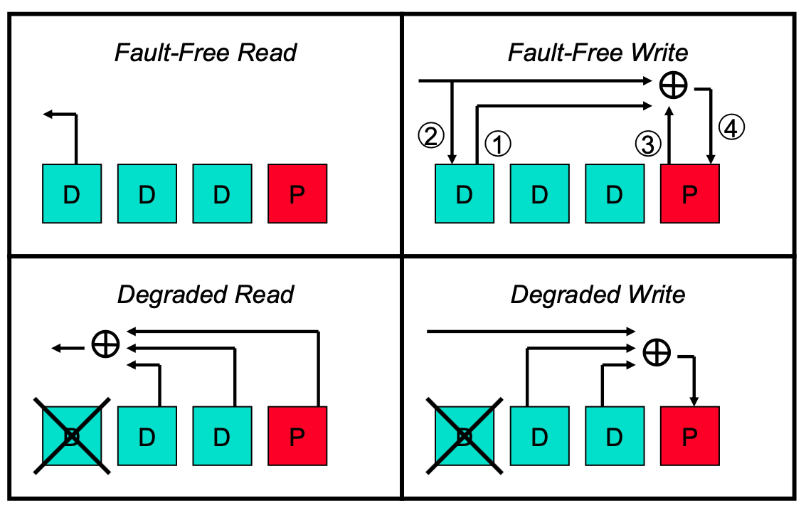
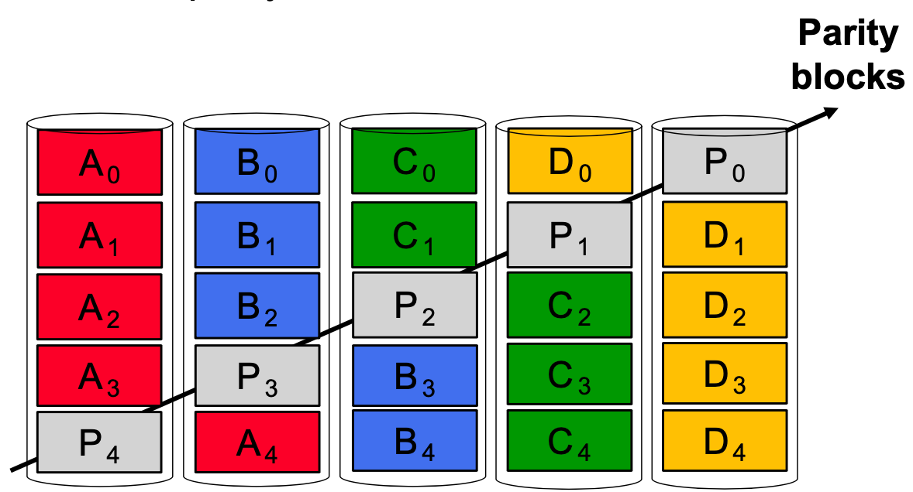
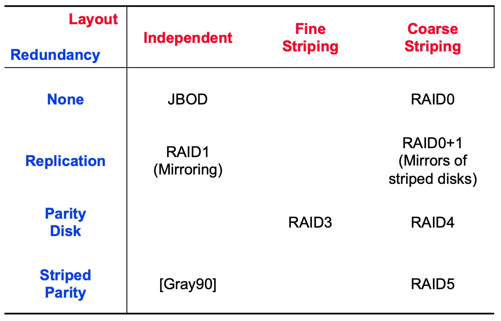

# Lecture 7 Multi-disk Systems and Disk Array Data Organizations

## Multi-disk Systems

* **Storage capacity**
  * Problem: cost, data growth
  * Solution: use multiple disks
  * Goal: Data growth at least 2x-3x faster than areal density
    * Approach: combine capacity of multiple disks
* **Performance**
  * Problem: load balancing
  * Solution: dynamic placement, striping
  * Goal: Bandwidth (MB/second)
    * Approach: stream data from multiple disks in parallel
  * Goal: Throughput (IOs/second)
    * Approach: concurrent requests to multiple disks
* **Reliability**
  * Problem: guarantee fault tolerance
  * Solution: replication, parity
  * Goal: Tolerate partial and full disk failures
    * Approach: store data copies across different disks
* Popular solution: **R**edundant **A**rray of **I**ndependent **D**isks

### Disk Subsystem Load Balancing

* Assumption: uniform data placement policy
  * Writing performance: excellent
  * Reading performance: **depends**
* Problem: some data more popular than other data
  * Distribution depends on the apps, usage, time
* Load Imbalances: fixed vs. migrating
  * **Fixed**: some data is always hot
  * **Migrating**: hot data chanegs over time
* Goal: find the right data placement policy
  * Common approach: Fixed data placement
  * Better approach: Dynamic data placement
    * Popular files labelled as hot, separated across multiple disks
  * Practical appraoch: **Disk striping**
    * Distribute chunks of data across all disks

### Disk Striping

* Data interleaved across multiple disks
  * Large file streaming benefits from parallel transfers
  * Thorough load balancing ideal for high-throughput requests
* How disk striping works
  * Break up LBN space into **fixed-size** stripe units
  * Distribute stripe units among disk in round-robin fashion
  * Straight-forward to compute location of block #B
    * Disk # = B % N, where N = number of disks
    * Disk block # = B / N (computes block offset on given disk)
* Key design decision: **picking the stripe unit size**
  * Assist alignment: choose multiple of file system block size

### Disk Failures

* Mean Time Between Failures (MTBF)
  * $MTBF = \frac{\Sigma(t_{down}-t_{up})}{Number of failures}$
  * $MTBF_{disk}$=300K-1.2M hours (32-136years, 1-3% per year)
  * MTBF of multi-disk system = Mean time to first disk failure
  * $MTBF_{MDS} = \frac{MTBF_{disk}}{Disks}$
  * For a striped arrau pf 1,000 drives, MTBF=49.6days, i.e. 7.4 failures/year on average

### Redundancy via Replicas

* Two copies of each write
  * Term used: mirroring, shadowing, duplexing
* Write both replicas, read from either
* Pros and Cons
  * Lower probability of both drives failing
  * Doubles the cost of storage
  * Reads: can read in parallel from both drives
  * Writes: delayed because we wait for two I/Os

### Error Correction

* General Single-Error-Correcting (SEC) codes: overkill
  * They aim to **find** which data is wrong and **fix** it
* Hint: Disk failures are self-identifying (a.k.a. erasures)
  * If failed disks stop, we don't have to find the error
* Fact: N-Error-Detecting codes also N-Erasure-Correcting
  * Error-Detecting codes can't find the error, just know its there
  * But if we independently know where error is, allows fixing
* Parity: Single-Erasure-Correcting code
  * Parity is computed via XOR

#### Parity Disks

* One extra disk
* All writes update parity disk
  * Parity disk becomes potential bottleneck

* First access (read) is normal
  * HDD: seek + rotation + transfer
  * SSD: page read
* Second access (write) is different
  * HDD: one **full rotation** from read completion
  * SSD: page write
* The parity disk bottleneck
  * Reads go only to the data disks
    * Hopefully load balanced across the disks
  * All writes go to the parity disk
    * Even worse: usually result in Read-Modify-Write sequence
* Solution: **Striping the Parity**

### The Small-Write Problem

* Parity-updating random small write costs 2x mirroring
  * Mirroring write: 2 disk accesses in parallel
  * Parity write: 4 disk accesses in 2 parallel sequences
    * (Read old data, Read old parity) -> (Write new data, Write new parity)
* Small writes popular: OLTP, Internet Services
* Major approaches (require fault-tolerance services):
  * Caching: delay writes in cache, schedule update later
  * Logging: delay parity update in log, schedule update later
  * Dynamic mapping: rearrange parity mapping as needed
  * Log-structuring: remap writes into large (full stripe) writes

## RAID Taxonomy

* **RAID 0** - Coarse-grained Striping with no redundancy
* **RAID 1** - Mirroring of independent disks
* **RAID 2** - Fine-grained data striping plus Hamming code disks
  * Uses Hamming codes to detect and correct multiple errors
  * Originally implemented when drives didn't always detect errors
  * Not used in real systems
* **RAID 3** - Fine-grained data striping plus parity disk
* **RAID 4** - Coarse-grained data striping plus parity check
* **RAID 5** - Coarse-grained data striping plus striped codes
* **RAID 6** - Coarse-grained data striping plus 2 striped codes
* **RAID N+3** - Coarse-grained data striping plus 3 striped codes

### RAID 6

* Goal: protect against two disk failures
  * Uses 2 parity disks per stripe: P and Q
  * P and Q must be computed independently
* Simple approach: Independent linear equations
  * P and Q overflow stripe unit
* Better approach: Modulo prime number
  * Finite space M (must be prime) with well-defined +-*/ ops
* Practical approach: **Galoid Fields**, GF($M^k$)
  * Finite space of $M^k$, where M prime, $k \in Z^+$
  * **Reed Solomon** error correction - GF($2^8$)
    * `+` and `-` ops: XOR
    * `*` and `/` ops: log operations, as defiend in GF space
    * Can use table of precomputed GF-log values
  * Extends to RAID N+3 simply (3 independent equations)

### The Disk Array Matrix

