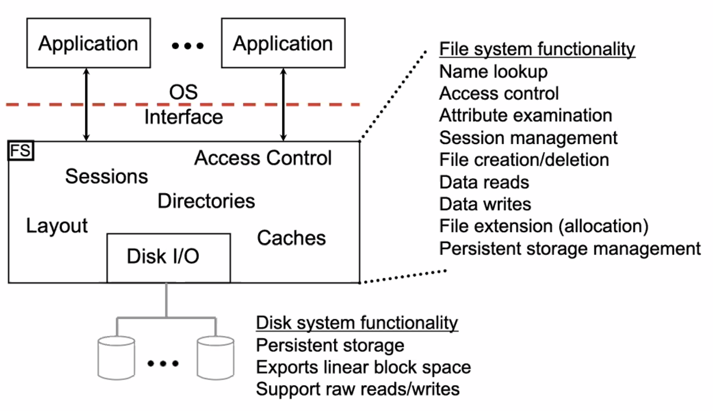
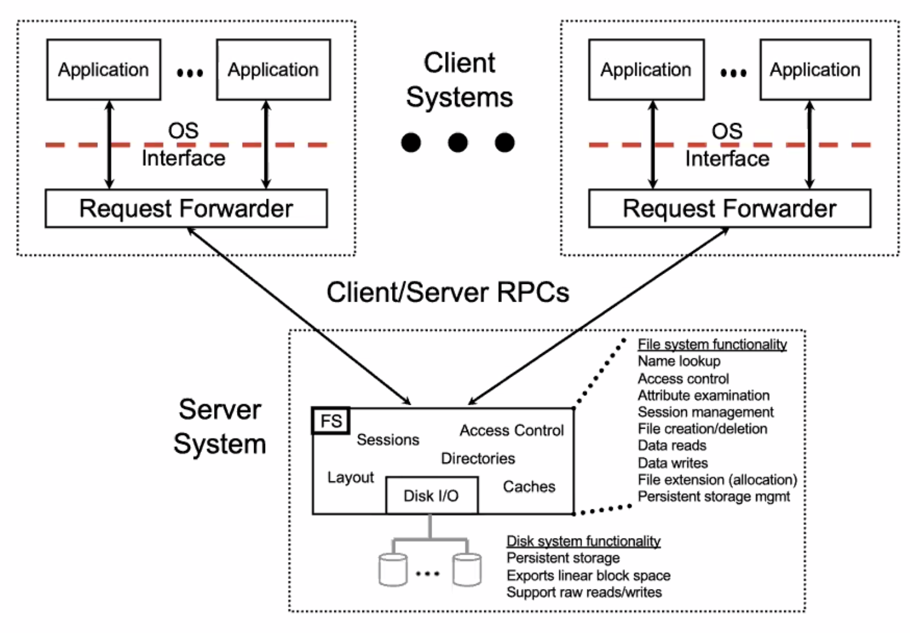

# Lecture 9 Distributed File Systems

## File System Functionality

* Functions
  * Translation between <name, offset> and <partition, sector>
  * Caching and persistence
  * Integrity rules for key data structures (directories, inodes)
  * Access control check
* **Functionality split** between FS & disk
  * Disk plays fairly limited role as a slave to central master (FS)
  * Also, for portability, FSs rely on very little from disks
* FS must provide service to many apps
  * but they all come to the one FS for everything FS-related

## Why Distributed File Systems

* Sharing
  * Share data among users and among computers
  * Long distance access
* Provisoning
  * Easy to redistribute storage between users
* Management
  * Backups easier when centralized
  * Overall reliablity higher (avoid single point of failure)
  * Disaster recovery
    * Mirror to remote sites
    * Erasure coding for efficiency

## Distributed File System Basics

* Have a separate **server** system providing base of FS
* Applications running on **client** machines use this base
  * May provide some amount of the overall FS functionality
* Key design decision: **how to partition FS functionality**
  * Performance scales better when clients do more
  * System is less complex when servers do more
  * Security is higher when servers do more
  * Semantics can be easier to work with when servers do more
  * Sharing of data easier when servers do more
  * Administration is easier if clients know/do less

### Approach #1:  Server Does Everything

* Pros: Simplicity
* Cons: Performance (Server and network can become bottlenecks)

### Remote Procedure Call

* Think of it like a procedure call
  * What the call is (read, write, create)
  * Provided parameters
  * A pointer to a buffer for bulk data transfer
    * and contents of the data buffer then get copied as needed
  * Implicit information provided by knowledge of session
    * like who it is and perhaps which file it is
* Needs effort from both client and server
* RPC things
  * Dealing with data representations
    * An explicit network representation for data
    * Anything both sides agree on is fine
  * Control information vs. data
    * Both may be sent on same connection or not
      * Separate channels allows important (control) to bypass big data
    * Data may be sent immediately or managed by server
      * Managed means credit-based flow control: client asks for permission; server replies with credits allowing client to send
* Managing namespace: mount/unmount
  * One can have many FSs on many devices
  * One must combine the FSs into one namespace

### Network File System (NFS)

#### NFS Mounting

* Mounting a remote file system
  * Allows clients to mount remote server disks
    * `mount -t nfs server:/user/local /user/local/xyz`
  * `mountd()`, the server's mount daemon, receives the requests
    * Checks the `/etc/exports` file to see if the requested disk has been exported and then permissions to see if the client has access
    * `/home/bassoon client:client2(r):client3`
  * Once the client has mounted the remote file system
    * Any client application can access the remote file as if it were local
    * VNODEs take care of differentiating between local and remote files
  * Server must still check UFS access rights on every NFS request
    * This means that the client and server must share user names (UID)
    * Hence directory services (NIS, LDAP, Active Directory)

#### Pathname Lookup

* When the client reaches an NFS mounted file system, NFS directory's VNODE lookup() operation will send lookup to server
  * Server will look it up in the directory
* This piece-meal lookup can take a long time
  * 1 RPC per directory
  * Important for the client to cache information whenever possible
  * Server won't know about client's other mount points
  * Having the client perform the individual lookups allows the client to manage/enforce UNIX semantics and deal with their own namespace

### Performance Tuning: Client-side Caches

* Mandatory in small-scale environments
* New problem: Cache coherance
  * having a consistent view across set of client caches
  * preserving atomicity of unix system call layer (err)
* Different models of consistency
  * Unix (Sprite): all reads see most recent write
  * NFSv3: other clients' writes visible in 30 sec (or close to open)
  * AFSvs: file session semantics
    * reads see version closed most recently before open (at session start)
  * Original HTTP: all reads see last read (no consistency, hit reload if you care about consistency)

### Approach #2: Sprite (Caching + Server Control)

* All reads see most recent write
* How?
  * Clients tell server when they open a file for read a write
    * client also asks for latest timestamp if previously cached
  * Server tells client whether cachaing of the file is allowed
    * any # of readers or a single writer; any other combo denied to all
  * Server also calls back to clients to disable caching as needed
    * doesn't work for mapped files (can't diable caching)
  * Client tells server whenever file is closed
* Who does what?
  * Client maintains most session info, like current offset
  * Server does almost all of FS activity
  * Client has cache, but so does server

### Approach #4: AFSv2 (Caching + Callbacks)

* All reads see opened version, which matches lastest close
* How?
  * Clients obtain full copy of file and callback from server
    * only when opening a file that is not currently cached with callback
    * AFSv3: no whole file semantics; use 64 KB chunks (huge file support)
  * Server promises to callback if the file changes
    * so client doesn't need to check again
  * Client writes back entire file (if changed) upon close
    * also keeps cached copy
  * Server revokes callbacks for the file from other clients
    * Forces file to be re-fetched by other clients to avoid stale data
    * Simple race on close for concurrent access semantics
* Who does what?
  * Client provides session and complete caching
  * Server does callbacks, directory magement, and additional caching

### Approach #3: NFSv3 (Stateless Caching)

* Other clients' writes visible within 30 seconds
  * Or the local open() after the other client's close()
* How?
  * Clients cache blocks and remember when last verified
  * Server promises nothing and remembers nothing
  * Clients check block freshness whenever older than 30 secs
  * Client used write-through caching (send to server immediately)
* Who does what?
  * Client provides session and caching
  * Server does everything an FS would do on a local system

### Stateless Server vs. Stateful Server

* Stateless servers
  * Simple
  * May be faster because of simplicity, though usually not
  * Quick to recover from crashes
    * Don't need to reconstruct client-related state
  * No problem with running out of state-tracking resources
* Stateful servers
  * May be faster because of long-lived connections
  * Can provide better semantics for users/programmers

