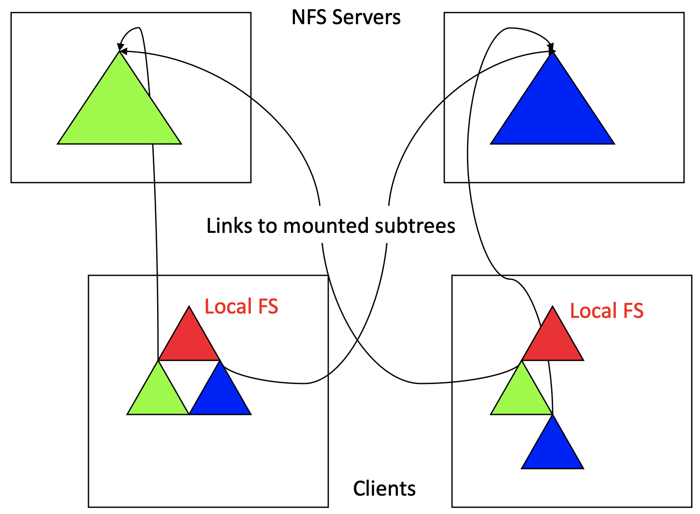
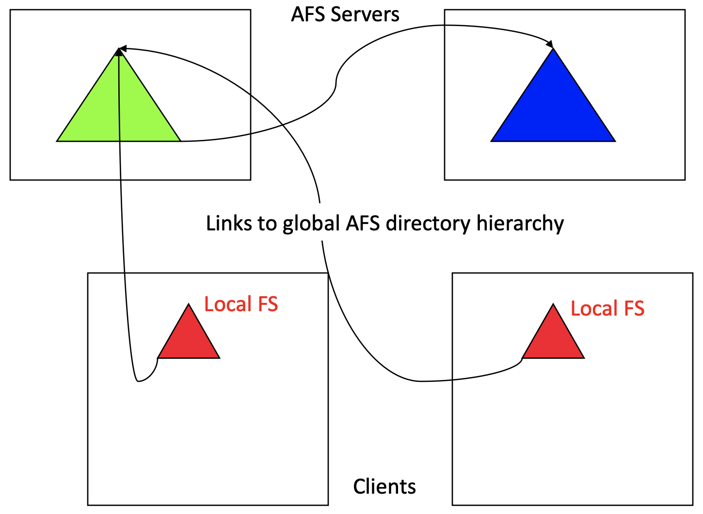
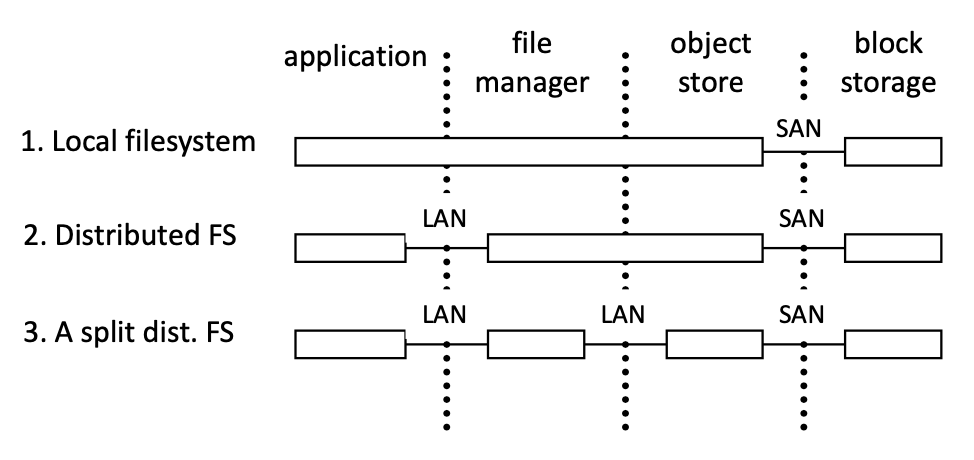
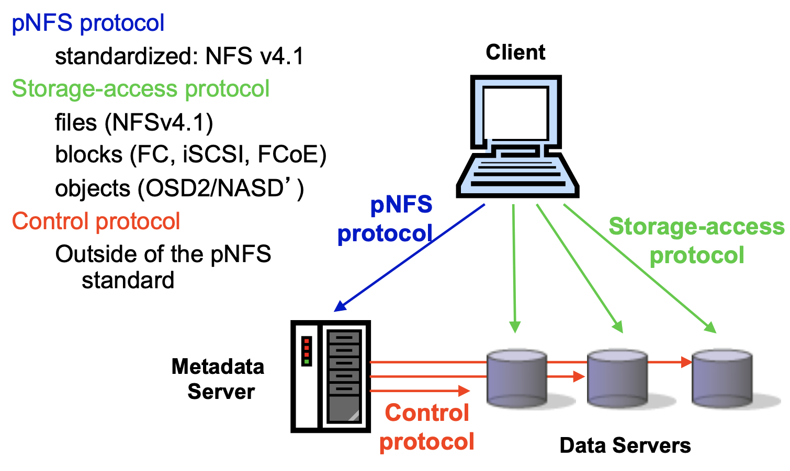

# Lecture 11 Multi-Server Storage

## Partition of Functionality Across Servers

* Two main approaches
  * Do the same thing on each server, but for different data
  * Do something different on each server, for some data
* Common issues
  * Finding the right server for a given task/datum
  * Balancing load across servers and avoiding bottlenecks
  * Avoiding excessive inter-server communication

### Approach #1: Same Function Different Data

* Naming and resource discovery
* **Load balancing**
  * Falls back on data distribution schemes
  * Manual data set placement
  * Striping or pseudo-random distribution

### Approach #2: Different Function Same Data

* Used for flexibility and bottleneck avoidance, rather than load distribution and fault tolerance
* Often combined with approach #1

#### pNFS & NASD

* **pNFS** standardizes Network Attached Secure Disks (**NASD**) concept
* Clients gets a layout from the NFSv4.1 server (aka "metadata server")
* The layout maps the file onto storage devices and addresses
* The client uses the layout to perform direct I/O to storage
* At any time the server can recall the layout
  * Must be done strictly, or may corrupt file system
* Client commits changes and returns the layout when it's done
* pNFS use is **optional**, client can always use regular NFS server I/O

## Aspects of Decentralized Services

### Concurrent Accesses

* Concurrent access to shared state
* Step #1: define consistency
  * Easy solution: every read sees most recent write
  * Generally, mutual exclusion required (e.g., critical section)
* Step #2: enforce concurrency model
  * Locks, semaphores, monitors
  * Failures, re-ordered messages
* One option: do updates at a central point
  * file server or coordination server
* Second option: support locks
  * client obtains lock from server, does scan/update, release it, works with leases
* Third option: cross fingers
* Fourth option: cross fingers and deal with conflicts
  * Send pre-update version to server with update
  * Server says sorry, try again if pre-update version was out of date
  * Called optimistic concurrency model

### Leases

* If the client dies with a lock, it means that lock is never freed, causing deadlock
* If the server dies having granted a lock, it means server doesn't know what has been granted
* Solution: leases
  * Locks granted for only a specified amount of time
  * Clients have to keep coming back to refresh lease
  * Dead client's lock simply expires after specified time
  * Reborn server can simply wait maximum expire time

### Optimistic Concurrency Control

* Assume no conflicts and verify before committing changes
  * As opposed to pessimistic schemes that lock before touching
* Works well in large systems that have few conflicts
* Problem: livelock
  * Sequences that fail the verify step get rolled back
  * When conflicting concurrency is frequent, it is possible to work hard and make no forward progress
  * One solution is to fall back on locking when this happens

	### Idempotent Requests

* In stateless servers, it is possible that a request is completed, but the client is not notified
* The client will retry (retransmit) the request after the server recovers
* Servers should make specific guarantees about which operations are idempotent
  * Read is an idempotent request
  * Remove is usually not an idempotent request

### Coordination and Scaling

* A major issue in function partitioning is making sure that the servers are not too interdependent
  * otherwise, they scale very poorly, and may fail together
  * e.g., NFS servers are completely independent
  * not always possible: data consistency is needed when replicating data
* Updates and consensus
  * when there is inter-dependence, the servers must agree on the related state
    * e.g., replication, parity, metadata
    * very tough, because want to maintain autonomy and performance
  * Distributed consensus dilemamas:
    * concurrency control
    * failure of servers

### Distribute Consensus for Replicas

* Option #1: primary and secondary servers
  * For any piece of data, there is a primary server
  * Updates and reads go to primary, which syncs secondary
* Option #2: voting among servers
  * Updates and reads go to quorum of servers
    * Read quorum and write quorum chosen to overlap
    * For any read, majority rules
* Option #3: 2-phase commit (for atomicity)
  * Intention to update is sent to all servers
    * Log intention before responding
  * Done message is sent to all servers after all respond
  * Reads may be able to go to any one up-to-date server