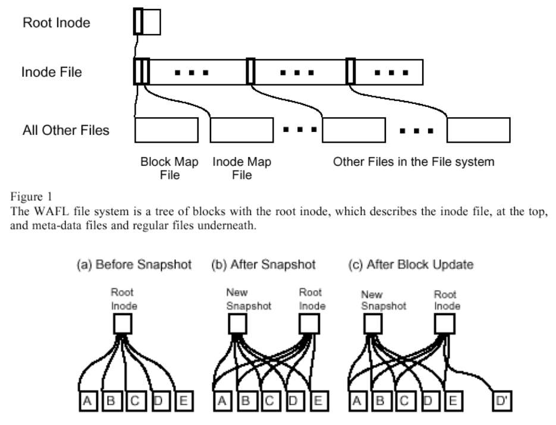
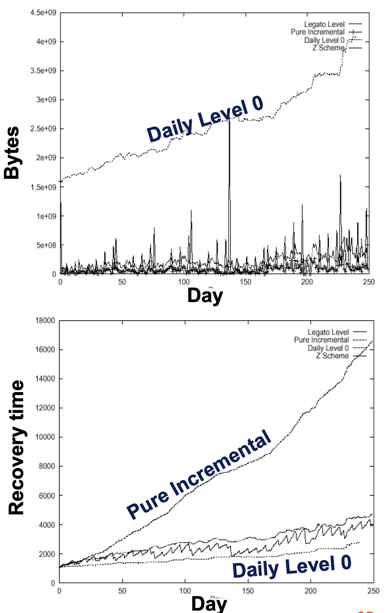

# Lecture 14 Data Protection

## Purpose of Data Protection

* Protection from user mistakes (fat-fingering)
  * Solution: find and restore a historical version
* Protection from device failures
  * Solution: cross-device redundancy, restoring from backup
* Protection from site failures
  * Solution: redundancy off-site (online or offline)
* Data archiving
  * Long-term data retention, often offline
  * Solution: mechanism for saving, protecting, later reading

## Data Backups

* Periodic copies of entire file system, database, etc
  * Time-consuming: slow to perform, slower to restore
  * Costly: requires management and storage space
* Backups are a good data protection plan
  * Can be used to recover files after user mistakes
    * Often handled by online backups or snapshots
    * e.g., OldFiles directory in AFS
  * Can be used to recover system state after corruption
    * e.g., disk crashes, OS flake-outs, hacks
  * Long-term archiving of data
    * e.g., customer legal records, patient medical records

## Picking Backup Storage Medium

### Tape

#### Tape Characteristics

* Bandwidth: how fast can you read/write
  * Faster with compression (LTO-8: 360 vs. 900MB/s)
* Capacity: how much data can you fit
  * Higher with compression (LTO-8: 12 vs. 30TB)
* Time-to-data: latency to get to data
  * Several secs of rewinding (LTO-8: 11s from EOT, ~1km)
* Media lifetime
  * Workload: can read/write entire tape 10,000s times
  * Bit error rate (BER): 1 error event in 1.25EB (LTO-8)
* Cost: $ per byte stored and accessed
  * Storage: $1/GB without compression (2-3x cheaper than HDD)
  * Access: power only tapes you access (vs. online disks)

#### Tape Performance

* Some tapes require you to start at the beginning
  * Cartridges have only 1 reel, and must be rewound
* Some tapes have "landing zones" throughout
  * Cassettes have 2 reels, wind to zone
* Most tapes have a directory to help expedite seeks
  * Option 1: stored at the begining of tape or on special directory tracks
  * Option 2: stored in NVRAM in tape container
  * Goal: enable high-speed seeks to relative position on tape
* Positioning: position tape before data prior to accessing
* Streaming: must stream at specific speed to read/write
* Buffering: system must supply tape drive bandwidth
* Newest drives dynamically scale down data density
  * Allows constant head speed when buffer is draining (no stop-start)
  * Implication: less data is stored more slowly
* Problem: need to deal with removable media
  * Considerably longer access times than fixed-media
  * Solution: automatic tape retrieval (takes seconds)
    * Tape libraries and silos hold 100s to 10000s of tapes

#### Software Tools for Managing Tape

* In UNIX, tapes appear as a block device
* Special software to read/write tapes
  * `tar` combines lots of files/directories into a single byte stream
  * `dd` is a tool that copies bytes from any input to any output
* Also need special commands to position the tape
  * `mt` command for magnetic tape management

#### Issues with Tape Storage

* Security issues
  * Problem 1: moving tapes off-site as disaster protection
    * But hard to beat bandwidth of a truck driving down the road
  * Problem 2: deleting files from an off-site backup
    * Solution: encrypt files with different keys, lose key to delete file
    * Challenge: avoiding losing keys by accident
* Reliability issues
  * Problem: endurance
    * Tapes eventually lose their data (15-30years)
    * Environmental conditions as storage sites can affect lifetime

### Alternative: Disk-based Backup

* Most big storage companies selling it now
* On-line storage: faster restores
* Management ease: friendlier interface compared to tape
* Longer media lifetime: overall benefit untested
* Reduced power: turn off disks when data is not accessed
* Deduplication: detect duplicates at source or at destination
* Faster restores: just mount "snapshot" as NFS volume

## Anatomy of Modern Backup Systems

* Multi-tiered domains
  * Clients: transmit backup data
  * Master server: job scheduling, backup image metadata
  * Storage servers: backup storage media management
* Backup schedules specify when to backup different clients
* Backup policies specify how to backup different applications

### Physical vs. Logical Backups

* Physical backups are performed at the block level
  * Idea: copy every LBN on a partition/disk
* Logical backups are performed at the file system level
  * Idea: interpret file system information and copy individual files
* Which is better?
  * Need to capture data hidden from file system (e.g., boot block)
  * Need to reduce CPU utilization
    * File system code paths can be expensive
  * Need to guarantee consistency at the file level
    * Physical backups can't tell blocks apart
  * Need to backup an encrypted volume
  * Need to conserve backup storage cost or network bandwidth
    * Physical backups can't avoid empty/uninteresting blocks

### Consistent Point-in-time Backups

* Problem: what if the file system changes during a backup?
  * Logical backup example: file `/b/foo` is renamed  to `/a/foo`
    * Directory `/a` is backed up, rename happens, directory `/b` is backed up
  * Physical backup example: large file `foo` is updated
    * Backup saves inode with indirect block pointing to de-allocated block
    * Backup saves data block after it is re-allocated and used elsewhere
  * Basically: lots of really bad scenarios for physical backup
    * Happens when you don't have semantic information on data
* How can we take a consistent backup?
  * Option 1: ensure the file system does not change during a backup
  * Option 2: take a snapshot of the file system, and back that up

### Snapshots

* Copy-on-write versions of a file system
* Basic idea: avoid in-place updates
  * Write to alternate location, then replace previous location
  * Never overwrite live data in place; instead remap identity
  * Deprecated versions of data blocks must be garbage collected
  * Note: shadow paging can support transactions, too

## Backup Performance

### Too Much Data to Backup

* How do you backup a Petabyte?
  * 2^50 bytes / 100 MB/s = 124 days (4 months)
  * Parallelism: if we  throw 1000 tapes drives at the problem = 3 hours
  * But each tape drive costs \$3,000: 1,000 cost \$3M!

### Incremental Backup

* You do not always have to backup an entire file system
  * Many files are shared across users
  * Many files change infrequently (or only in part)
* `dump` supports the notion of an incremental backup
  * Basic idea: backup only files that changed since the last backup
  * `dump` also support different levels
  * Backup all files that have changed since last dump at the same level or below
  * e.g., `Monday thru Saturday = incremental since last Sunday, Sunday = incremental since last full backup`
* Incremental backup significantly reduces backup sizes
  * But may require multiple tapes to reconstruct a file system after a crash
  * Restore the last full backup, apply all incrementals since then

### Backup Performance

* Level scheme
  * Incremental at different dump levels
* Reality today: Full backups + deduplication

## Diaster Recovery

* Diaster - Anything that stops your computing

### Protecting the Infrastruture

* For years, backup was the most common method
* Different levels of replacement plan
  * cold backup site - empty site reserved in case of disaster
  * hot backup site - site which already contains all of the necessary equipment

### Remote Mirroring

* Mirror all data on multiple sites
* Issues
  * Synchronous vs. Asynchronous (slow/perfect vs. fast/imperfect)
  * Distance
  * Support for network partitions
  * Network
* Implementation
  * Snapshot mirroring - takes a snapshot of the current disk and mirrors it to another drive
  * Snapshots can and do fall out-of-sync
  * Allows one to duplicate their data at a point in time for backup/testing new systems/analytics

### Remote Data Centers

* If network costs continue to drop, can we store all of our data remotely?
  * only use local disks as a cache
  * remote site is responsible for managing your data (backup, mirroring, security)
  * storage management costs are shared among multiple customers