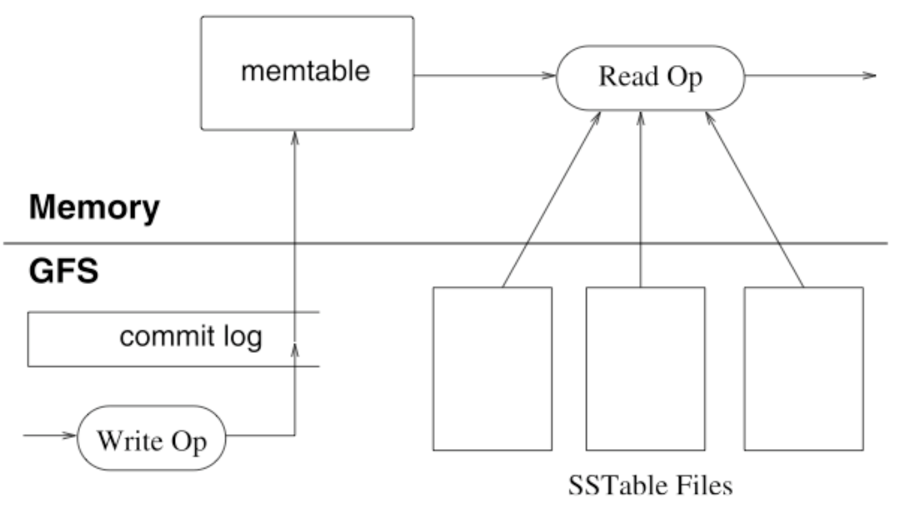

# Lecture 15 Scalable Table Stores (the BigTable example)

## BigTable

* An Internet service database
  * From-scratch purpose-built database
  * Limited transactions (row only)
  * Not SQL, not full relational operators
  * Designed more for MapReduce
  * Emphasis on scalability (membership and load balancing)
  * Lots of non-overwrite
  * Some bounds on size for memory/tree depth

### Data Model

* A table is a sparse, distributed, persistent multidimensional sorted map
  * Sorted & sparse -> range queries (B-trees)
  * Persistent means durable (redo log)
    * Disk pages of DB stored in SSTables (sorted string tables) with index at end
* Data is organized into three dimensions: rows, columns, and timestamps
  * (row: string, column: string, time: int64) - string
  * Leaves of indices (tablets, <= 1GB) contain cells of appropriate row range

#### Rows & Columns

* One primary key (row) & range queries
* An index for each column family
  * Group data in column families for compaction/seeks

### API

* Not SQL
* Atomic row writes (No begin/end/abort)
* Iterator reading
  * Search and filter
  * User defined filters

### Transactions

* Atomic accesses to 1 row (in all columns)
* Single row operations are serializable
  * Isolation for concurrent operations
* Programmer sorts out consistency for concurrent changes involving multiple rows
* Durability with redo logs (no-aborts to need undo)

### System Components

* Client library - API
* Tablet servers - manages set of tablets
  * It doesn't store tablets, but on GFSs
* Tablet - a row range within a table
* Master server - assign tablets to tablet servers
* Chubby lock service - used in server and tablet location discovery

### Durability

* No-force policy
  * On commit, complete row (copy-on-write) written to redo log (using group commit for throughput)
* Database per tablet on disk stored as SSTables
  * Metadata tablets list SSTables and redo log pointers
  * Read merges memtable, SSTTables (limit with bloom filter)
  * When full memtable converted into SSTable (need cleaning)
  * Periodic compaction of SSTables limits merging and cleaning

### Indices

* Table use 3 level B-tree
  * Large size of nodes ensures max table size is very big (128MB tablets -> 2^44 PBs)
  * Tablet contains all cells within row range (but may be split into distinct storage by column families)
* Metadata tablets index by table ID and end row
  * Clients cache locations optimistically, possibly retrying up the tree, for scalability
  * Metadata is held in memory (size limitations)

## BigTable2: Spanner

* Stronger semantics for programmers
  * Hierarchical directories instead of rows
  * Support distributed transactions
  * Add strong consistency across data centers
    * Paxos (quorum consensus voting across replicas)
    * Integrated transactions, paxos and network time
  * User specified latency, replication and location
* More automation
  * Auto movement of data
  * Selection of replication level for performance