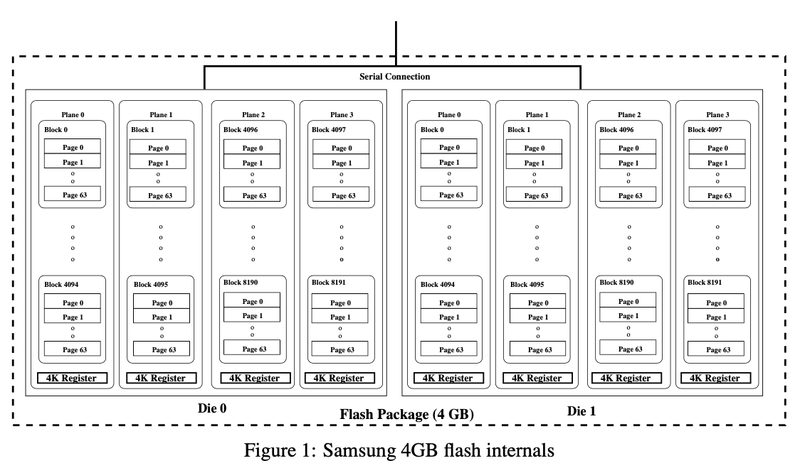
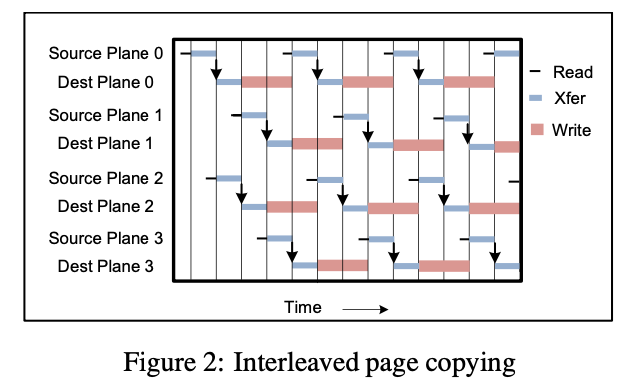
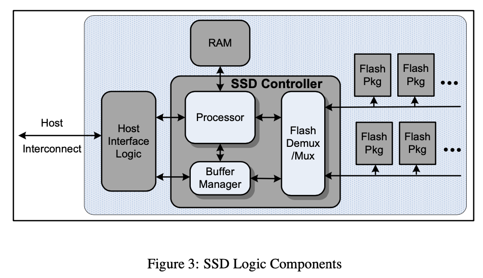
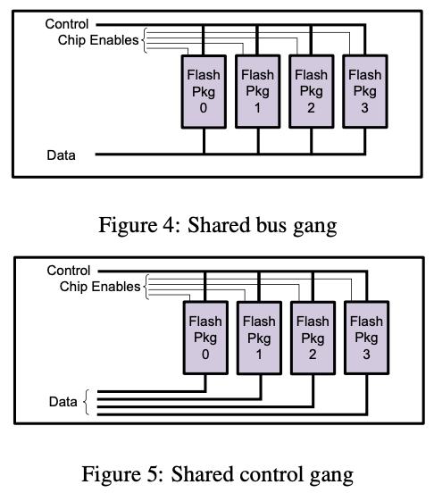

# Design Tradeoffs for SSD Performance

## Flash Memory

* **Flash memory** is an electronic non-volatile computer memory storage medium that can be electrically erased and reprogrammed
* Two main types: **NAND** (Not-And) and **NOR** (Not-Or) logic gates
* **Floating-gate** memory
* Based on **EEPROM** (electrically erasable programmable read-only memory)
* NAND-type flash memory can be erased, written, and read in blocks (or pages)
* NOR-type flash allows a single machine word (byte) to be written to an erased location or read independently
* A flash memory device consists of one or **more** memory chips (aka dies, each holding many flash memory **cells**)
* Comparing to non-flash EEPROM with slow erase cycles, flash memory has significant speed advantage when writing large amounts of data due to **larger block size**

## Background

### Flash Packages

* 4GB Flash Package
  * two 2GB dies
  * sharing an 8-bit serial I/O bus and a number of common control signals
  * each die contains 8192 blocks, organized among 4 planes of 2048 blocks
  * the dies can opearte independently, each performing operations involving one or two planes (0 & 1 or 2 & 3)
  * each block in turn consists of 64 4KB pages
  * each page includes a 128 byte region to store metadata

### Bandwidth and Interleaving

* The serial interface over which flash packages receive commands and transmit data is a primary bottleneck for SSD performance
* Interleaving the serial transfer time and the program operation doubles the overall bandwidth
* Interleaving can provide considerable speedups when the operation latency is greater than the serial access latency
* Operations on the same flash plane cannot be interleaved

## SSD Basics

* All NAND-based SSDs are constructed from an array of flash packages
* Each SSD must contain a **host interface logic** to support some form of physical host interface connection (USB, FiberChannel, PCI Express, SATA) and logical disk emulation
* The **bandwidth of the host interconnect** is often a critical constraint on the performance of the device as a whole
* An internal **buffer manager** holds pending and satisfied requests along the primary data path
* A **multiplexer** (Flash Demux/Mux) emits commands and handles transport of data along the serial connection to flash packages
* A processing engine is also required to manage the request flow and **mappings** from disk logical block address to physical flash location
* The processor, buffer manager, and multiplexer are typically implemented in **a discrete component** such as an ASIC or FPGA, and data flow between these logic elements is very fast
* The processor, and its associated RAM, may be **integrated**, as is the case for simple USD flash-stick devices

### Logical Block Map

* To achieve acceptable performance, writes must be performed **sequentially** whenever possible
* Each write of a single **logical-disk block address** (LBA) corresponds to a write of a different flash page, even the simplest SSD must maintain some **mapping** between logical block address and physical flash location
* We assume that the logical block map is head in **volatile** memory and **reconstructed** from stable storage at startup time

#### Allocation Pool

* **Static map**
  * A portion of each LBA constitues a fixed mapping to a specific allocation pool
* **Dynamic map**
  * The non-static portion of a LBA is the lookup key for a mapping within a pool
* **Logical page size**
  * The size for the referent of a mapping entry **varies**
* **Page span**
  * A logical page might span related pages on different flash packages thus creating the potential for accessing sections of the page in parallel

#### Constraints

* **Load balancing**
  * **I/O operations** should be evenly balanced between allocation pools
* **Parallel access**
  * The assignment of LBAs to physical addresses should interfere as **little** as possible with the ability to access those LBAs in parallel
* **Block erasure**
  * Flash pages cannot be re-written without first being erased
  * Only fixed-size blocks of contiguous pages can be erased
* RAID systems stripe logically contiguous chunks of data to distribute load and to arrange that consecutive pages will be placed on different packages that can be accessed in parallel

### Cleaning

* At any given time, a pool can have one or more **active blocks** to hold incoming writes
* We need a **garbage collector** to enumerate previously used blocks that **must be** erased and recycled
* Cleaning can be summarized as follows
  * When a page write is complete, the previously mapped page location is **superseded** since its contents are now out-of-date
  * When recycling a candidate block, all non-superseded pages in the candidate **must** be written elsewhere prior to erasure
* **Cleaning efficiency** is the ratio of superseded pages to total pages during block cleaning
* Using **striping** to enhance parallel access for sequential addresses works **against** the clustering of superseded pages
* For each allocation pool, we maintain a **free block list** that we populate with recycled blocks
* There **must** be enough spare blocks to allow writes and cleaning to proceed, and to allow for block replacement if a block fails
* An SSD can be substantially **overprovisioned** with spare capacity in order to reduce the demand for cleaning blocks in foreground
* If an active block and cleaning state per plane is maintained, then cleaning operations within the same plane can be arranged with high probability

### Parallelism and Interconnect Density

* Handle I/O requests on multiple flash packages in parallel
* Make use of the addtional serial connections to their pins
* **Parallel requests**
  * Each flash package is an independent entity and can therefore accept a separate flow of requests
  * Maintain a queue per element
* **Ganging**
  * A gang of flash packages can be utilized in synchrony to optimize a multi-page request
  * Allow multiple packages to be used in parallel without the complexity of multiple queues
* **Interleaving**
  * Interleaving can be used to improve the bandwidth and hide the latency of costly operations
* **Background cleaning**
  * Cleaning would be performed continuously in the background on otherwise idle components
  * The use of operations that don't require data to cross the serial interface, such as internal copy-back, can help hide the cost of cleaning

* The situation becomes more interesting when full connectivity to the flash packages is not possible
  * Two choices for organizing a gang of flash packages
  * the packages are connected to a serial bus where a controller dynamically selects the target of each command
  * each package has separate data path to the controller, but the control pins are connected in a single broadcast bus
* Interleaving can play a role within a gang
* Intra-plane copy-back can be used to implement block cleaning in background
* Cleaning can take place with lower latency if pages are streamed at maximum speed between two chips
  * This benefit comes at the expense of **occupying** two sets of controller pins

### Persistence

* Flash memory is by definition **persistent storage**
* To recover SSD state, it is essential to **rebuild** the logical block map and all related data structures
* The recovery must also reconstruct knowledge of **failed blocks** so that they are not re-introduced into active use
* Dedicated area (128 bytes) of metadata can be used to store the logical block address that maps to a given flash page
* **Error detection and correction** must be provided by application firmware, but not flash parts
  * The page metadata can hold an error-detection code to determine which pages are valid and which blocks are failure-free, and an error-correction code to recover from the single-bit errors that are expected with NAND flash
* The problem of recovering SSD state can be bypassed by holding the logical block map in **Phase-Change RAM** or Magnetoresistive RAM
  * These non-volatile memories are writable at byte granularity and don't have the block-erasure constraints of NAND flash
  * Backup power might be enough to flush teh necessary recovery state to flash on demand

### Industry Trends

* **Consumer portable storage**
  * Inexpensive units with one or two packages and a simple controller
* **Laptop disk replacements**
  * Provide substantial bandwidth to SATA disks they replace
  * Random read performance is far superior, while random write is comparable to that of rotating media
* **Enterprise/database accelerators**
  * Very fast sequential performance, random read performance superior to that of a high-end RAID array, and very strong random write performance

## Design Details and Evaluation

| Technique             | Positives        | Negatives           |
| --------------------- | ---------------- | ------------------- |
| Large allocation pool | Load balancing   | Few intra-chips     |
| Large page size       | Small page table | Read-modify-writes  |
| Overprovisioning      | Less cleaning    | Reduced capacity    |
| Ganging               | Sparser wiring   | Reduced parallelism |
| Striping              | Concurrency      | Loss of locality    |

## Wear-leveling

* Objective is to design a block management algorithm so as to **delay** the expiry time of any single block
* Track the average lifetime remaining over all blocks
  * The remaining lifetime of any block should be within **ageVariance** of the average remaining lifetime
  * Maintain some notion of **block erase count** in persistent storage
  * Instead of freezing the recycling of worn out blocks, we can rate-limit their usage
    * Use **Random Early Discard** in which the probability of recycling drops linearly from 1 to 0 as a blocks' remaining lifetime drops from say 80% to 0% of the average
  * Migrate cold data into old blocks
* One method to identify cold data is to look for blocks that have exceeded specified parameters for remaining lifetime and time since last erasure
  * It is important that temperature metadata travel with the content as it is moved to a new physical block
  * Cleaning can group pages of different temperatures in the same block
  * The resultant block temperature needs to reflect that of the aggregate
* **Modified Algorithm**:
  * If the remaining lifetime in the chosen block is below **retirementAge** of the average remaining lifetime then migrate cold data into this block from a migration-candidate queue, and recycle the head block of the queue
  * Populate the queue with blocks exceeding parametric thresholds for remaining lifetime and duration, or alternatively, choose migration candidates by tracking content temperature
  * Otherwise, if the remaining lifetime in the chosen is below **ageVariance**, then restrict recycling of the block with a probability that increases linearly as the remaining lifetime drops to 0
* Cleaning load can be reduced if an SSD has knowledge of **content volatility**
* Localization of warm data will lead to better cleaning efficiency