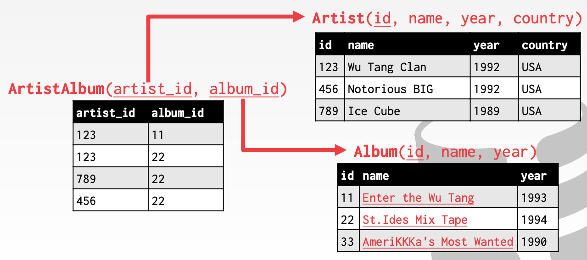

# Lecture 01 Course Intro & Relational Model

## Databases

* Organized collection o inter-related data that models some aspect of the real-world
* Databases are core the component ofr most computer applications
* Examples
  * Create a database that models a digital music store to keep track of artists and albums
  * Store our database as comma-separated value (CSV) files that we manage in our own code
* Problems
  * Data integrity
  * Implementation
  * Durability

## Database Management System

* A **DBMS** is software that allows applications to store and analyze information in a database
* A general-purpose DBMS is designed to allow the definition, creation, querying, update, and administration of databases
* Relational model is proposed in 1970 by Ted Codd

### Data Model

* A **data model** is collection of concepts for describing the data in a database
  * Relational -> Most DBMSs
  * Key/Value, Graph, Document, Column-family -> NoSQL
  * Array/Matrix -> Machine Learning
  * Hierarchical, Network -> Obsolete / Rare
* A **schema** is a description of a particular collection of data, using a given data model

### Relational Model

* **Structure**: The definition of relations and their contents
* **Integrity**: Ensure the database's contents satisfy constraints
* **Manipulation**: How to access and modfy a database's contents
* A **relation** is unordered set that contain the relationship of attributes that represent entities
* A **tuple** is a set of attribute values (also known as its **domain**) in the relation
  * Values are normally atomic/scalar
  * The special value NULL is a member of every domain
* N-ary relation = Table with n columns
* A relation's **primary key** uniquely identifies a single tuple
  * Some DBMSs automatically create an internal primary key if you don't define one
  * Auto-generation of unique integer primary keys: `AUTO_INCREMENT` (MySQL)
* A **foreign key** specifies that an attribute from one relation has to map to a tuple in another relation

## Data Manipulation Languages (DML)

* How to store and retrieve information from a database
  * Procedural: The query specifies the high-level strategy the DBMS should use to find the desired result (**Relational Algebra**)
  * Non-procedural: The query specifies only what data is wanted and not how to find it (**Relational Calculus**)

### Relational Algebra

* **Select**
  * Choose a subset of the tuples from a relation that satisfies a selection predicate
  * **Predicate** acts as a filter to retain only tuples that fulfill its qualifying requirement
  * Can combine multiple predicates using conjunctions / disjunctions
  * Syntax: $\sigma_{predicate}(R)$
* **Projection**
  * Generate a relation with tuples that contains only the specified attributes
    * Can rearrange attributes' ordering
    * Can manipulate the values
  * Syntax: $\Pi_{A_1,A_2,\cdots,A_n}(R)$
* **Union**
  * Generate a relation that contains all tuples that appear in either only one or both input relations
  * Syntax: $(R \cup S)$
* **Intersection**
  * Generate a relation that contains only the tuples that appear in both of the input relations
  * Syntax: $(R \cap S)$
* **Difference**
  * Generate a relation that contains only the tuples that appear in the first and not the second of the input relations
  * Syntax: $(R - S)$
* **Product**
  * Generate a relation that contains all possible combinations of tuples from the input relations
  * Syntax: $(R \times S)$
* **Join**
  * Generate a relation that contains all tuples that are a combination of two tuples (one from each input relation) with a common value(s) for one or more attributes
* Extra Operators
  * Rename, Assignment, Duplicate Elimination, Aggregation, Sorting, Division

### Queries

* The relational model is independent of any query language implementation
* **SQL** is de facto standard
