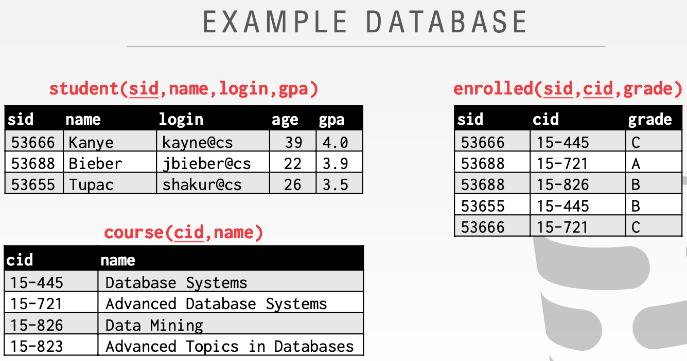
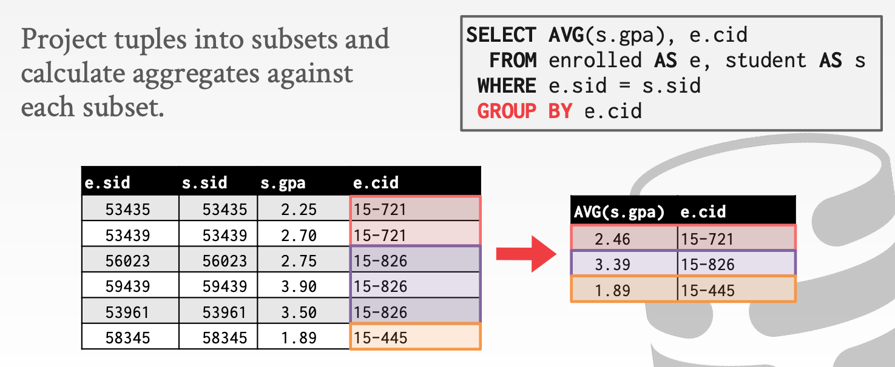
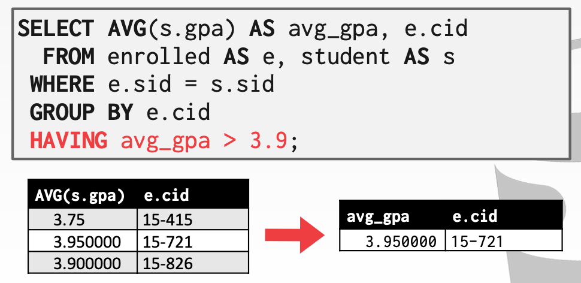
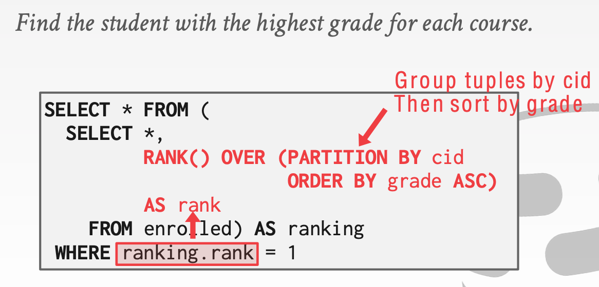
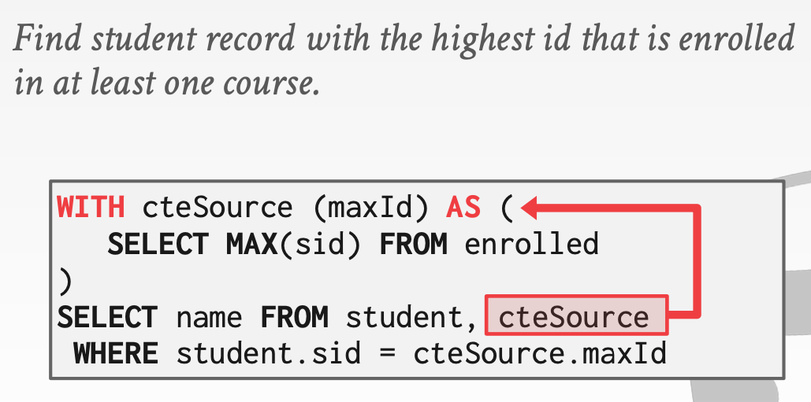

# Lecture 02 Advanced SQL

## Relational Languages

* User only needs to specify the answer that they want, not how to compute it
* The DBMS is responsible for efficient evaluation of the query
  * Query optimizer: re-orders operations and generates query plan
* Data Manipulation Language (DML)
* Data Definition Language (DDL)
* Data Control Language (DCL)
* Important: SQL is based on **bags** (duplicates) not **sets** (no duplicates)

### Aggregates

* Functions that return a single value from a bag of tuples:
  * `AVG(col)` -> Return the average col value
  * `MIN(col)` -> Return minimum col value
  * `MAX(col)` -> Return maximum col value
  * `SUM(col)` -> Return sum of values in col
  * `COUNT(col)` -> Return # of values for col
  * Aggregate functions can only be used in the `SELECT` output list
  * Example: Get # of students with a "@cs" login:
    * `SELECT COUNT(login) AS cnt FROM student WHERE login LIKE '%@cs'`
  * Example: Get # of students and their average GPA that have a "@cs" login
    * `SELECT AVG(gpa), COUNT(sid) FROM student WHERE login LIKE '%@cs'`
  * `COUNT`, `SUM`, `AVG` support `DISTINCT`
  * Output of other columns outside of an aggregate is undefined

### Group By

* Project tuples into subsets and calculate aggregates against each subset
* Non-aggregated values in `SELECT` output clause must appear in `GROUP BY` clause

### Having

* Filters results based on aggregation computation
* Like a `WHERE` clause for a `GROUP BY`

### String Operations

|          | String Case | String Quotes |
| -------- | ----------- | ------------- |
| SQL-92   | Sensitive   | Single Only   |
| Postgres | Sensitive   | Single Only   |
| MySQL    | Insensitive | Single/Double |
| SQLite   | Sensitive   | Single Only   |
| DB2      | Sensitive   | Single Only   |
| Oracle   | Sensitive   | Single Only   |

* `LIKE` is used for string matching
  * `%` -> Matches any substring (including empty strings)
  * `_` -> Matches any one character
* SQL standard says to use `||` operator to concatenate two or more strings together

### Date/Time Operations

* Can be used in either output and predicates
* Support/syntax varies wildly

### Output Redirection

* Store query results in another table
  * Table must not already be defined
  * Table will have the same # of columns with the same types as the input
  * MySQL: `CREATE TABLE CourseIds (SELECT DISTINCT cid FROM enrolled)`
* Insert tuples from query into another table
  * Inner `SELECT` must generate the same columns as the target table
  * DBMSs have different options/syntax on what to do with duplicates
  * SQL-92: `INSERT INTO CourseIds (SELECT DISTINCT cid FROM enrolled)`

### Output Control

* `ORDER BY <column*> [ASC|DESC]`
  * Order the output tuples by the values in one or more of their columns
  * `SELECT sid FROM enrolled WHERE cid = '15-721' ORDER BY grade DESC, sid ASC`
* `LIMIT <count> [offset]`
  * Limit the # of tuples returned in output
  * Can set an offset to return a range
  * `SELECT sid, name FROM student WHERE login LIKE '%@cs' LIMIT 20 OFFSET 10`

### Nested Queries

* Queries containing other queries
* Inner queries can appear almost anywhere in query
* `SELECT name FROM student WHERE sid IN (SELECT sid FROM enrolled)`
* `ALL` -> Must satisfy expression for all rows in sub-query
  * `SELECT sid, name FROM student WHERE sid => ALL(SELECT sid FROM enrolled)`
* `ANY` -> Must satisfy expression for at least one row in sub-query
  * `SELECT name FROM student WHERE sid = ANY(SELECT sid FROM enrolled WHERE cid = '15-445')`
* `IN` -> Equivalent to `=ANY()`
  * `SELECT sid, name FROM student WHERE sid IN (SELECT MAX(sid) FROM enrolled)`
* `EXISTS` -> At least one row is returned
  * `SELECT * FROM course WHERE NOT EXISTS(SELECT * FROM enrolled WHERE course.cid = enrolled.cid)`

### Window Functions

* Performs a sliding calculation across a set of tuples that are related
* Like an aggregation but tuples are not grouped into a single output tuples
* `SELECT ... FUNC-NAME(...) OVER(...) FROM tableName`
* `FUNC-NAME` can be aggregation functions or special functions
* Special window functions:
  * `ROW_NUMBER()` -> # of the current row
  * `RANK()` -> Order position of the current row
* The `OVER` keyword specifies how to group together tuples when computing the window function
* Use `PARTITION BY` to specify group

### Common Table Expressions

* Provides a way to write auxiliary statements for use in a larger query
  * Think of it like a temp table just for one query
* Alternative to nested queries and views
* `WITH cteName AS (SELECT 1) SELECT * FROM cteName`
* You can bind output columns to names before the `AS` keyword

