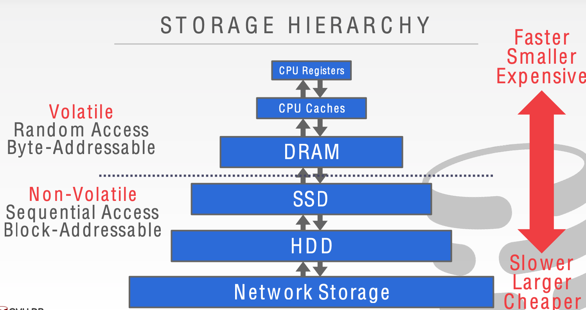
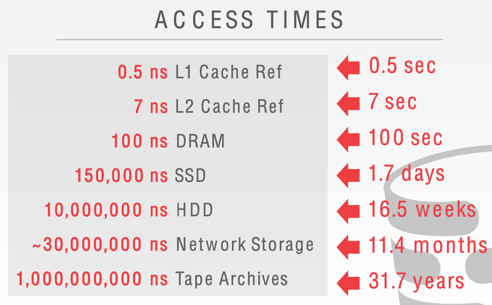
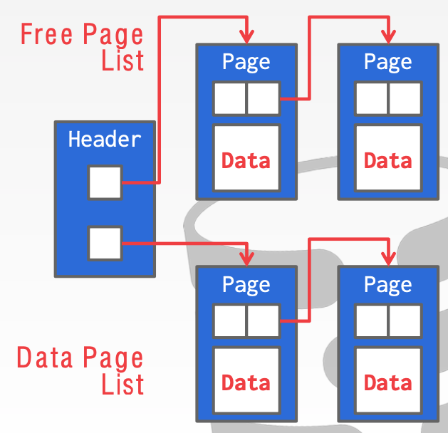
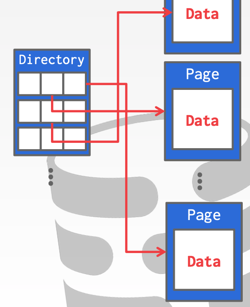
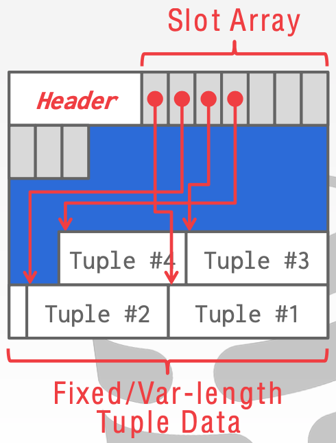
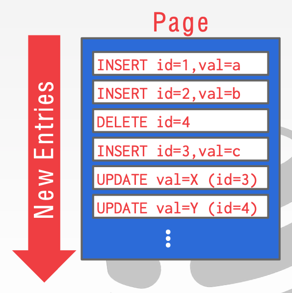

# Lecture 03 Database Storage - Part I

## Disk-Oriented Architecture

* The DBMS assumes that the primary storage location of the database is non-volatile disk
* The DBMS's components manage the movement of data between non-volatile and volatile storage

### Storage Hierarchy

### Access Times

### System Design Goals

* Allow the DBMS to manage databases that exceed the amount of memory available
* Reading/writing to disk is expensive, so it must be managed carefully to avoid large stalls and performance degradation
* Why not use the OS?
  * One can use memory mapping (`mmap`) to store the contents of a file into a process's address space
  * The OS is responsible for moving data and the files' pages in and out of memory
  * `madvise`: Tell the OS how you expect to read certain pages
  * `mlock`: Tell the OS that memory ranges cannot be paged out
  * `msync`: Tell the OS to flush memory ranges out to disk
* DBMS (almost) always wants to control things itself and can do a better job at it
  * Flushing dirty pages to disk in the correct order
  * Specialized prefetching
  * Buffer replacement policy
  * Thread/process scheduling
* **How the DBMS represents the database in files on disk?**

## File Storage

* The DBMS stores a database as one or more files on disk
* The **storage manager** is responsible for maintaining a database's files
  * Some do their own scheduling for reads and writes to improve spatial and temporal locality of pages
  * It organizes the files as a collection of **pages**
    * Tracks data read/written to pages
    * Tracks the available space

## Database Pages

* A **page** is a fixed-size block of data
  * It can contain tuples, meta-data, indexes, log records
  * Most systems do not mix page types
  * Some systems require a page to be self-contained
* Each page is given a unique identifier
  * The DBMS uses an indirection layer to map page ids to physical locations
* There are three different notions of pages in a DBMS:
  * Hardware Page (usually 4KB)
  * OS Page (usually 4KB)
  * Database Page (512B-16KB)
    * 4KB: SQLite, IBM DB2, ORACLE
    * 8KB: SQL Server, PostgreSQL
    * 16KB: MySQL
* Page Storage Architecture
  * Heap File Organization
  * Sequential / Sorted File Organization
  * Hashing File Organization

### Database Heap

* A **heap file** is an unordered collection of pages where tuples that are stored in random order
  * Create / Get / Write / Delete Page
  * Must also support iterating over all pages
* Need meta-data to keep track of what pages exist and which ones have free space
* Two ways to represent a heap file:
  * Linked List
  * Page Directory

#### Heap File: Linked List

* Maintain a **header page** at the beginning of the file that stores two pointers:
  * HEAD of the free page list
  * HEAD of the data page list
* Each page keeps track of the number of free slots in itself

#### Heap File: Page Directory

* The DBMS maintains special pages that tracks the location of data pages in the database files
* The directory also records the number of free slots per page
* The DBMS has to make sure that the directory pages are in sync with the data pages

### Page Header

* Every page contains a **header** of meta-data about the page's contents
  * Page Size
  * Checksum
  * DBMS Version
  * Transaction Visibility
  * Compression Information
* Some systems require pages to be **self-contained** (e.g., Oracle)

### Page Layout

* Two approaches:
  * Tuple-oriented
  * Log-structured
* **Strawman Idea**: Keep track of the numebr of tuples in a page and then just append a new tuple to the end

#### Slotted Pages

* The most common layout scheme is called **slotted pages**
* The slot array maps slots to the tuples' starting position offsets
* The header keeps track of:
  * The # of used slots
  * The offset of the starting location of the last slot used

#### Log-Structured File Organization

* Instead of storing tuples in pages, the DBMS only stores **log record**
* The system appends log records to the file of how the database was modified
* To read a record, the DBMS scans the log backwards and "recreates" the tuple to find what it needs
* Build indexes to allow it to jump to locations in the log
* Periodically compact the log

### Tuple Layout

* A tuple is essentially a sequence of bytes
* It's the job of the DBMS to interpret those bytes into attribute types and values
* Each tuple is prefixed with a **header** that contains meta-data about it
  * Visibility info (concurrency control)
  * Bit Map for NULL values
* We do **not** need to store meta-data about the schema
* Attributes are typically stored in the order that you specify them when you create the table
* Can physically **denormalize** related tuples and store them together in the same page
  * Potentially reduces the amount of I/O for common workload patterns
  * Can make updates more expensive

### Record IDs

* The DBMS needs a way to keep track of individual tuples
* Each tuple is assigned a unique **record identifier**
  * Most common: page_id + offset/slot
  * Can also contain file location info
* An application **cannot** rely on these ids to mean anything
