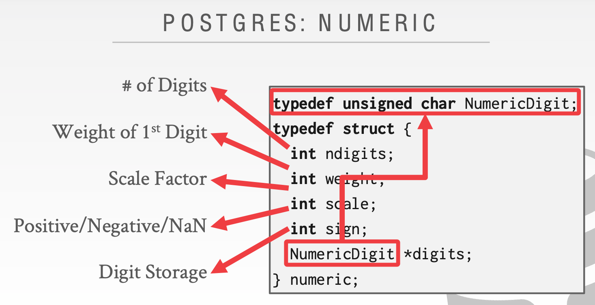

# Lecture 04 Database Storage - Part II

## Data Representation

* `INTEGER`/`BIGINT`/`SMALLINT`/`TINYINT`
  * C/C++ Representation
* `FLOAT`/`REAL` vs. `NUMERIC`/`DECIMAL`
  * IEEE-754 Standard / Fixed-point Decimals
  * Variable-precision numeric type that uses the native C/C++ types
    * Examples: `FLOAT`/`REAL`/`DOUBLE`
    * Faster than arbitrary precision numbers but can have rounding errors
  * Numeric data types with arbitrary precision and scale
    * Examples: `NUMERIC`/`DECIMAL`
  * Typically stored in a exact, variable-length binary representation with additional meta-data
    * Like a `VARCHAR` but not stored as a string
* `VARCHAR`/`VARBINARY`/`TEXT`/`BLOB`
  * Header with length, followed by data bytes
* `TIME`/`DATE`/`TIMESTAMP`
  * 32/64 bit integer of (micro)seconds since Unix epoch

### Postgres: Numeric

### Large Values

* Most DBMSs don't allow a tuple to exceed the size of a single page
* To store values that are larger than a page, the DBMS uses separate **overflow** storage pages
  * Postgres: TOAST (>2KB)
  * MySQL: Overflow (> 1/2 size of page)

### External Value Storage

* Some systems allow you to store a really large value in an external file
* Treated as a `BLOB` type
* The DBMS **cannot** manipulate the contents of an external file
  * No durability / transaction protections

## System Catalogs

* A DBMS stores meta-data about databases in its internal catalogs
  * Tables, columns, indexes, views
  * Users, permissions
  * Internal statistics
* You can query the DBMS's internal `INFORMATION_SCHEMA` catalog to get info about the database
* Example: List all the tables in the current database
  * SQL-92: `SELECT * FROM INFORMATION_SCHEMA.TABLES WHERE table_catalog = '<db name>';`
  * Postgres: `\d;`
  * MySQL: `SHOW TABLES;`
* Example: List all the tables in the student table
  * SQL-92: `SELECT * FROM INFORMATION_SCHEMA.TABLES WHERE table_name = 'student';`
  * Postgres: `\d student;`
  * MySQL: `DESCRIBE student;`

### On-line Transaction Processing

* Simple queries that read/update a small amount of data that is related to a single entity in the database

### On-line Analytical Processing

* Complex queries that read large portions of the database spanning multiple entities
* You execute these workloads on the data you have collected from your OLTP applications

### Hybrid Transaction + Analytical Processing

* OLTP + OLAP together on the same database instance

## Storage Models

* The DBMS can store tuples in different ways that are better for either OLTP or OLAP workloads
* We assume the **n-ary storage model** (aka "row storage")

### N-ary Storage Model

* The DBMS stores all attributes for a single tuple contiguously in a page
  * Aka **"row store"**
* Ideal for OLTP workloads where queries tend to operate only on an individual entity and insert-heavy workloads
* Advantages
  * Fast inserts, updates, and deletes
  * Good for queries that need the entire tuple
* Disadvantages
  * Not good for scanning large portions of the table and/or a subset of the attributes

### Decomposition Storage Model

* The DBMS stores the values of a single attribute for all tuples contiguously in a page
  * Aka **"column store"**
* Ideal for OLAP workloads where read-only queries perform large scans over a subset of the table's attributes
* Tuple identification
  * Choice #1: Fixed-length Offsets
    * Each value is the same length for an attribute
  * Choice #2: Embedded Tuple Ids
    * Each value is stored with its tuple id in a column
* Advantages
  * Reduces the amount wasted I/O because the DBMS only reads the data that it needs
  * Better query processing and data compression
* Disadvantages
  * Slow for point queries, inserts, updates, and deletes because of tuple splitting/stitching
