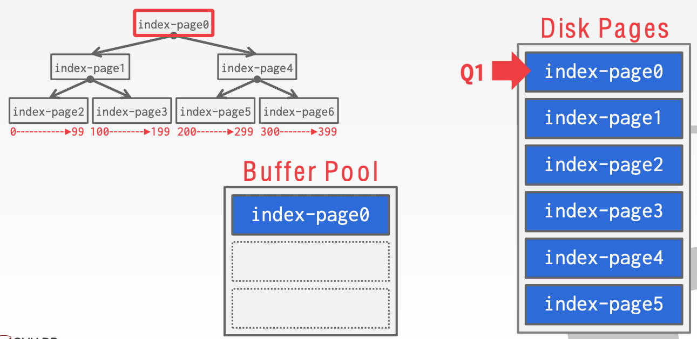

# Lecture 05 Buffer Pools

## Database Storage

* Spatial Control
  * Where to write pages on disk
  * The goal is to keep pages that are used together often as physically close together as possible on disk
* Temporal Control:
  * When to read pages into memory, and when to write to disk
  * The goal is minimize the number of stalls from having to read data from disk

## Buffer Pool Manager

### Buffer Pool Organization

* Memory region organized as an array of fixed-size pages
* An array entry is called a **frame**

### Buffer Pool Meta-data

* When the DBMS requests a page, an exact copy is placed into one of these frames
* The **page table** keeps track of pages that are currently in memory
  * Also maintains additional meta-data per page:
    * **Dirty Flag**
    * **Pin/Reference Counter**

### Locks vs. Latches

* **Locks**:
  * Protects the database's logical contents from other transactions
  * Held for transaction duration
  * Need to be able to rollback changes
* **Latches** (Mutex):
  * Protects the critical sections of the DBMS's internal data structure from other threads
  * Held for operation duration
  * Do not need to be able to rollback changes

### Page Table vs. Page Directory

* The **page directory** is the mapping from page ids to page locations in the database files
  * All changes must be recorded on disk to allow the DBMS to find on restart
* The **page table** is the mapping from page ids to a copy of the page in buffer pool frames
  * This is an in-memory data structure that does not need to be stored on disk

### Allocation Policies

* Global Policies:
  * Make decisions for all active txns
* Local Policies:
  * Allocate frames to a specific txn without considering the behavior of concurrent txns
  * Still need to support sharing pages

### Buffer Pool Optimizations

#### Multiple Buffer Pools

* The DBMS does not always have a single buffer pool for the entire system
  * Multiple buffer pool instances
  * Per-database buffer pool
  * Per-page type buffer pool
* Helps reduce latch contention and improve locality

#### Pre-fetching

* The DBMS can also prefetch pages based on a query plan
  * Sequential Scans
  * Index Scans

#### Scan Sharing

* Queries can reuse data retrieved from storage or operator computations
  * This is different from result caching
* Allow multiple queries to attach to a single cursor that scans a table
  * Queries do not have to be the same
  * Can also share intermediate results
* If a query starts a scan and if there one already doing this, then the DBMS will attach to the second query's cursor
  * The DBMS keeps track of where the second query joined with the first so that it can finish the scan when it reaches the end of the data structure
  * Fully supported in IBM DB2 and MSSQL and Oracle only supports **cursor sharing** for identical queries

#### Buffer Pool Bypass

* The sequential scan operator will not store fetched pages in the buffer pool to avoid overhead
  * Memory is local to running query
  * Works well if operator needs to read a large sequence of pages that are contiguous on disk
  * Can also be used for temporary data (sorting, joins)

### OS Page Cache

* Most disk operations go through the OS API
* Unless you tell it not to, the OS maintains its own filesystem cache
* Most DBMSs use direct I/O (`O_DIRECT`) to bypass the OS's cache
  * Redundant copies of pages
  * Different eviction policies

## Replacement Policies

* When the DBMS needs to free up a frame to make room for a new page, it must decide which page to **evict** from the buffer pool
* Goals:
  * Correctness
  * Accuracy
  * Speed
  * Meta-data overhead

### Least-Recently Used

* Maintain a timestamp of when each page was last accessed
* When the DBMS needs to evict a page, select the one with the oldest timestamp
  * Keep the pages in sorted order to reduce the search time on eviction

### Clock

* Approximation of LRU without needing a separate timestamp per page
  * Each page has a **reference bit**
  * When a page is accessed, set to 1
* Organize the pages in a circular buffer with a "**clock hand**"
  * Upon sweeping, check if a page's bit is set to 1
  * If yes, set to zero; If no, then evict
* LRU and CLOCK replacement policies are susceptible to **sequential flooding**
  * A query performs a sequential scan that reads every page
  * This pollutes the buffer pool with pages that are read once and never again
  * The most recently used page is actually the most unneeded page

### Better Policies: LRU-k

* Track the history of the last K references as timestamps and compute the interval between subsequent accesses
* The DBMS then uses this history to estimate the next time that page is going to be accessed

### Better Policies: Localization

* The DBMS chooses which pages to evict on a per txn/query basis
  * This minimizes the pollution of the buffer pool from each query
  * Keep track of the pages that a query has accessed
* Example: Postgres maintains a small ring buffer that is private to the query

### Better Policies: Priority Hints

* The DBMS knows what the context of each page during query execution
* It can provide hints to the buffer pool on whether a page is important or not

### Dirty Pages

* **Fast**: If a page in the buffer pool is **not** dirty, then the DBMS can simply drop it
* **Slow**: If a page is dirty, then the DBMS must write back to disk to ensure that its changes are persisted

### Background Writing

* The DBMS can periodically walk through the page table and write dirty pages to disk
* When a dirty page is safely written, the DBMS can either evict the page or just unset the dirty flag
* Need to be careful that we don't write dirty pages **before** their log records have been written

## Other Memory Pools

* The DBMS needs memory for things other than just tuples and indexes
* These other memory pools may not always backed by disk
  * Sorting + Join Buffers
  * Query Caches
  * Maintenance Buffers
  * Log Buffers
  * Dictionary Caches
