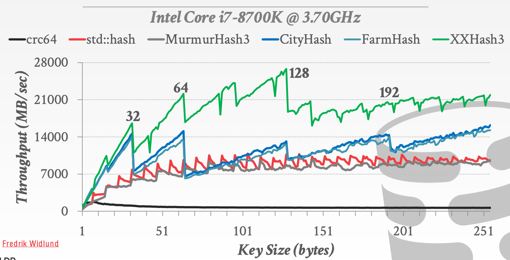
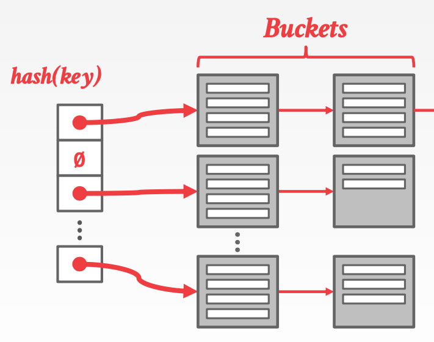
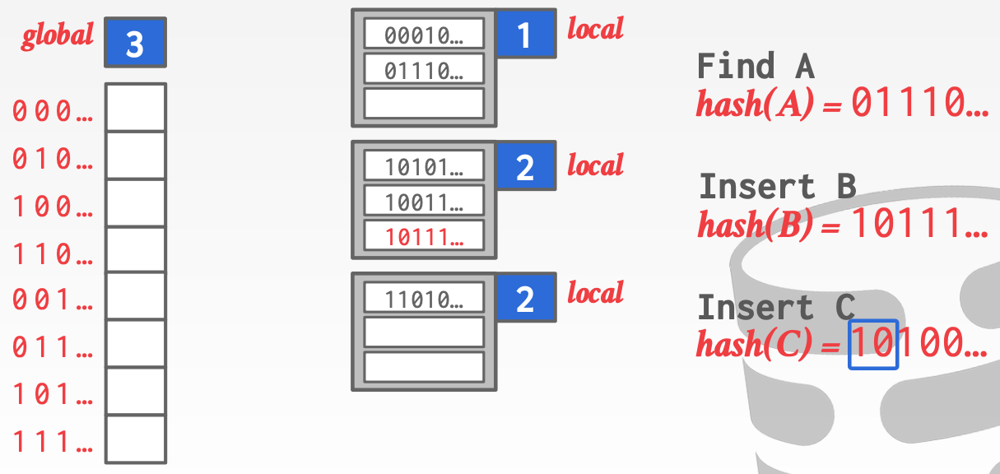

# Lecture 06 Hash Tables

## Hash Tables

* A **hash table** implements an unordered associative array that maps keys to values
* It uses a **hash function** to compute an offset into the array for a given key, from which the desired value can be found
* Space Complexity: $O(n)$
* Operation Complexity:
  * Average: $O(1)$
  * Worst: $O(n)$
* **Static Hash Table**
  * Allocate a giant array that has one slot for **every** element you need to store
  * To find an entry, mod the key by the number of elements to find the offset in the array
* Design Decision #1: Hash Function
  * How to map a large key space into a smaller domain
  * Trade-off between being fast vs. collision rate
* Design Decision #2: Hashing Scheme
  * How to handle key collisions after hashing
  * Trade-off between allocating a large hash table vs. additional instructions to find/insert keys
* **Perfect hash function**
  * If $key1 \neq key2$, then $hash(key1) \neq hash(key2)$

## Hash Functions

* For any input key, return an integer representation of that key
* We do **not** want to use a cryptographic hash function for DBMS hash tables
* We want something that is fast and has a low collision rate

## Static Hashing Schemes

### Linear Probe Hashing

* Single giant table of slots
* Resolve collisions by linearly searching for the next free slot in the table
  * To determine whether an element is present, hash to a location in the index and scan for it
  * Insertions and deletions are generalizations of lookups
* Deletes
  * Approach #1: Tombstone
  * Approach #2: Movement

### Non-Unique Keys

* Choice #1: Separate Linked List
  * Store values in separate storage area for each key
* Choice #2: Redundant Keys
  * Store duplicate keys entries together in the hash table

### Robin Hood Hashing

* Variant of linear hashing that steals slots from rich keys and give them to poor keys
  * Each key tracks the number of positions they are from where its optimal position in the table
  * On insert, a key takes the slot of another key if the first key is farther aways from its optimal position than the second key

### Cuckoo Hashing

* Use multiple hash tables with different hash function seeds
  * On insert, check every table and pick anyone that has a free slot
  * If no table has a free slot, evict the element from one of them and then re-hash it find a new location
* Look-ups and deletions are always $O(1)$ because only one location per hash table is checked

## Dynamic Hashing Schemes

* Static hash tables require the DBMS to know the number of elements it wants to store
  * Otherwise it has rebuild the table if it needs to grow/shrink in size
* Dynamic hash tables resize themselves on demand

### Chained Hashing

* Maintain a linked list of **buckets** for each slot in the hash table
* Resolve collisions by placing all elements with the same hash key into the same bucket
  * To determine whether an element is present, hash to its bucket and scan for it
  * Insertions and deletions are generalizations of lookups

### Extendible Hashing

* Chained-hashing approach where we split buckets instead of letting the linked list grow forever
* Multiple slot locations can point to the same bucket chain
* Reshuffling bucket entries on split and increase the number of bits to examine
  * Data movement is localized to just the split chain

### Linear Hashing

* The hash table maintains a **pointer** that tracks the next bucket to split
  * When **any** bucket overflows, split the bucket at the pointer location
* Use multiple hashes to find the right bucket for a given key
* Can use different overflow criterion:
  * Space Utilization
  * Average Length of Overflow Chains
* Splitting buckets based on the split pointer will eventually get to all overflowed buckets
  * When the pointer reaches the last slot, delete the first hash function and move back to begining
* The pointer can also move backwards when buckets are empty
