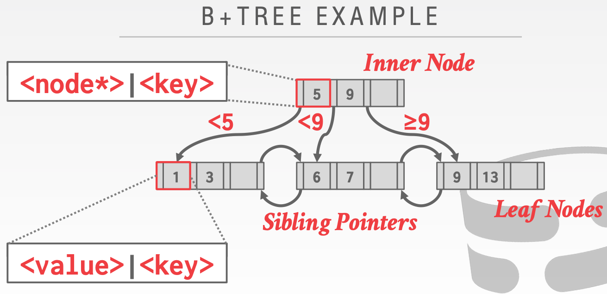
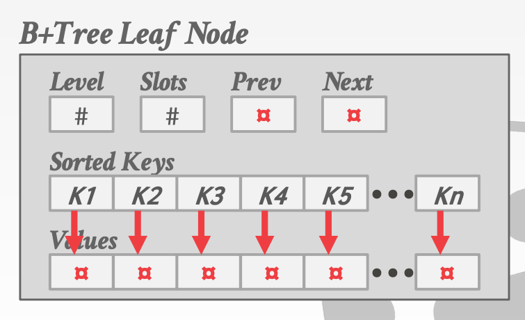
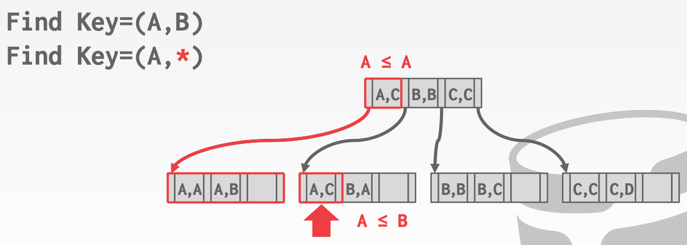

# Lecture 07 Tree Indexes - Part I

## Table Indexes

* A **table index** is a replica of a subset of a table's attributes that are organized and/or sorted for efficient access using a subset of those attributes
* The DBMS ensures that the contents of the table and the index are logically in sync
* It is the DBMS's job to figure out the best indexes to use to execute each query
* There is a trade-off on the number of indexes to create per database
  * Storage Overhead
  * Maintenance Overhead

## B+Tree

* A **B+Tree** is a self-balancing tree data structure that keeps data sorted and allows searches, sequential access, insertions, and deletions in $O(logn)$
  * Optimized for systems that read and write large blocks of data
* A B+Tree is an M-way search tree with the following properties:
  * It is perfectly balanced (i.e., every leaf node is at the same depth)
  * Every node other than the root, is at least half-full
    * $M/2-1 \leq \#keys \leq M-1$
  * Every inner node with $k$ keys has $k+1$ non-null children

### B+Tree Nodes

* Every B+Tree node is comprised of an array of key/value pairs
  * The keys are derived from the attributes that the index is based on
  * The values will differ based on whether the node is classified as **inner nodes** or **leaf nodes**
  * The arrays are usually kept in sorted key order

#### Leaf Node Values

* Approach #1: Record Ids
  * A pointer to the location of the tuple that the index entry
* Approach #2: Tuple Data
  * The actual contents of the tuple is stored in the leaf node
  * Secondary indexes have to store the record id as their values

### B-Tree vs. B+Tree

* A B-Tree stores keys + values in all nodes in the tree
  * More space efficient since each key only appears once in the tree
* A B+Tree only stores values in leaf nodes
  * Inner nodes only guide the search process

### B+Tree Insert

* Find correct leaf node L
* Put data entry into L in sorted order
* If L has enough space, done!
* Otherwise, split L keys into L and a new node L2
  * Redistribute entries evenly, copy up middle key
  * Insert index entry pointing to L2 into parent of L
* To split inner node, redistribute entries evenly, but push up middle key

### B+Tree Delete

* Start at root, find leaf L where entry belongs
* Remove the entry
* If L is at least half-full, done!
* If L has only M/2-1 entries,
  * Try to redistribute, borrowing from sibling (adjacent node with same parent as L)
  * If redistribution fails, merge L and sibling
* If merge occurred, must delete entry (pointing to L or sibling) from parent of L

## Clustered Indexes

* The table is sorted in the sort order specified by the primary key
  * Can be either heap- or index-organized storage
* Some DBMSs always use a clustered index
  * If a table doesn't contain a primary key, the DBMS will automatically make a hidden row id primary key
* Other DBMSs cannot use them at all

### Selection Condition

* The DBMS can use a B+Tree index if the query provides any of the attributes of the search key
* Example: Index on <a,b,c>
  * Supported: (a=5 AND b=3)
  * Supported: (b=3)
* Not all DBMSs support this
* For hash index, we must have all attributes in search key

## B+Tree Design Decisions

### Node Size

* The slower the storage device, the larger the optimal node size for a B+Tree
  * HDD: ~1MB
  * SSD: ~10KB
  * In-Memory: ~512B
* Optimal sizes can vary depending on the workload
  * Leaf Node Scans vs. Root-to-Leaf Traversals

### Merge Threshold

* Some DBMSs do not always merge nodes when it is half full
* Delaying a merge operation may reduce the amount of reorganization
* It may also better to just let underflows to exist and then periodically rebuild entire tree

### Variable Length Keys

* Approach #1: Pointers
  * Store the keys as pointers to the tuple's attribute
* Approach #2: Variable Length Nodes
  * The size of each node in the index can vary
  * Requires careful memory management
* Approach #3: Padding
  * Always pad the key to be max length of the key type
* Approach #4: Key Map / Indirection
  * Embed an array of pointers that map to the key + value list within the node

### Non-Unique Indexes

* Approach #1: Duplicate Keys
  * Use the same leaf node layout but store duplicate keys multiple times
* Approach #2: Value Lists
  * Store each key only once and maintain a linked list of unique values

### Intra-Node Search

* Approach #1: Linear
  * Scan node keys from beginning to end
* Approach #2: Binary
  * Jump to middle key, pivot left/right depending on comparison
* Approach #3: Interpolation
  * Approximate location of desired key based on known distribution of keys

## Optimizations

### Prefix Compression

* Sorted keys in the same leaf node are likely to have the same prefix
* Instead of storing the entire key each time, extract common prefix and store only unique suffix for each key

### Suffix Truncation

* The keys in the inner nodes are only used to direct traffic
* Store a minimum prefix that is needed to correctly route probes into the index

### Bulk Insert

* The fastest/best way to build a B+Tree is to first sort the keys and then build the index from the bottom up

### Pointer Swizzling

* Nodes use page ids to reference other nodes in the index
* The DBMS must get the memory location from the page table during traversal
* If a page is pinned in the buffer pool, then we can store raw pointers instead of page ids
  * This avoids address lookups from the page table
