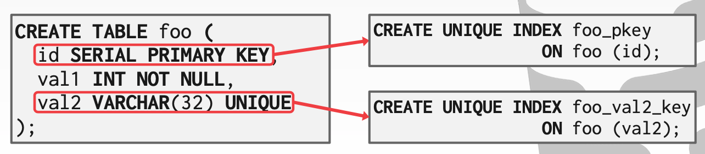
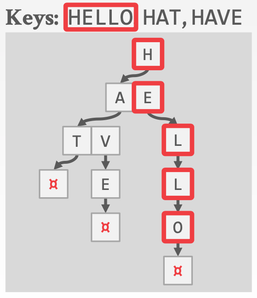
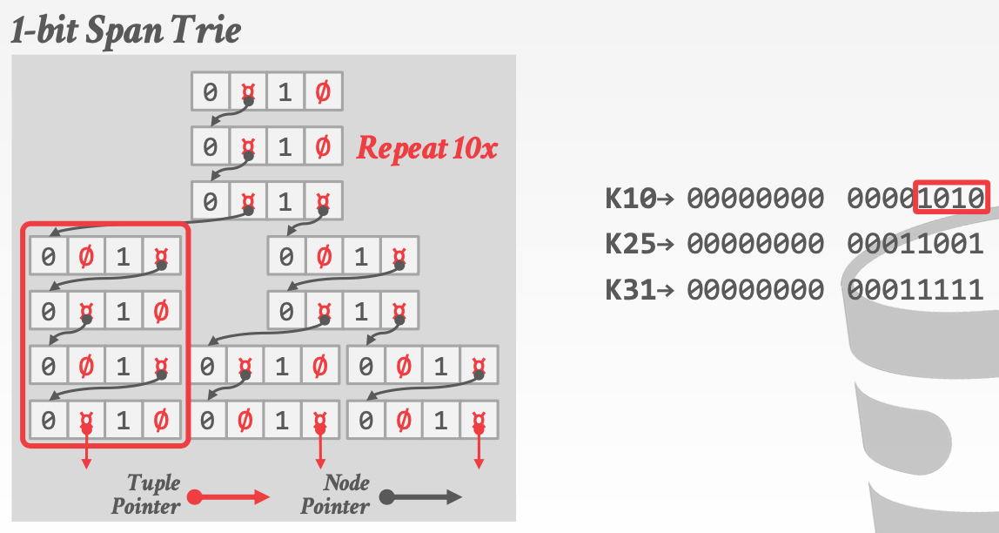
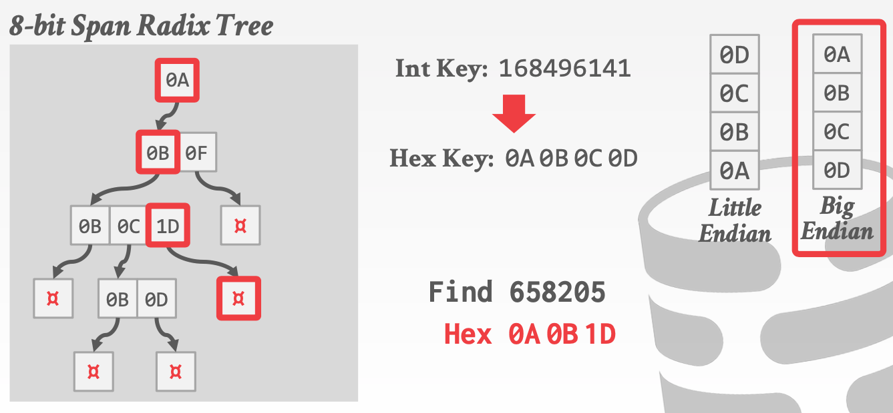

# Lecture 08 Tree Indexes - Part II

## More B+Trees

### B+Tree: Duplicate Keys

* Approach #1: Append Record Id
  * Add the tuple's unique record id as part of the key to ensure that all keys are unique
  * The DBMS can still use partial keys to find tuples
* Approach #2: Overflow Leaf Nodes
  * Allow leaf nodes to spill into overflow nodes that contain the duplicate keys
  * This is more complex to maintain and modify

## Additional Index Magic

### Implicit Indexes

* Most DBMSs automatically create an index to enforce integrity constraints but **not** referential constraints (foreign keys)
  * Primary Keys
  * Unique Constraints

### Partial Indexes

* Create an index on a subset of the entire table
  * This potentially reduces its size and the amount of overhead to maintain it
* One common use case is to partition indexes by date ranges
  * Create a separate index per month, year
* Example: `CREATE INDEX idx_foo ON foo (a, b) WHERE c = 'WuTang'; SELECT b FROM foo WHERE a = 123 AND c = 'WuTang';`

### Covering Indexes

* If all the fields needed to process the query are available in an index, then the DBMS does not need to retrieve the tuple
  * This reduces contention on the DBMS's buffer pool resources
* Example: `CREATE INDEX idx_foo ON foo (a, b); SELECT b FROM foo WHERE a = 123;`

### Index Include Columns

* Embed additional columns in indexes to support index-only queries
* These extra columns are only stored in the leaf nodes and are **not** part of the search key
* Example: `CREATE INDEX idx_foo ON foo (a, b) INCLUDE (c); SELECT b FROM foo WHERE a = 123 AND c = 'WuTang';`

### Functional/Expression Indexes

* An index does not need to store keys in the same way that they appear in their base table
* You can use expressions when declaring an index
* Example: `CREATE INDEX idx_user_login ON users (EXTRACT(dow FROM login)); SELECT * FROM users WHERE EXTRACT(dow FROM login) = 2;`

### Observation

* The inner node keys in a B+Tree cannot tell you whether a key exists in the index
  * You must always traverse to the leaf node
* This means that you could have (at least) one buffer pool page miss per level in the tree just to find out a key does not exist

## Tries / Radix Trees

### Trie Index

* USe a digital representation of keys to examine prefixes one-by-one instead of comparing entire key
  * Aka "Digital Search Tree" or "**Prefix Tree**"

* Shape only depends on key space and length
  * Does not depend on existing keys or insertion order
  * Does not require rebalancing operations
* All operations have $O(k)$ complexity where k is the length of the key
  * The path to a leaf node represents the key of the leaf
  * Keys are stored implicitly and can be reconstructed from paths

### Trie Key Span

* The **span** of a trie level is the number of bits that each partial key / digit represents
  * If the digit exists in the corpus, then store a pointer to the next level in the trie branch; otherwise, store null
* This determines the **fan-out** of each node and the physical **height** of the tree

### Radix Tree

* Omit all nodes with only a single child
  * Aka "**Patricia Tree**"
* Can produce **false positives**, so the DBMS always checks the original tuple to see whether a key matches
* **Binary Comparable Keys**
  * Not all attribute types can be decomposed into binary comparable digits for a radix tree
    * Unsigned Integers: Byte order must be flipped for little endian machines
    * Signed Integers: Flip two's-complement so that negative numbers are smaller than positive
    * Floats: Classify into group (neg vs. pos, normalized vs. denormalized), then store as unsigned integer
    * Compound: Transform each attribute separately

## Inverted Indexes

* An **inverted index** stores a mapping of words to records that contain those words in the target attribute
  * Sometimes called a **full-text search index**
* The major DBMSs support these natively

### Query Types

* **Phrase Searches**
  * Find records that contain a list of words in the given order
* **Proximity Searches**
  * Find records where two words occur within n words of each other
* **Wildcard Searches**
  * Find records that contain words that match some pattern (e.g., regular expression)

### Design Decisions

* Decision #1: What To Store
  * The index needs to store at least the words contained in each record (separated by punctuation characters)
  * Can also store frequency, position, and other meta-data
* Decision #2: When To Update
  * Maintain auxiliary data structures to stage updates and then update the index in batches