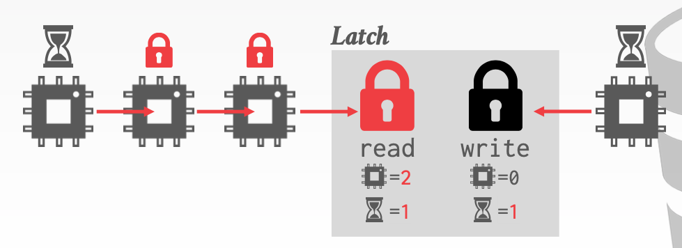

# Lecture 09 Index Concurrency

## Concurrency Control

* We need to allow multiple threads to safely access our data structures to take advantage of additional CPU cores and hide disk I/O stalls
* A **concurrency control** protocol is the method that the DBMS uses to ensure correct results for concurrent operations on a shared object
  * Logical Correctness: Can I see the data that I am supposed to see?
  * Physical Correctness: Is the internal representation of the object sound?

## Latches Overview

### Locks vs. Latches

|            | Locks                                | Latches                   |
| ---------- | ------------------------------------ | ------------------------- |
| Separate   | User transactions                    | Threads                   |
| Protect    | Database Contents                    | In-Memory Data Structures |
| During     | Entire Transactions                  | Critical Sections         |
| Modes      | Shared, Exclusive, Update, Intention | Read, Write               |
| Deadlock   | Detection & Resolution               | Avoidance                 |
| ...by...   | Waits-for, Timeout, Abort            | Coding Discipline         |
| Kept in... | Lock Manager                         | Protected Data Structure  |

### Latch Modes

* **Read Mode**
  * Multiple threads can read the same object at the same time
  * A thread can acquire the read latch if another thread has it in read mode
* **Write Mode**
  * Only one thread can access the object
  * A thread cannot acquire a write latch if another thread holds the latch in any mode

### Latch Implementations

* **Approach #1: Blocking OS Mutex**

  * Simple to use but non-scalable (about 25ns per lock/unlock invocation)

  * Example: `std::mutex`

 ```c++
 std::mutex m;
 //
 m.lock();
 // Do something special...
 m.unlock();
```

* **Approach #2: Test-and-Set Spin Latch (TAS)**

  * Very efficient (single instruction to latch/unlatch)

  * Non-scalable, not catch friendly

  * Example: `std::atomic<T>`

```c++
std::atomic_flag latch;
//
while (latch.test_and_set(params)) {
// Retry? Yield? Abort?
}
```

* **Approach #3: Reader-Writer Latch**

  * Allows for concurrent readers
  * Must manage read/write queues to avoid starvation
  * Can be implemented on top of spinlocks



## Hash Table Latching

* Easy to support concurrent access due to the limited ways threads access the data structure
  * All threads move in the same direction and only access a single page/slot at a time
  * Deadlock are not possible
* To resize the table, take a **global latch** on the entire table (i.e., in the header page)
* **Approach #1: Page Latches**
  * Each page has its own reader-writer latch that protects its entire contents
  * Threads acquire either a read or write latch before they access a page
* **Approach #2: Slot Latches**
  * Each slot has its own latch
  * Can use a single mode latch to reduce meta-data and computational overhead

## B+Tree Latching

* We want to allow multiple threads to read and updates a B+Tree at the same time
* We need to protect from two types of problems:
  * Threads trying to modify the contents of a node at the same time
  * One thread traversing the tree while another thread splits/merges node

### Latch Crabbing/Coupling

* Basic idea:
  * Get latch for parent
  * Get latch for child
  * Release latch for parent if safe
* A **safe node** is one that will not split or merge when updated
  * Not full (on insertion)
  * More than half-full (on deletion)
* **Find**: Start at root and go down repeatedly,
  * Acquire R latch on child
  * Then unlatch parent
* **Insert/Delete**: Start at root and go down, obtaining W latches as needed
  * Once child is latched, check if it is safe
  * If child is safe, release all latches on ancestors
* Taking a write latch on the root every time becomes a bottleneck with higher concurrency
* Better Latching Algorithm
  * Assume that the leaf node is safe
  * Use read latches and crabbing to reach it, and then verify that it is safe
  * If leaf is not safe, then do previous algorithm using write latches

## Leaf Node Scans

* The threads in all the examples so far have acquired latches in a top-down manner
  * A thread can only acquire a latch from a node that is below its current node
  * If the desired latch is unavailable, the thread must wait until it becomes available
* But what if we want to move from one leaf node to another leaf node?
* Latches do **not** support deadlock detection or avoidance
  * The only way we can deal with this problem is through coding discipline
  * The leaf node sibling latch acquisition protocol must support a no-wait mode
  * The DBMS's data structures must cope with failed latch acquisitions

## Delayed Parent Updates

* Every time a leaf node overflows, we must update **at least** three nodes
  * The leaf node being split
  * The new leaf node being created
  * The parent node
* **Blink-Tree Optimization**: When a leaf node overflows, delay updating its parent node
