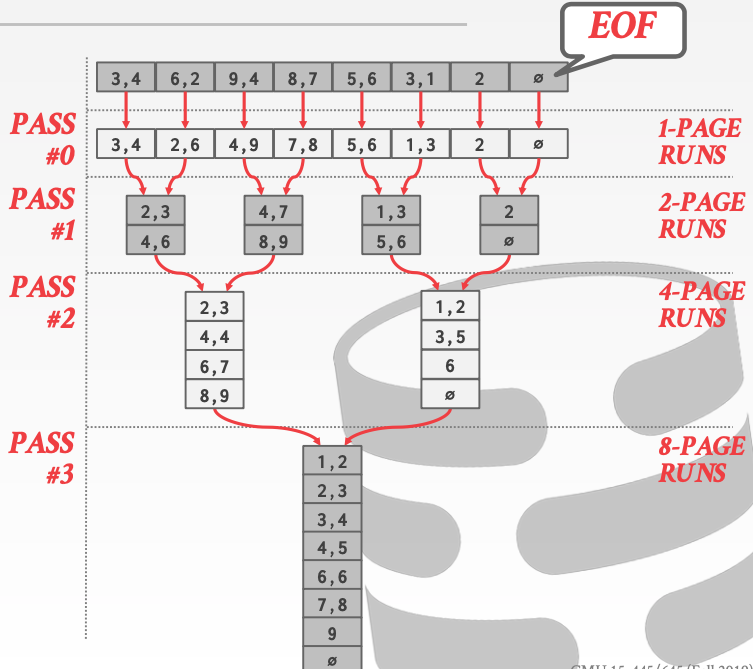
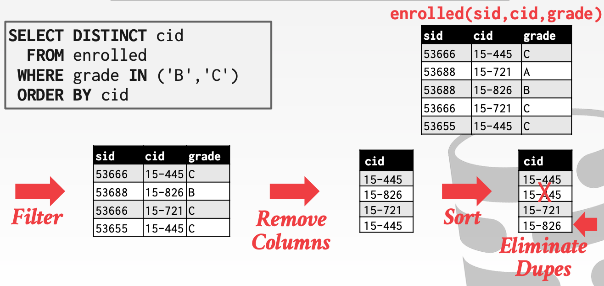
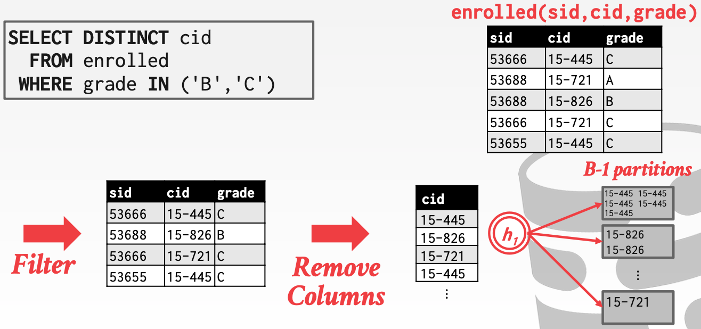
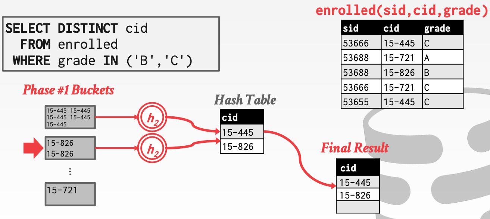
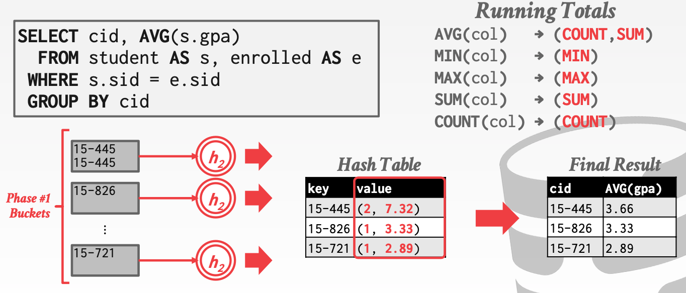

# Lecture 10 Sorting & Aggregations

## Query Plan

* The operators are arranged in a tree
* Data flows from the leaves of the tree up towards the root
* The output of the root node is the result of the query

## Disk-Oriented DBMS

* Just like it cannot assume that a table fits entirely in memory, a disk-oriented DBMS cannot assume that the results of a query fits in memory
* We are going use on the buffer pool to implement algorithms that need to spill to disk
* We are also going to prefer algorithms that maximize the amount of sequential access

## External Merge Sort

* Tuples in a table have no specific order
* But queries often want to retrieve tuples in a specific order
  * Trivial to support duplicate elimination (`DISTINCT`)
  * Bulk loading sorted tuples into a B+Tree index is faster
  * Aggregations (`GROUP BY`)

### External Merge Sort

* Divide-and-conquer sorting algorithm that splits the data set into separate **runs** and then sorts them individually
* Phase #1 - Sorting
  * Sort blocks of data that fit in main memory and then write back the sorted blocks to a file on disk
* Phase #2 - Merging
  * Combine sorted sub-files into a single larger file

### 2-Way External Merge Sort

* "2" represents the number of runs that we are going to merge into a new run for each pass
* Data set is broken up into N pages
* The DBMS has a finite number of B buffer pages to hold input and output data
* **Pass #0**
  * Read every B pages of the table into memory
  * Sort pages into runs and write them back to disk
* **Pass #1,2,3**
  * Recursively merges pairs of runs into runs twice as long
  * Uses there buffer pages (2 for input pages, 1 for output)

* In each pass, we read and write each page in file
* Number of passes = $1 + \lceil \log_2 N \rceil$
* Total I/O cost = $2N \times (\# of passes)$
* This algorithm only requires three buffer pages to perform the sorting ($B=3$)
* But even if we have more buffer space available ($B>3$), it does not effectively utilize them

### Double Buffering Optimization

* Prefetch the next run in the background and store it in a second buffer wile they system is processing the current run
  * Reduces the wait time for I/O requests at each steap by continuously utilizing the disk

### General External Merge Sort

* **Pass #0**
  * Use $B$ buffer pages
  * Produce $\lceil N/B \rceil$ sorted runs of size $B$
* **Pass #1,2,3**
  * Merge $B-1$ runs (i.e., K-way merge)
* Number of passes = $1 + \lceil \log_{B-1}{\lceil N/B \rceil} \rceil$
* Total I/O Cost = $2N \times (\# of passes)$

### Using B+Tree for Sorting

* If the table that must be sorted already has a B+Tree index on the sort attributes, then we can use that to accelerate sorting
* Retrieve tuples in desired sort order by simply traversing the leaf pages of the tree
* Case to consider:
  * Clustered B+Tree
    * Traverse to the left-most leaf page, and then retrieve tuples from all leaf pages
    * This is always better than external sorting because there is no computational cost and all disk access is sequential
  * Unclustered B+Tree
    * Chase each pointer to the page that contains the data
    * This is almost always a bad idea
    * In general, one I/O per data record

## Aggregation

* Collapse multiple tuples into a single scalar value
* Two implementation choices:
  * Sorting
  * Hashing

### Sorting Aggregation

### Hashing Aggregation

* What if we don't need the data to be ordered
  * Forming groups in `GROUP BY` (no ordering)
  * Removing duplicates in `DISTINCT` (no ordering)
* Hashing is a better alternative in this scenario
  * Only need to remove duplicates, no need for ordering
  * Can be computationally cheaper than sorting
* Populate an ephemeral hash table as the DBMS scans the table
* For each record, check whether there is already an entry in the hash table
  * `DISTINCT`: Discard duplicate
  * `GROUP BY`: Perform aggregate computation
* If everything fits in memory, then it is easy
* If the DBMS must spill data to disk, then we need to be smarter

#### External Hashing Aggregate

* Phase #1 - Partition
  * Divide tuples into buckets based on hash keys
  * Write them out to disk when they get full
* Phase #2 - ReHash
  * Build in-memory hash table for each partition and compute the aggregation

#### Phase #1 - Partition

* Use a hash function $h_1$ to split tuples into partitions on disk
  * Paritions are spilled to disk via output buffers
* Assume that we have $B$ buffers
* We will use $B-1$ buffers for the partitions and $1$ buffer for the input data

#### Phase #2 - ReHash

* For each partition on disk:
  * Read it into memory and build and in-memory hash table based on a second hash function $h_2$
  * Then go through each bucket of this hash table to bring together matching tuples
* This assumes that each partition fist in memory

#### Hashing Summarization

* During the ReHash phase, store pairs of the form (`GroupKey`->`RunningVal`)
* When we want to insert a new tuple into the hash table:
  * If we find a matching `GroupKey`, just update the `RunningVal` appropriately
  * Else insert a new `GroupKey`->`RunningVal`

#### Cost Analysis

* How big of a table can we hash using this approach
  * $B-1$ spill partitions in phase #1
  * Each should be no more than $B$ blocks big
* Answer: $B \times (B-1)$
  * A table of $N$ pages needs about $sqrt(N)$ buffers
  * Assumes hash distributes records evenly

## Conclusion

* Choice of sorting vs. hashing is subtle and depends on optimizations done in each case
* We already discussed the optimizations for sorting:
  * Chunk I/O into large blocks to amortize seek+RD costs
  * Double-buffering to overlap CPU and I/O
