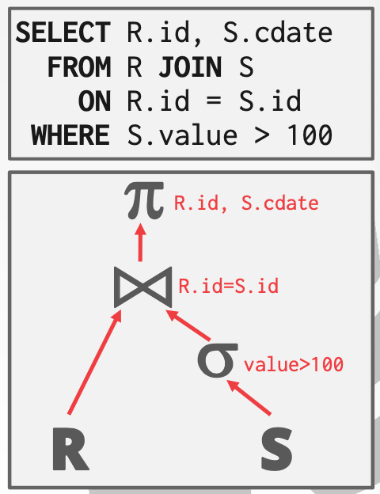
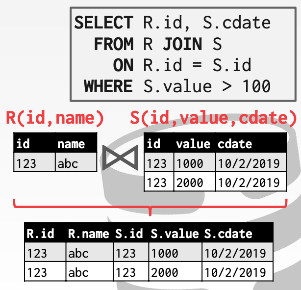
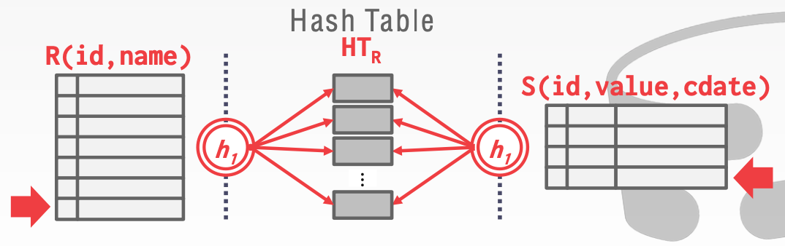
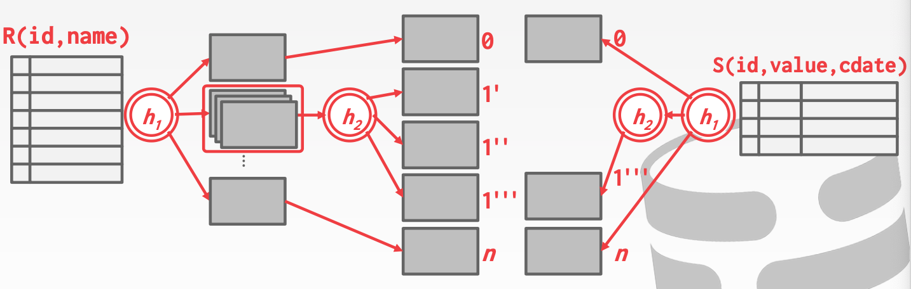

# Lecture 11 Join Algorithms

## Join

* We will focus on combining **two** tables at a time with **inner equijoin** algorithms
* In general, we want the **smaller** table to always be the left table ("outer table") in the query plan

### Join Operators

* Decision #1: Output
  * What data does the join operator emit to its parent operator in the query plan tree?
* Decision #2: Cost Analysis Criteria
  * How do we determine whether one join algorithm is better than another?



### Operator Outputs

* For a tuple $r \in R$ and a tuple $s \in S$ that match on join attributes, concatenate $r$ and $s$ together into a new tuple
* Copy the values for the attributes in outer and inner tuples into a new output tuple
* Subsequent operators in the query plan never need to go back to the base tables to get more data
* Only copy the joins keys along with the record ids of the matching tuples
* Ideal for column stores because the DBMS does not copy data that is not need for the query
  * This is called **late materialization**



### Join vs. Cross-Product

* Join is the most common operation and thus must be carefully optimized
* Cross-product followed by a selection is inefficient because the cross-product is large

## Join Algorithms

### Nested Loop Join

#### Simple/Stupid Nested Loop Join

```text
foreach tuple r ∈ R: (Outer)
	foreach tuple s ∈ S: (Inner)
		emit, if r and s match
```

* For every tuple in R, it scans S once
* For R has $M$ pages and $m$ tuples, S has $N$ pages and $n$ tuples
* Cost: $M+(m·N)$

#### Block Nested Loop Join

```text
foreach block B_R ∈ R:
	foreach block B_S ∈ S:
		foreach tuple r ∈ B_R:
			foreach tuple s ∈ B_S:
				emit, if r and s match
```

* This algorithm performs fewer disk accesses
  * For every block in R, it scans S once
* Cost: $M+(M·N)$
* The smaller table in terns of # of pages should be the outer table
* What if we have $B$ buffer available?
  * Use $B-2$ buffers for scanning the outer table
  * Use one buffer for the inner table, one buffer for storing output
  * Cost: $M + (\lceil M/(B-2) \rceil · N)$
  * What if the outer relation completely fits in memory ($B>M+2$)?
    * Cost: $M+N$

#### Index Nested Loop Join

* We can avoid sequential scans by using an index to find inner table matches
  * Use an existing index for the join
  * Build one on the fly (hash table, B+Tree)
  * Assume the cost of each index probe is some constant C per tuple
  * Cost: $M+(m·C)$

```text
foreach tuple r ∈ R:
	foreach tuple s Index(r_i = s_j):
		emit, if r and s match
```

### Sort-Merge Join

* Phase #1: Sort
  * Sort both tables on the join keys
  * We can use the external merge sort algorithm that we talked about last class
* Phase #2: Merge
  * Step through the two sorted tables with cursors and emit matching tuples
  * May need to backtrack depending on the join type

```text
sort R,S on join keys
cursor_R <- R_sorted, cursor_S <- S_sorted
while cursor_R and cursor_S:
	if cursor_R > cursor_S:
		increment cursor_S
  if cursor_R < sursor_S:
  	increment cursor_R
  elif cursor_R and cursor_S match:
  	emit
  	increment cursor_S
```

* Total Cost: Sort+Merge
  * Sort Cost (R): $2M · (1 + \lceil log_{B-1}{\lceil M/B \rceil} \rceil)$
  * Sort Cost (S): $2N · (1 + \lceil log_{B-1}{\lceil N/B \rceil} \rceil)$
  * Merge Cost: $(M + N)$
  * The worst case for the merging phase is when the join attribute of all of the tuples in both relations contain the same value
* The input relations may be sorted by either by an explicit sort operator, or by scanning the relation using an index on the join key

### Hash Join

* If tuple $r \in R$ and a tuple $s \in S$ satisfy the join condition, then they have the same value for the join attributes
* If that value is hashed to some partition $i$, the $R$ tuple must be in $r_i$ and the $S$ tuple in $s_i$
* Therefore, $R$ tuples in $r_i$ need only to be compared with $S$ tuples in $s_i$

#### Basic Hash Join Algorithm

* Phase #1: Build
  * Scan the outer relation and populates a hash table using the hash function $h_1$ on the join attributes
* Phase #2: Probe
  * Scan the inner relation and use $h_1$ on each tuple to jump to a location in the hash table and find a matching tuple

```text
build hash table HT_R for R
foreach tuple s ∈ S:
	output, if h_1(s) ∈ HT_R
```



#### Hash Table Contents

* Key: The attributes that the query is joining the tables on
* Value: Varies per implementation
  * Depends on what the operators above the join in the query plan expect as its input
  * Approach #1: Full Tuple
    * Avoid having to retrieve the outer relation's tuple contents on a match
    * Takes up more space in memory
  * Approach #2: Tuple Identifier
    * Ideal for column stores because the DBMS doesn't fetch data from disk it doesn't need
    * Also better if join selectivity is low

#### Probe Phase Optimization

* Create a Bllom Filter duing the build phase when the key is likely to not exist in the hash table
  * Threads check the filter before probing the hash table
  * This will be faster since the filter will fit in CPU caches
  * Sometimes called **sideways information passing**

#### Grace Hash Join

* Hash join when tables do not fit in memory
  * Build Phase: Hash both tables on the join attribute into partitions
  * Probe Phase: Compares tuples in corresponding partitons for each table
* Hash R into (0,1,...,max) buckets
* Hash S into the same # of buckets with the same hash function
* Join each pair of matching buckets between R and S
* If the buckets do not fit in memory, then use **recursive partitioning** to split the tables into chunks that will fit
  * Build another hash table for $bucket_{R,i}$ using hash function $h_2$
  * Then probe it for each tuple of the other table's bucket at that level



* Cost of hash join
  * Assume that we have enough buffers
  * Cost: $3(M+N)$
* Partitioning Phase
  * Read+Write both tables
  * $2(M+N)$ I/Os
* Probing Phase
  * Read both tables
  * $M+N$ I/Os
* If the DBMS knows the size of the outer table then it can use a static hash table
  * Less computational overhead for build / probe operations

## Conclusion

| Algorithm               | I/O Cost        | Example      |
| ----------------------- | --------------- | ------------ |
| Simple Nested Loop Join | M+(m·N)         | 1.3 hours    |
| Block Nested Loop Join  | M+(M·N)         | 50 seconds   |
| Index Nested Loop Join  | M+(M·logN)      | 20 seconds   |
| Sort-Merge Join         | M+N+(sort cost) | 0.59 seconds |
| Hash Join               | 3(M+N)          | 0.45 seconds |

* Hashing is almost always better than sorting for operator execution
* Caveats
  * Sorting is better on non-uniform data
  * Sorting is better when result needs to be sorted
* Good DBMSs use either or both
