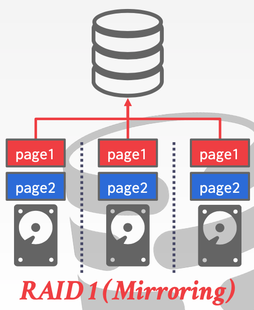
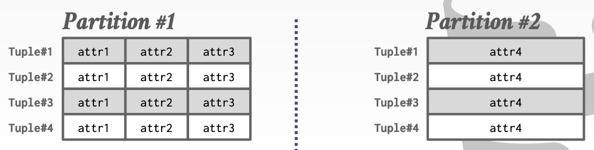
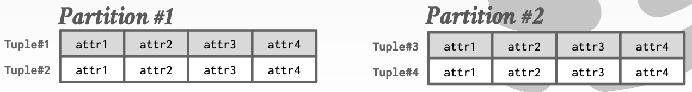

# Lecture 13 Query Execution - Part II

## Parallel Execution

* Increased performance
  * Throughput
  * Latency
* Increased responsiveness and availability
* Potentially lower **total cost of ownership** (TCO)

### Parallel vs. Distributed

* Database is spread out across multiple **resources** to improve different aspects of the DBMS
* Appears as a single database instance to the application
  * SQL query for a single-resource DBMS shoul generate same result on a parallel or distributed DBMS
* **Parallel DBMSs**:
  * Resources are physically close to each other
  * Resources communicate with high-speed interconnect
  * Communication is assumed to cheap and reliable
* **Distributed DBMSs**:
  * Resources can be far from each other
  * Resources communicate using slower interconnect
  * Communication cost and problems cannot be ignored

## Process Models

* A DBMS's **process model** defines how the system is architected to support concurrent requests from a multi-user application
* A **worker** is the DBMS component that is responsible for executing tasks on behalf of the client and returning the results

### Process Per Worker

* Each worker is a separate OS process
  * Relies on OS scheduler
  * Use shared-memory for global data structures
  * A process crash doesn't take down entire system
  * Examples: IBM DB2, Postgres, Oracle

### Process Pool

* A worker uses any process that is free in a pool
  * Still relies on OS scheduler and shared memory
  * Bad for CPU cache locality
  * Examples: IBM DB2, Postgres (2015)

### Thread Per Worker

* Single process with multiple worker threads
  * DBMS manages its own scheduling
  * May or may not use a dispatcher thread
  * Thread crash may kill the entire system
  * Examples: IBM DB2, MSSQL, MySQL, Oracle (2014)

### Process Models

* Using a multi-threaded architecture has several advantages
  * Less overhead per context switch
  * Do not have to manage shared memory
* The thread per worker does **not** mean that the DBMS supports intra-query  parallelism

### Scheduling

* For each query plan, the DBMS decides where, when, and how to execute it
  * How many tasks should it use?
  * How many CPU cores should it use?
  * What CPU core should the tasks execute on?
  * Where should a task store its output?
* The DBMS always knows more than the OS

## Execution Parallelism

### Inter- vs. Intra- Query Parallelism

* Inter-Query: Different queries are executed concurrently
  * Increases throughput & reduces latency
  * If multiple queries are updating the database at the same time, then this is hard to do correctly
* Intra-Query: Execute the operations of a single query in parallel
  * Decreases latency for long-running queries
  * Think of organization of operators in terms of a producer/consumer paradigm

### Intra-Query Parallelism

#### Approach #1: Intra-Operator (Horizontal)

* Decompose operators into independent **fragments** that perform the same function on different subsets of data
* The DBMS inserts an **exchange** operator into the query plan to coalesce results from children operators
  * Exchange Type #1 - **Gather**
    * Combine the results from multiple workers into a single output stream
    * Query plan root must always be a gather exchange
  * Exchange Type #2 - **Repartition**
    * Reorganize multiple input streams across multiple output streams
  * Exchange Type #3 - **Distribute**
    * Split a single input stream into multiple output streams

#### Approach #2: Inter-Operator (Vertical)

* Operations are overlapped in order to pipeline data from one stage to the next without materialization
* Also called **pipelined parallelism**

#### Approach #3: Bushy Parallelism

* Extension of inter-operator parallelism where workers execute multiple operators from different segments of a query plan at the same time
* Still need exchange operators to combine intermediate results from segments
* Using additional processes/threads to execute queries in parallel won't help if the disk is always the main bottleneck

## I/O Parallelism

* Split the DBMS installation across multiple storage devices
  * Multiple Disks per Database
  * One Database per Disk
  * One Relation per Disk
  * Split Relation across Multiple Disks

### Multi-Disk Parallelism

* Configure OS/hardware to store the DBMS's file across multiple storage devices
  * Storage Appliances
  * RAID Configuration
* This is transparent to the DBMS

### Database Partitioning

* Some DBMSs allow you specify the disk location of each individual database
  * The buffer pool manager maps a page to a disk location
* This is also easy to do at the filesystem level if the DBMS stores each database in a separate directory
  * The log file might be shared though
* Split single logical table into disjoint physical segments that are stored/managed separately
* Ideally partitioning is transparent to the application

#### Vertical Partitioning

* Store a table's attributes in a separate location (e.g., file, disk volume)
* Have to store tuple information to reconstruct the original record

#### Horizontal Partitioning

* Divide the tuples of a table up into disjoint segments based on some partitioning key
  * Hash Partitioning
  * Range Partitioning
  * Predicate Partitioning

