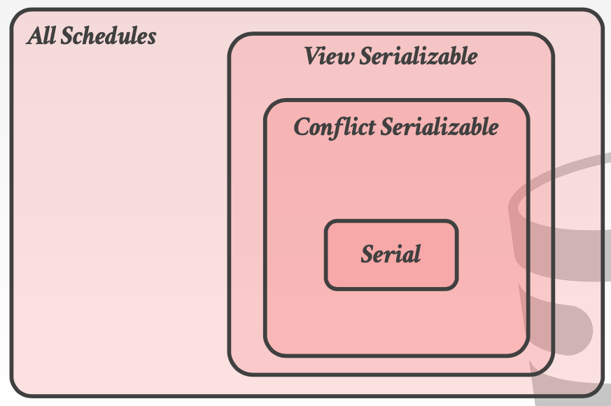

# Lecture 16 Concurrency Control Theory

* Concurrency Control
  * Operator Execution
  * Access Methods
* Recovery
  * Buffer Pool Manager
  * Disk Manager
* Motivation
  * How to avoid race condition?
    * Lost Updates -> Concurrency Control
  * What is the correct database state?
    * Durability -> Recovery

## Transactions

* A **transaction** is the execution of a sequence of one or more operations on a database to perform some higher-level function
* It is the basic unit of change in a DBMS

### Strawman System

* Execute each transaction one-by-one (i.e., serial order) as they arrive at the DBMS
  * One and only one transaction can be running at the same time
* Before a transaction starts, copy the entire database to a new file and make all changes to that file
  * If the transaction succeeds, overwrite the original file
  * If the transaction fails, remove the dirty copy
* A potentially better approach is to allow concurrent execution of independent transactions
* We need formal correctness criteria to determine whether an interleaving of operations is valid

### Transaction in SQL

* A new transaction starts with the `BEGIN` command
* The transaction stops with either `COMMIT` or `ABORT`
  * If commit, the DBMS either saves all the transaction's changes **or** abort it
  * If abort, all changes are undone so that it's like as if the transaction never executed at all

### Correctness Criteria: ACID

* **Atomicity**: All actions in the transaction, or none happen
  * All or nothing
* **Consistency**: If each transaction is consistent and the DB starts consistent, then it ends up consistent
  * It looks correct to me
* **Isolation**: Execution of one transaction is isolated from that of other transactions
  * As if alone
* **Durability**: If a transaction commits, its effects persist
  * Survie failures

### Atomicity of Transactions

* DBMS guarantees that transactions are **atomic**
  * From user’s point of view: txn always either executes all its actions, or executes no actions at all
* **Approach #1: Logging**
  * DBMS logs all actions so that it can undo the actions of aborted transactions
  * Maintain undo records both in memory and on disk
  * Logging is used by almost every DBMS
* **Approach #2: Shadow Paging**
  * DBMS makes copies of pages and transactions make changes to those copies
  * Only when the transaction commits is the page made visible to others

### Consistency of Transactions

#### Database Consistency

* The database accurately models the real world and follows integrity constraints
* Transactions in the future see the effects of transactions committed in the past inside of the database

#### Transaction Consistency

* If the database is consistent before the transaction starts (running alone), it will also be consistent after
* Transaction consistency is the application’s responsibility

### Isolation of Transactions

* Users submit transactions, and each transaction executes as if it was running by itself
* But the DBMS achieves concurrency by interleaving the actions (reads/writes of DB objects) of transactions
* A **concurrency control** protocol is how the DBMS decides the proper interleaving of operations from multiple transactions
* Two categories of protocols
  * **Pessimistic**: Don't let problems arise in the first place
  * **Optimistic**: Assume conflicts are rare, deal with them after they happen

#### Properties of Schedules

* If the schedule is **equivalent** to some **serial execution**, we would say the schedule is correct
* Two operations **conflict** if:
  * They are by different transactions
  * They are on the same object and at least one of them is a write
* Levels of serializability
  * **Conflict Serializability** - Most DBMSs try to support this
  * **View Serializability** - No DBMS can do this
* Two schedules are **conflict equivalent** if and only if:
  * They involve the same actions of the same transactions,
  * Every pair of conflicting actions is ordered the same way
* Schedule S is conflict serializable if you are able to transform S into a serial schedule by swapping consecutive non-conflicting operations of different transactions

#### Serializability

* **Dependency Graph** (**precedency graph**)
  * One node per transaction
  * Edge from $T_i$ to $T_j$ if:
    * An operation $O_i$ of $T_i$ conflicts with an operation $O_j$ of $T_j$ and
    * $O_i$ appears earlier in the schedule than $O_j$
* A schedule is conflict serializable iff its dependency graph is acyclic
* View Serializability allows for (slightly) more schedules than Conflict Serializability does
* Neither definition allows all schedules that you would consider "serializable"

### Durability of Transaction

* All of the changes of committed transactions should be persistent
  * No torn updates
  * No changes from failed transactions
* The DBMS can use either **logging** or shadow paging to ensure that all changes are durable
