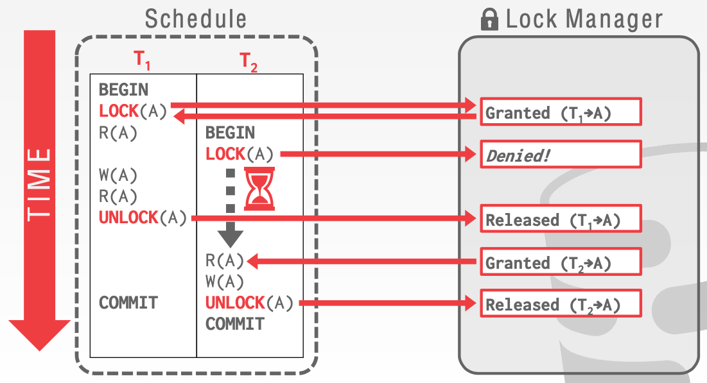
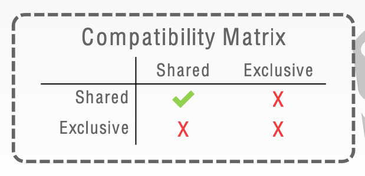
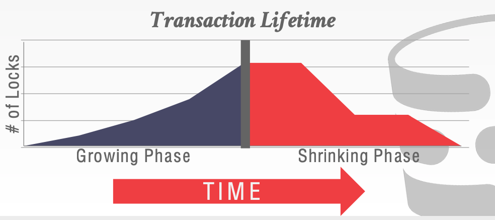
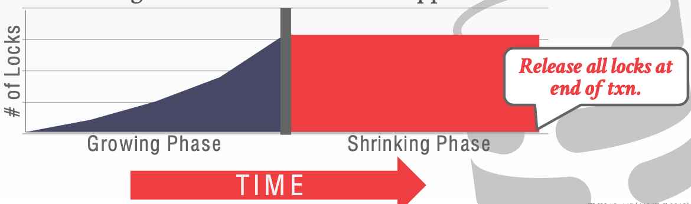
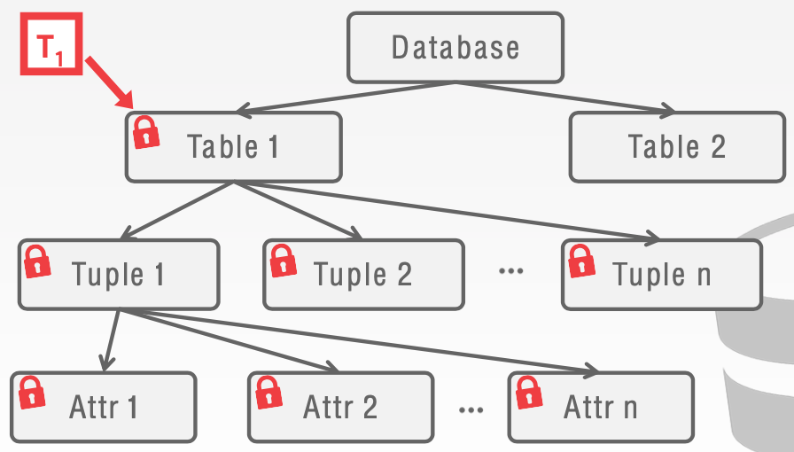
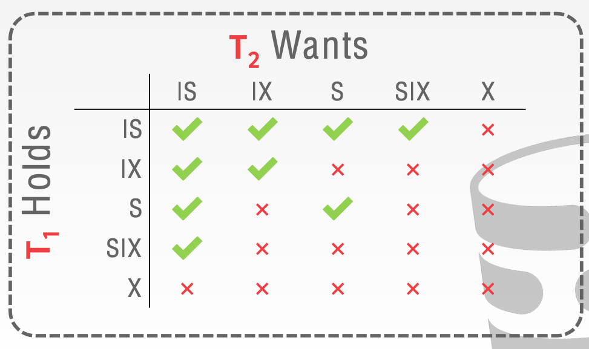

# Lecture 17 Two-Phase Locking

* We need a way to guarantee that all execution schedules are correct (i.e., serializable) without knowing the entire schedule ahead of time
* Solution: Use **locks** to protect database objects

## Lock Types

* **S-LOCK**: Shared locks for reads
* **X-LOCK**: Exclusive locks for writes

## Two-Phase Protocol

* **Two-phase locking** (2PL) is a concurrency control protocol that determines whether a transaction can access an object in the database on the fly
* The protocol does **not** need to know all the queries that a transaction will execute ahead of time
* **Phase #1: Growing**
  * Each transaction requests the locks that it needs from the DBMS's lock manager
  * The lock manager grants/denies lock requests
* **Phase #2: Shrinking**
  * The transaction is allowed to only release locks that it previously acquired
  * It cannot acquire new locks
  * The transaction is not allowed to acquire/upgrade locks after the growing phase finishes

* 2PL on itw own is sufficient to gurantee conflict serializability
* But it is subject to **cascading aborts**
* There are potential schedules that are serializable but would not be allowed by 2PL
  * Locking limits concurrency
* May still have **dirty reads**
  * Solution: **Strong Strict 2PL** (aka Rigorous 2PL)
* May lead to **deadlocks**
  * Solution: **Detection** or **Prevention**

### Strong Strict Two-Phase Locking

* A schedule is **strict** if a value written by a transaction is not read or overwritten by other transactions until that transaction finishes
* Does **not** incur cascading aborts

## 2PL Deadlocks

* A **deadlock** is a cycle of transactions waiting for locks to be released by each other

### Deadlock Detection

* The DBMS creates a **waits-for** graph to keep track of what locks each transaction is waiting to acquire
  * Nodes are transactions
  * Eadge from $T_i$ to $T_j$ if $T_i$ is waiting for $T_j$ to release a lock
* The system periodically checks for cycles in waits-for graph and then decides how to break it

### Deadlock Handling

* When the DBMS detects a deadlock, it will select a **victim** transaction to rollback to break the cycle
* The victim transaction will either restart **or** abort depending on how it was invoked
* There is a trade-off between the frequency of checking for deadlocks and how long txns have to wait before deadlocks are broken
* Selecting the proper victim depends on a lot of different variables
* We also should consifer the # of times a transaction has been restarted in the past to prevent **starvation**
* After selecting a victim transaction to abort, the DBMS can also decide on how far to rollback the transaction's changes
  * Approach #1: Completely
  * Approach #2: Minimally

### Deadlock Prevention

* Assign priorities based on timestamps:
  * Older Timestamp = Higher Priority
* **Wait-Die** (Old Waits for Young)
  * If requesting transaction has higher priority than holding transaction, then requesting transaction waits for holding transaction
  * Otherwise requesting transaction aborts
* **Wound-Wait** (Yound Waits for Old)
  * If requesting transaction has higher priority than holding transaction, then holding transaction aborts and releases lock
  * Otherwise requesting transaction waits
* When a transaction restarts, what is its (new) priority?
  * Its **original** timestamp

## Hierarchical Locking

* Ideally, each transaction should obtain fewest number of locks that is needed

* **Exclusive** + **Shared** for leafs of lock tree
* Special **Intention** locks for higher levels

#### Intention Locks

* An **intention lock** allows a higher level node to be locked in **shared** or **exclusive** mode without having to check all descendent nodes
* If a node is in an intention mode, then explicit locking is being done at a lower level in the tree
* **Intention-Shared** (IS)
  * Indicates explicit locking at a lower level with shared locks
* **Intentionn-Exclusive** (IX)
  * Indicates locking at lower level with exclusive **or** shared locks
* **Shared+Intention-Exclusive** (SIX)
  * The subtree rooted by that node is locked explicitly in **shared** mode and explicit locking is being done at a lower level with **exclusive-mode** locks
* Each transaction obtains appropriate lock at highest level of the database hierarchy
* Hierarchical locks are useful in practice as each transaction only needs a **few** locks

#### Lock Escalation

* Lock escalation dynamically asks for coarser- grained locks when too many low level locks acquired
* This reduces the number of requests that the lock manager has to process
