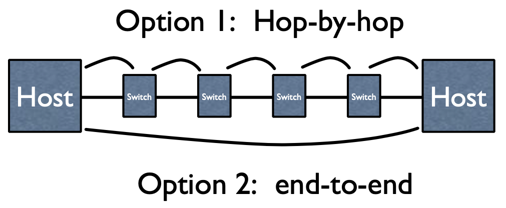
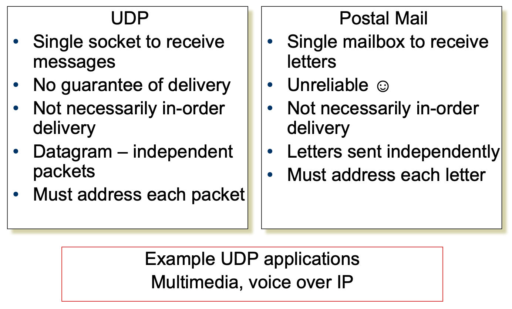

# Lecture 3 Communication

## Layering & Protocols

### Network Service Model

* Defines what promises that the network gives for any transmission
* Defines what type of failures to expect
* If network provides some of following features, we can reuse them across applications
  * Performance guarantees (QoS)
  * Flow and congestion control
  * Fragmentation
* What if the Data gets Corrupted? Add a checksum
* What if the Data gets Lost? Timeout and Retransmit
* What if the Data is Out of Order? Add Sequence Numbers

### Possible Failure Models

* Fail-stop
* Fail-slow or fail-stutter
* Byzantine
  * Anything that can go wrong, will
  * Including malicious entities taking over your computers and making them do whatever they want

### Layering

* Each layer relies on services from layer below and exports services to layer above
* **Interface** defines interaction with peer on other hosts
* **Protocols** define:
  * Interface to higher layers (API)
  * Interface to peer (syntax & semantics)
    * Actions taken on receipt of a messages
    * Format and order of messages
    * Error handling, termination, ordering of requests, etc
* Hides implementation - layers can change without disturbing other layers (black box)

## Internet Design

### Survivability

* If network is disrupted and reconfigured
  * Communicating entities should not care!
  * No higher-level state reconfiguration

|                  | Network        | Host         |
| ---------------- | -------------- | ------------ |
| Failure handling | Replication    | Fate sharing |
| Net Engineering  | Tough          | Simple       |
| Switches         | Maintain state | Stateless    |
| Host trust       | Less           | More         |

#### Fate Sharing

* Lose state information for an entity if and only if the entity itself is lost
* Example
  * OK to lose TCP state if one endpoint crashes
  * NOT okay to lose if an intermediate router reboots
* Tradeoffs:
  * Survivability: Heterogeneous network → less information available to end hosts and Internet level recovery mechanisms
  * Trust: must trust endpoints more

### IP Layering

### The Internet Protocol Suite

## Transport Protocols

### End-to-End Argument

* Deals with **where** to place functionality
  * Inside the network (in switching elements)
  * At the edges
* Argument
  * If you have to implement a function end-to-end anyway, **don’t implement it inside the communication system**
* Key motivation for split of functionality between TCP, UDP and IP

### UDP vs. TCP

* UDP provides just integrity and demux
* TCP adds
  * Connection-oriented
  * Reliable
  * Ordered
  * Point-to-point
  * Byte-stream
  * Full duplex
  * Flow and congestion controlled

## Application Design

* Typical network app has two pieces: **client** and **server**

### Socket API Operation Overview

### Transport Service Requirements of Common Apps

| Application                | Data loss                 | Bandwidth                     | Time Sensitive   |
| -------------------------- | ------------------------- | ----------------------------- | ---------------- |
| file transfer              | no loss                   | elastic                       | no               |
| email                      | no loss                   | elastic                       | no               |
| web documents              | no loss                   | elastic                       | no               |
| interactive audio/video    | loss-tolerant (often)     | audio: 5Kb-1Mb vide: 10Kb-5Mb | yes, 100's msecs |
| non-interactive audio/vide | loss-tolerant (sometimes) | same as above                 | yes, few secs    |
| interactive games          | loss-tolerant             | few Kbps                      | yes, 100's msecs |
| financial apps             | no loss                   | elastic                       | Yes and no: μs   |

### Design Tradeoff

* Do you need everything TCP provides?
* If not:
  * Can you deal with its drawbacks to take advantage of the subset of its features you need?
  * You’re going to have to implement the ones you need on top of UDP

### Web Page Retrieval

* Static configuration
  * IP address, DNS server IP address, IP address of routers
* **ARP for router**
* **DNS lookup for web server**
  * Several packet exchanges for lookup
* TCP SYN exchange
* HTTP Get request
* **HTTP response**
  * Slow start, retransmissions, etc

### Minimalist Approach

* Dumb network
  * IP provide minimal functionalities to support connectivity
    * Addressing, forwarding, routing
* Smart end system
  * Transport layer or application performs more sophisticated functionalities
    * Flow control, error control, congestion control
* Advantages
  * Accommodate heterogeneous technologies
  * Support diverse applications
  * Decentralized network administration
