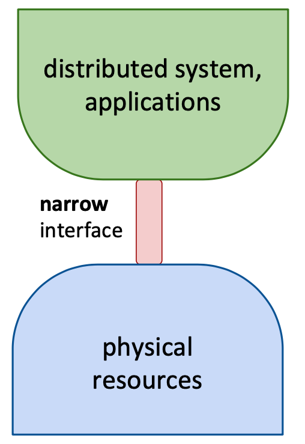
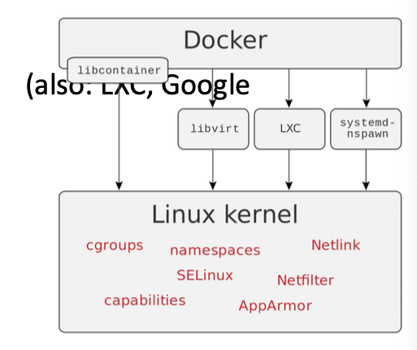

# Lecture 20 Virtualization Techniques

## Success of Virtualization

* Characteristic of good design for distributed systems
  * Small marginal load due to each additional client
  * **maximum # of clients with fixed # servers**
  * aggresive caching helps if wordload is right
* Need: ability to do dynamically grow resources
  * Hard to do with real resources
  * Made possible by **virtualiztaion**
* Virtualization can transform CAPEX into OPEX
  * CAPEX -> capital expenses
  * OPEX -> operational expenses
* Flexibility allocation of resources in cloud -> elasticity

## Virtualization Techniques

* Separate
  * Physical characteristics of resources
  * From the way in which other systems, applications, or end users interact
* Why is hardware special?
  * Narrow & stable waistline critical
    * Narrow: freer innovation & vendor neutrality
    * Stable: longevity / ubiquity
* Wide interfaces -> brittle abstractions
  * Hard to: deploy, sustain, scale

### Starting Point: Physical Machine

* Physical Hardware
  * Processors, memory, chipset, I/O devices
  * Resources often grossly underutilized
* Software
  * Tightly coupled to physical hardware
  * Single active OS instance
  * OS controls hardware

### Virtualizing This Machine

* Software Abstraction
  * Behave like hardware
  * Encapsulates all OS and application state
* Virtualization Layer
  * Extra level of indirection
  * Decouples hardware, OS
  * Enforces isolation
  * Multiplexes physical hardware across tenants

### Types of Virtualization

* System virtualization
  * Virtualizing the entire hardware interface
* Container virtualization
  * Virtualizing OS resources between processes

## System Virtualization

### Virtual Machines

* Implemented via Virtual Machine Monitor (VMM, aka hypervisor)
* **Fidelity**: Programs running in the virtualized environment run identically to running natively
* **Performance**: A statistically dominant subset of the instructions must be executed directly on the CPU
* **Safety and isolation**: The VMM must completely control access to system resources

### Types of System Virtualization

* Type 1: Native/Bare metal
  * Higher performance
  * Xen, Hyper-V
* Type 2: Hosted
  * Easier to install
  * Leverage host's device drivers
  * VMware Workstation, Parallels

### Requirements on VMs

* Isolation (Resource & Failure Isolation)
* Encapsulation (Mixed-OS Environment)
  * Cleanly capture all VM state
  * Enables VM snapshots, clones
* Protability (Improved Resource Utilization)
  * Independent of physical hardware
  * Enables migration of live, running VMs (freeze, suspend)
  * Clone VMs easily, make copies
* Interposition (Security Isolation)
  * Transformations on instructions, memory, I/O
  * Enables transparent resource overcommitment, compression, replication

### Efficient CPU Virtualization

* Non-privileged instructions
  * e.g., Load from mem
  * Run as native machine
* Privileged instructions
  * e.g., Update CPU state, Manipulate page table
  * Trap to vMM
  * Trap and Emulate -> Full control for VMM

### OS Memory Abstraction

* VMM partitions memory among VMs
  * VMM needs to assign hardware pages to VMs
  * VMM needs to control mapping for isolation

#### Three Levels of Abstraction

* **Logical**: process address space in a VM
* **Physical**: abstraction of hardware memory, managed by guest OS
* **Machine**: actual hardware memory
* Subtle challenges in real implementations (e.g., page table updates don't trap)

### I/O Virtualization

* Direct access: VMs can directly access devices
  * Requires H/W support (e.g., DMA passthrough, SR-IOV)
* Shared access: VMM provides an emulated device and routes I/O data to and from the device and VMs
* VMM provides virtual disks
  * Type 1 VMM - store guest root disks and config information within file system provided by VMM as a disk image
    * Support live migration that moves running guest OS between systems without interrupting user access to the guest or its app
  * Type 2 VMM - store the same info as files in the host OS's file system

### Virtual Machine Summary

* VMMs multiplex virtual machines on hardware
  * Virtualize CPU, Memory, and I/O devices
  * Run OSes in VMs, apps in OSes unmodified
  * Run different versions, kinds of OSes simultaneously
* Support for virtualization built into CPUs
  * Goal is to fully virtualize architecture
  * Required for transparent trap-and-emulate
* Virtual machines add significant overhead

## Container Virtualization

### Motivation for Containers

* Changing architecture of web applications
* New architecture: components -> micro services

* Why container virtualization?
  * **Overhead associated with deploying on VMs**
    * I/O overhead
    * OS-startup overhead per VM
    * Memory/Disk overhead (duplicate data)
* New idea:
  * Multiple isolated instance of programs
  * Running in user-space (shared kernel)
  * Instances see only resources (files, devices) assigned to their container

### Requirements on Containers

* Isolation and encapsulation
  * Fault and performance isolation
  * Encapsulation of environment, libraries, etc
* Low overhead
  * Fast instantiation/startup
  * Small per-operation overhead (I/O)
* Reduced portability

### Implementaiton of Containers

#### Resource View Isolation

* Problem: containers should only see their resources, and are the only users of their resources
  * e.g., PIDs, hostnames, UIDs, interprocess communication (IPC)
* Solution: each process is assigned a **namespace**
  * Syscalls only show resources within own namespace
  * Subprocesses inherit namespace
* Current implementation: namespace implementation per resource type (PIDs, UIDs, networks, IPC), in Linux since 2006
  * Containers feel like VMs, can get root
  * Security relies on kernel, containers make direct syscalls

#### Resource Usage Isolation

* Problem: meter resource usage and enforce hard limits per container
  * e.g., limit memory usage, priorities for CPU and I/O usage
* Solution: **usage counters for groups of processes** (`cgroup`s)
  * Compressible resources (CPU, I/O bandwidth): rate limiting
  * Non-compressible resources (Memory/disk space): requrie terminating containers (e.g., OOM killer per cgroup)
* Current implementation: `cgroup`/`kernfs`, in Linux since 2013/2014
  * Efficiency: 1000s of containers on a single host
  * Small overhead per memory allocation, and in CPU scheduler

#### Filesystem Isolation

* Problem: per-container filesystems without overhead of a virtual disk for each container
* Solution: **layering** of filesystems (copy on write)
  * Read-write (upper) layer that keeps per-container file changes
  * Read-only (lower) layer for original files
* Current implementation: OverlayFS, in Linux since 2014
  * Instant container startup
  * Upper layer is **ephemeral**

### The Container Ecosystem

* `libcontainer` - written in Go
  * Automates using kernel features (namespaces, cgroups, OverlayFS)
  * Container-image configuration language

### Container Summary

* Fast boot times: 100s of milliseconds
* High density: 1000s of containers per machine
* Very small I/O overhead
* Require no CPU support
* Implementation complexity is harder
* Less general than VMs and can only run the same OS (shared OS)
* Harder to migrate than VMs
  * State of containers is not fully encapsulated, state leaks into host OS
  * In practice: no container migration, but instead containers are ephemeral - just terminate old one and start new one
* Large attack surface under adversarial behavior
  * Containers typically have access to all syscalls
  * One possible fixup: syscall filtering (very complicated)
* **In practice, use VMs to isolate between different users, and containers to isolate different applications/services of a single user**
