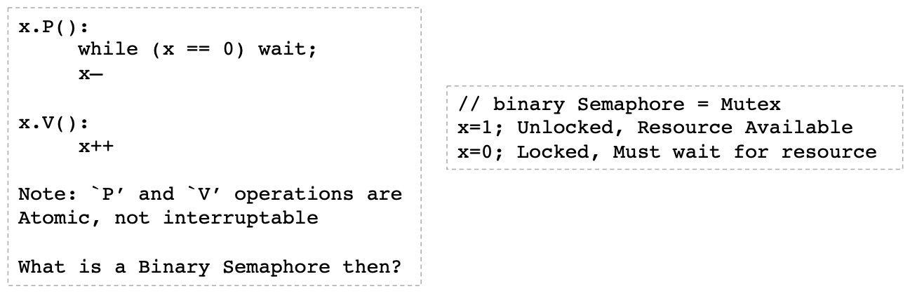

# Lecture 4 Concurrency

## Concurrency Terms

* Critical Section: piece of code accessing a shared resource, usually variables or data structures
* Race Condition: Multiple threads of execution enter Critical Section at the same time, **update shared resource**, leading to undesirable outcome
* Indeterminate Program: One or more Race Conditions, output of program depending on ordering, non deterministic

### Mutual Exclusion

* Mutual Exclusion: guarantee that **only** a single thread/process enters a Critical Section, avoiding races
* Desired Properties of Mutual Exclusion
  * **Mutual Exclusion (Correctness)**: single process in Critical Section at one time
  * **Progress (Efficiency)**: Processes don’t wait for available resources, or no spin-locks => no wasted resources
  * **Bounded Waiting (Fairness)**: No process waits for ever for a resource, i.e. a notion of fairness

#### Achieving Mutual Exclusion

* Test-and-Set instruction (atomic testing/setting of a value)


#### Classical Model of Concurrency

* Threads running within an address space
* Private/Shared state => primitive to access shared state
* E.g. Semaphores: Integer variable ‘x’ with 2 operations



#### Semaphones to Create a FIFO

```text
b.Init():
	b.sb = NewBuf()
	b.mutex = 1
	b.items = 0

b.Insert(x):
	b.mutex.lock()
	b.sb.Insert(x)
	b.mutex.unlock()
	b.items.V()

b.Remove():
	b.mutex.lock()
	b.items.P()
	x = b.sb.Remove()
	b.mutex.unlock()
	return x

b.Flush():
	b.mutex.lock()
	b.sb.Flush()
	b.items = 0
	b.mutex.unlock()
```

* We avoid the race condition but prone to a DEADLOCK

#### Buffer using ConditionVars

* Condition Variables(cvars)
  * cvars provide a sync point, one thread suspended until activated by another
  * cvar always associated with mutex
  * Wait() and Signal() operations defined with cvars

```text
cvar.Wait():
	Must be called after locking mutex.
	Atomically: release mutex & suspend operation
	When resume, lock mutex (but maybe not right away)

cvar.Signal():
	If no thread suspended, then NO-OP
	Wake up (at least) one suspended thread.
	(Typically do within scope of mutex, but not required)
```

```text
b.Init():
	b.sb = NewBuf()
	b.mutex = 1
	b.cvar = NewCond(b.mutex)

b.Insert(x):
	b.mutex.lock()
	b.sb.Insert(x)
	b.sb.Signal()
	b.mutex.unlock()

b.Remove():
	b.mutex.lock()
	while b.sb.Empty() {
		b.cvar.wait()
	}
	x = b.sb.Remove()
	b.mutex.unlock()
	return x

b.Flush():
	b.mutex.lock()
	b.sb.Flush()
	b.mutex.unlock()
```

* Mesa semantics (looser) vs Hoare Semantics (tighter)
* With Mesa semantics, use while loops to recheck the condition
  * Always safe to do so

## Concurrency Model for GO

* Channels are used for:
  * Passing information around (are typed: int, char, ...)
  * **Synchronizing** GOroutines
  * Providing pointer to return location (like a "**callback**")
* GoRoutines:
  * **Independently** executing function, launched by “go”
  * Independent call stack, very **inexpensive**, 1000s of them
* Instead of communicating by sharing memory, share memory by communicating

### Go Channel

* Bounded FIFO queue
  * `c := make(chan int, 10)`
  * Insertion (If channel full, wait for receiver)
    * Then put value at the end
    * `c <- 21`
  * Removal (If channel empty, then wait for sender)
    * Then get first value
    * `s := <- c`
  * Note, when channel capacity is 0, Insert/Remove is a rendezvous (i.e. sync point)

#### Use Go Channel to Implement a Mutex

```go
type Mutex struct {
     mc chan int
}
// Create an unlocked mutex
func NewMutex() *Mutex {
	m := &Mutex{make(chan int, 1)}
	m.Unlock() # Initially, channel empty == locked
  return m
}
// Lock operation, take a value from the channel
func (m *Mutex) Lock() {
	<- m.mc # Don't care about value
}
func (m *Mutex) Unlock() {
	m.mc <- 1 # Stick in value 1.
}
```
