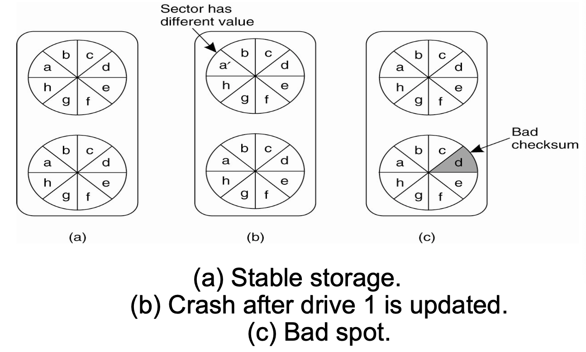
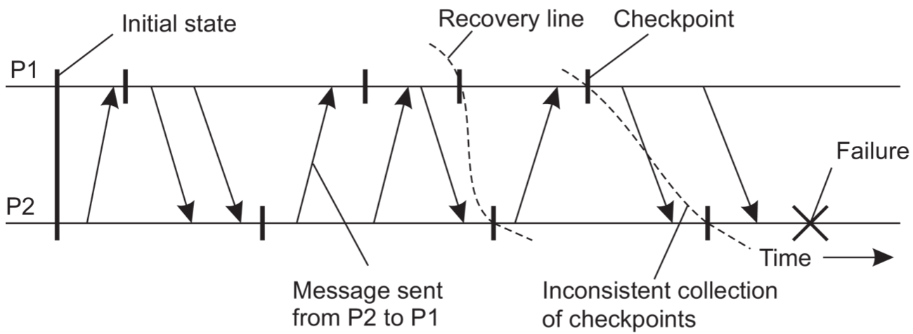
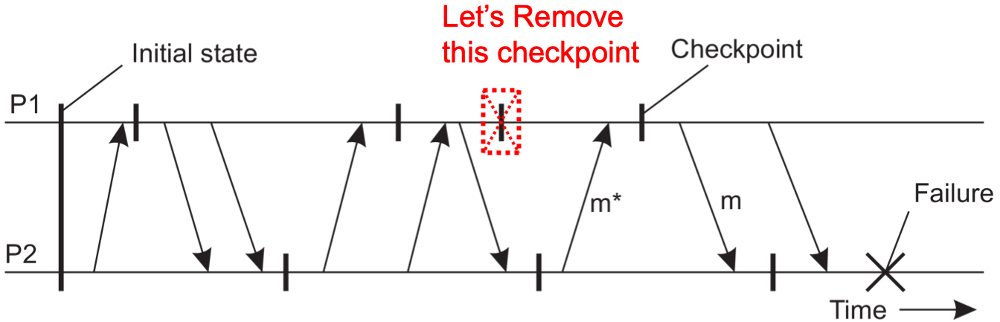

# Lecture 9 Fault Tolerance, Logging and Recovery

## Fault Tolerance

* Dealing successfully with **partial failure** within a distributed system
* Fault tolerant -> dependable systems
* Dependability implies the following:
  * Availability
  * Reliability
  * Safety
  * Maintainability

### Failure Models

| Type of Failure               | Description                                                  |
| ----------------------------- | ------------------------------------------------------------ |
| Crash failure                 | Server halts, working correctly before                       |
| Omission failure              | Server fails to respond to request / receive incoming messages / send messages |
| Timing failure                | Server's response outside specified time interval            |
| Response failure              | Incorrect server response / Wrong value of response / Deviation from flow of control |
| Arbitrary (Byzantine) failure | Server may produce arbitrary responses at arbitrary times    |

### Masking Failures by Redundancy

* Information Redundancy - add extra bits to allow for error detection/recovery
  * Hamming codes: detect 2-bit errors, correct 1-bit errors
* Time Redundancy - perform operation and, if needs be, perform it again
  * Purpose of transactions: BEGIN/END/COMMIT/ABORT
* Physical Redundancy - add extra (duplicate) hardware and/or software to the system
* Redundancy is expensive; but without redundancy, we need to recover after a crash

## Fault Tolerance using Checkpoints

### Recovery Strategies

* When a failure occurs, we need to bring the system into an error free state (recovery)
* **Backward Recovery**: return the system to some previous correct state (using **checkpoints**), then continue executing
  * Packet retransmit in case of lost packet
  * Checkpointing can be very expensive (especially when errors are very rare)
* **Forward Recovery**: bring the system into a correct new state, from which it can then continue to execute
  * Erasure coding -> Forward Error Correction
  * All potential errors need to be accounted for up-front
* In practice: backward recovery common

### Backward Recovery

* Checkpoint: snapshot the state of the distributed system
  * Transactions
  * Messages received/sent
  * Roles like coordinator in 2 Phase Commit
* Frequent checkpoints are expensive
  * Requires writing to stable storage

#### Checkpointing

* A recovery line to detect the correct distributed snapshot

* The domino effect – Cascaded rollback
  * If checkpoints are un-coordinated

#### Coordinated Checkpointing

* Key idea: each process takes a checkpoint after a globally coordinated action
* Simple solution: **2-phase blocking protocol**
  * Coordinator multicast checkpoint_REQUEST message
  * Participants receive message, takes a checkpoint, stops sending messages and queues them, and sends back checkpoint_ACK
  * Checkpoints **can** fail, if participant sent msg before checkpoint_REQUEST and receiver gets msg after checkpoint_REQUEST; then, abort and do try another coordinated checkpoint soon
  * Once all participants ACK, coordinator sends checkpoint_DONE to allow blocked processes to go on
* Optimization: consider only processes that depend on the recovery of the coordinator (those it sent a message since last checkpoint)

## Fault Tolerance using Logging and Recovery

### Transactions

* Appear as a single **indivisible** operation
* **Atomicity**:
  * Each transaction completes in its entirely, or is aborted
  * If aborted, should not have effect on the shared global state
* **Consistency**:
  * Each transaction preserves a set of invariants about global state
* **Isolation**:
  * Serializability
  * Each transaction executes as if it were the only one with the ability to read/write shared global state
* **Durability**:
  * Once a transaction has been completed, or committed there is no going back (undo)
* To make transactions reliable, store enough information to disk to determine global state in the form of a LOG
  * Disk performance is poor versus memory
  * Writing to disk to handle arbitrary crash is hard
  * General idea: store enough data on disk so as to recover to a valid state after a crash
    * **Shadow pages** and **Write-ahead Logging** (WAL)
    * Idea is to provide **Atomicity** and **Durability**

### Shadow Paging vs. Write-ahead Logging

* Shadow Pages
  * page = unit of storage
  * When writing a page, make a shadow copy
    * No references from other pages, edit easily
  * ABORT: discard shadow page
  * COMMIT: Make shadow page real and update pointers to data on this page from other pages recursively
  * Essentially **copy-on-write** to avoid in-place page update
* Write-ahead Logging
  * Create a log recording every update to database
  * Updates considered reliable when stored on disk
  * Updated versions are kept in memory (page cache)
  * Logs typically store both **REDO** and **UNDO** operations
  * After a crash, recover by replaying log entries to reconstruct correct state
  * Fewer disk operations, transactions considered **committed once log written**

## Logging and Recovery in Practice: ARIES

### ARIES Recovery Algorithms

* ARIES: Algorithms for Recovery and Isolation Exploiting Semantics
* Principles
  * Write-ahead logging
  * Repeating history during Redo
  * Logging changes during Undo

#### Write-Ahead Logging in ARIES

* View as sequence of entries, sequential number
  * **Log-Sequence Number (LSN)**
* Page on disk, some also in memory (page cache)
* Reconstruct global consistent state using
  * Log files + disk contents + (page cache)
* Logs consist of sequence of records
  * `LSN: [prevLSN, TID, “update”, pageID, new value, old value]`
  * Storing old and new values allow **REDO** operations to bring a page up to date, or **UNDO** an update reverting to an earlier version
* Transaction Table (TT): All TXNS not written to disk
  * Including Seq Num of the last log entry they caused
* Dirty Page Table (DPT): All dirty pages in memory
  * Includes recoveryLSN: first log entry to make page dirty (i.e. earliest change to page)

#### Recovery Using WAL

* Analysis Pass
  * Reconstruct TT and DPT from start or last checkpoint
  * Get copies of all pages at the start
* Recovery Pass (REDO pass)
  * Replay log forward, make updates to all dirty pages
  * Bring everything to state at the time of the crash
* UNDO Pass
  * Replay log file backward, revert any changes made by transactions that has not committed (use PrevLSN)
  * For each write Compensation Log Record (CLR)
  * Once reach entry without PrevLSN -> Done

#### Optimizing WAL

* In practice, we can do better with Checkpoint
  * Periodically save DPT, TT
  * Store any dirty pages to disk, indicate in LOG file
  * Prune initial portion of log file: All transactions upto checkpoint have been committed or aborted
