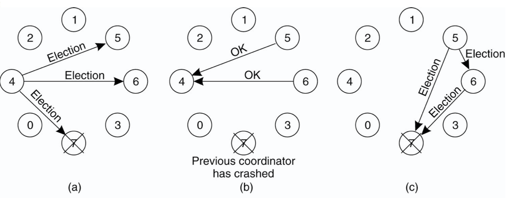

# Lecture 9 Mutual Exclusion

## Centralized Mutual Exclusion

### Mutual Exclusion

```text
while true:
	Perform local operations
	Acquire(lock)
	Execute critical section
	Release(lock)
```

* Must ensure that only one instance of code is in critical section
* Whereas multithreaded systems can use shared memory, we assume that processes can only coordinate via message passing
* Correctness/Safety: At most one process holds the lock/enter critical section at a time
* Fairness: Any process that makes a request must be granted lock
  * Deadlock-free
* Other requirements:
  * Low message overhead
  * No bottlenecks
  * Tolerate out-of-order messages

### Mutual Exclusion A Centralized Algorithm


* Clearly safe
* Fairness depends on queueing policy
* Cycle is a complete round of the protocol with one process i entering its critical section and then exiting (1 request, 1 grant, 1 release)
* Lock server creates bottleneck

### Elections

#### The Bully Algorithm

* P notices that leader has failed
* P sends an `ELECTION` message to all processes with higher numbers
* If no one responds, P wins the election and becomes coordinators
* If one of the higher-ups answers, it takes over. P's job is done.




#### A Ring Algorithm

* Election algorithm using a ring


## Totally Ordered Multicast

### Decentralized Algorithm Strawman

* Majority vote
* A coordinator always responds immediately to a request with GRANT or DENY
* Node failure matters and coordinators may forget vote on reboot
* What if you get less than m = n / 2 votes?
  * Backoff and retry later
  * Starvation
* **Can** use Lamport's to totally order

### Totally-Ordered Multicast

* A multicast operation by which all messages are delivered in the same order to each receiver
* Lamport details:
  * Each message is timestamped with the current logical time of its sender
  * Multicast messages are also sent back to the sender
  * **Assume all messages sent by one sender are received in the order they were sent and that no messages are lost**
  * Receiving process puts a message into a local queue ordered according to timestamp
  * The receiver multicasts an ACK to all other processes
  * Only deliver message when it is **both** at the head of queue and ACKed by all participants

## Distributed Mutual Exclusion

### Lamport Mutual Exclusion

* Every process maintains a queue of pending requests for entering critical section in order
* The queues are ordered by virtual timestamps derived from Lamport timestamps
* When node i wants to enter critical section, it sends timestamped request to all other nodes (including itself)
  * Wait for replies from all other nodes
  * If own request is at the head of its queue and all replies have been received, enter critical section
  * Upon exiting critical section, remove its request from the queue and send a release message to every process
* Other nodes
  * After receiving a request, enter the request in its own request queue and reply with a timestamp
    * This reply is unicast
  * After receiving release message, remove the corresponding request from its own request queue

### A Distributed Algorithm (Ricart & Agrawala)

* When node i wants to enter critical section, it sends timestamped request to all other nodes
  * These other nodes reply eventually
  * When i receives n-1 replies, then can enter critical section
* Trick: Node j having earlier request doesn't reply to i until after it has completed its critical section
* Deadlock free: Cannot have cycle where each node waiting for some other
* Starvation free: If node makes request, it will be granted eventually

### Token Ring Algorithm

* Organize the processes involved into a logical ring
* One token at any time -> passed from node to node along ring
* Issues: Lost token

### A Comparison of the Four Algorithms

| Algorithm     | Messages per entry/exit | Delay before entry | Problems                   |
| ------------- | ----------------------- | ------------------ | -------------------------- |
| Centralized   | 3                       | 2                  | Coordinator crash          |
| Decentralized | 3mk, k = 1,2,...        | 2m                 | Starvation, low efficiency |
| Distributed   | 2(n-1)                  | 2(n-1)             | Crash of any process       |
| Token ring    | 1 to infinity           | 0 to n-1           | Lost token, process crash  |

* None of these algorithms can tolerate failed processes or dropped messages
