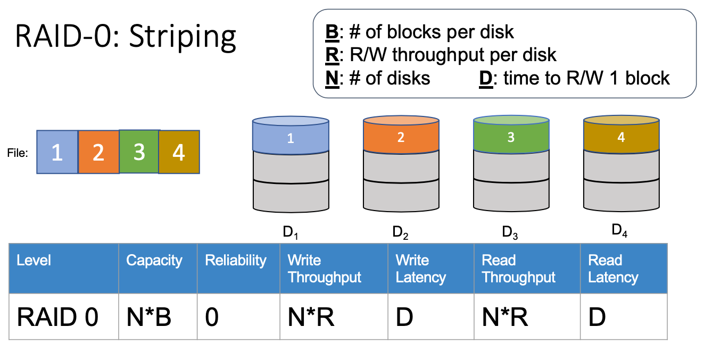
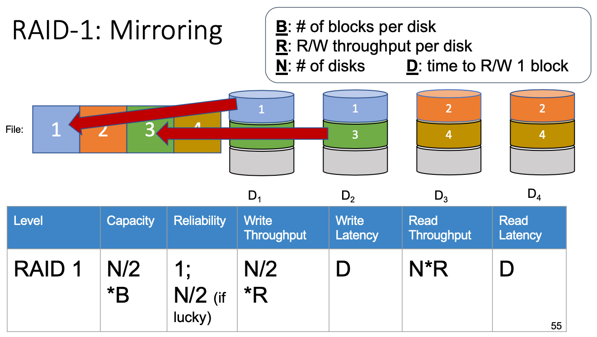
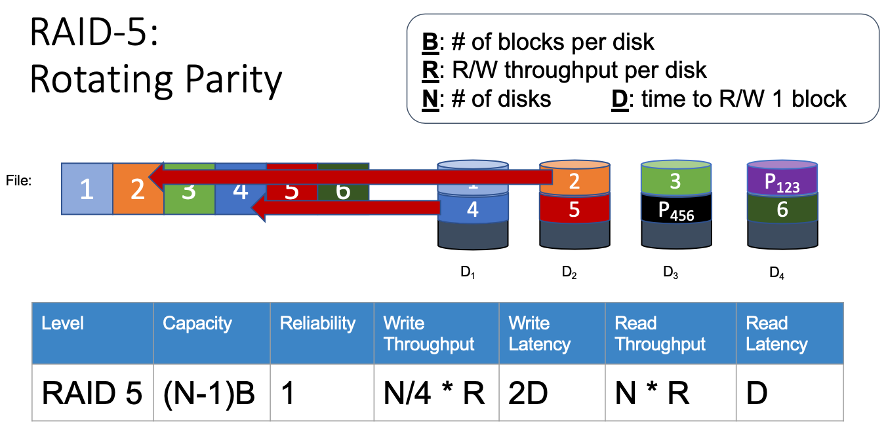

# Lecture 13 Fault Tolerance & RAID

## Errors & Error Recovery

* Hard errors: Dead/damaged component which experiences a fail-stop/crash
* Soft errors: A flipped signal or bit, caused by an external source or a faulty component

### Metrics of Availability

* Mean time to failure (**MTTF**)
* Mean time to repair (**MTTR**)
* Mean time between failures (**MTBF**) = MTTF + MTTR
* Availability = MTTF / (MTTF + MTTR)
* Availability Service Level Objective (**SLO**)
  * System targets
* Availability Service Level Agreement (**SLA**)
  * For customers

### Detect Errors

* Single Bit Parity
  * f(D) = sum of bits in D (mod 2)
  * Cannot reliably detect multiple bit errors
* Checksumming
  * Used by TCP, UDP, IP, etc
  * f(D) = Ones' complement sum of all bytes in a packet
  * Tricked by typical error patterns - e.g. burst errors
* Cyclic Redundancy Check (CRC)
  * Efficient streaming implementation in hardware
  * x86 instruction to calculate CRC
  * Used by ethernet and hard drives

### Error Recovery

* Triple modular redundancy
  * Send the same request to 3 different instances of the system
  * Compare the answers, take the majority
* Error Correcting Codes (ECC)
  * Two dimensional bit parity
* Retry (Network)
  * Detect the error: Timeout/Parity/Checksum
  * Correct the error: Retry/Retransmit

### Fault Tolerant Design

* Consider
  * The probability of failure of each component
  * The cost of failure
  * The cost of implementing fault tolerance

## RAID Levels and Performance

### Redundant Array of Inexpensive Disks (RAID)

* Use multiple disks to form single logical disk
* **RAID Levels**
  * RAID 0 - Data striping without redundancy
  * RAID 1 - Mirroring of independent disks
  * RAID 4 - Data striping plus parity disk
  * RAID 5 - Data striping plus stripped (rotated) parity
  * Others RAID 2 & 3 & 6
* Definitions:
  * Reliability: # of disk failures we can tolerate
  * Latency: time to process read/write requests

### Single Disk

### RAID-0: Striping

* To optimize performance, interleave data across multiple disks
  * Large file streaming -> parallel transfers
  * Small requests benefits from load balancing
* If a disk fails, part of the file system is lost

### RAID-1: Mirroring

* To achieve better reliability, two or more copies
  * Write both, read either
  * High data redundancy and only tolerate 1 disk failure
  * Parity disks: same reliability, higher usable capacity

### RAID-4: Parity Disk

* Calculating parity: Erasure code
  * Common example: XOR

* Capacity: one extra disk needed per stripe
* Bottleneck
  * Reads go to the data disks
  * All writes go to the parity disk
  * Add disk doesn't provide any performance gain

### RAID-5 Rotating Parity

* Distribute parity blocks in round-robin manner
  * Read old data block from data disk
  * Read old parity block from parity disk
  * Write new data block to data disk
  * Write new parity block to parity disk

## Estimating Availability

### Metrics of Availability & Reliability

* Mean time to first data loss (**MTTDL**) for RAID
  * Calculate from single disk MTTF
* With n disks, n times more likely to fail, and
  * Mean time to first disk failure ~ MTTF(disk) / # of disks
* Assumption: failed disks stay failed
  * MTTDL(RAID-0) = mean time to first disk failure
  * MTTDL(pair) = 1.5 * MTTF(drive)
  * MTTDL(RAID-1) = MTTDL(pair) / # of pairs
    * RAID-1 fails if at least one pair fails
  * MTTDL(set) = Mean time to first disk failure + Mean time to second disk failure
  * MTTDL(RAID-4) = MTTDL(set) / # of sets
* MTTF: the longer the better

### Reliability After Adding Rebuild

* After a drive failure
  * Data still accessible
  * A second failure is BAD
* Reconstruct the lost data onto a new drive
  * online spares are common features of high-end disk arrays
  * must balance rebuild rate with foreground performance impact
* How data is reconstructed?
  * Mirroring: read good copy
  * Parity: read all remaining drives (including parity) and compute
* MTTR is considered
  * MTTDL(array) = 1 / prob of 1st failure * 1 / prob of 2nd failure before repair
  * 1 / prob of 1st failure = mean time to first disk failure
  * prob of 2nd failure before repair = MTTR(drive) / MTTF(secondDrive)
* For mirroring
  * MTTDL(pair) = (MTTF(drive) / 2) * (MTTF(drive) / MTTR(drive))
  * MTTDL(RAID-1) = MTTDL(pair) / # of pairs
* For 5-disk parity-protected arrays
  * MTTDL(set) = (MTTF(drive) / 5) * ((MTTF(drive) / 4) / MTTR(drive))
  * MTTDL(RAID-4) = MTTDL(set) / # of sets

### Rebuild Mechanisms

* Three modes of operations
  * Normal mode
  * Degraded mode
  * Rebuild mode
* Background process
  * Use degraded mode read to reconstruct data
  * then, write it to replacement disk
* Interference with foreground activity and controlling rate
* Using the rebuilt disk
