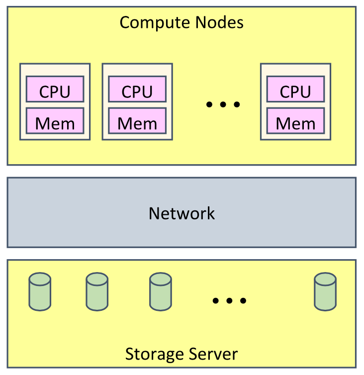
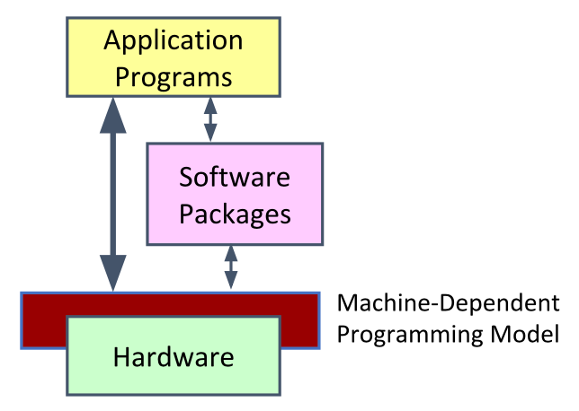
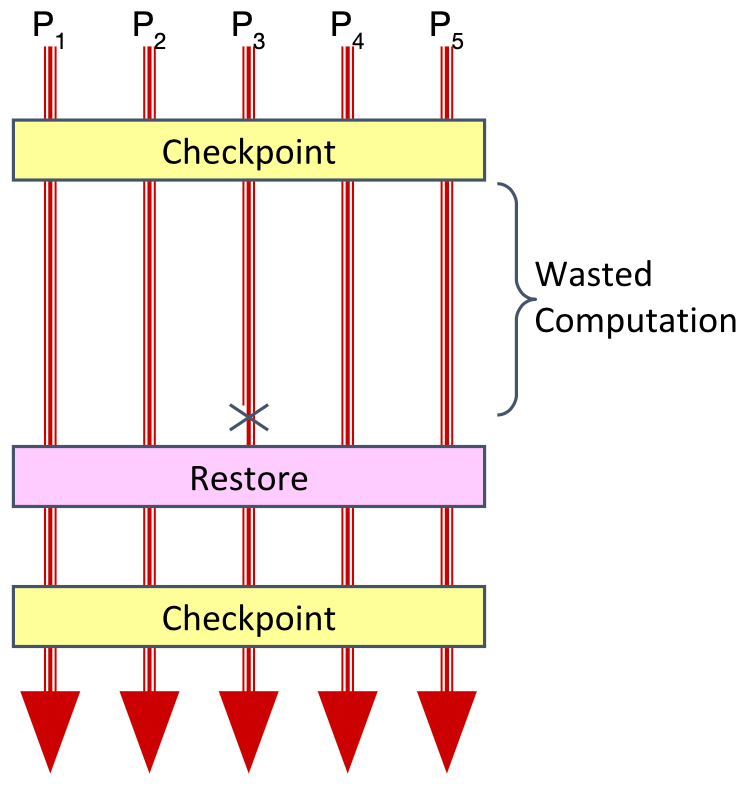
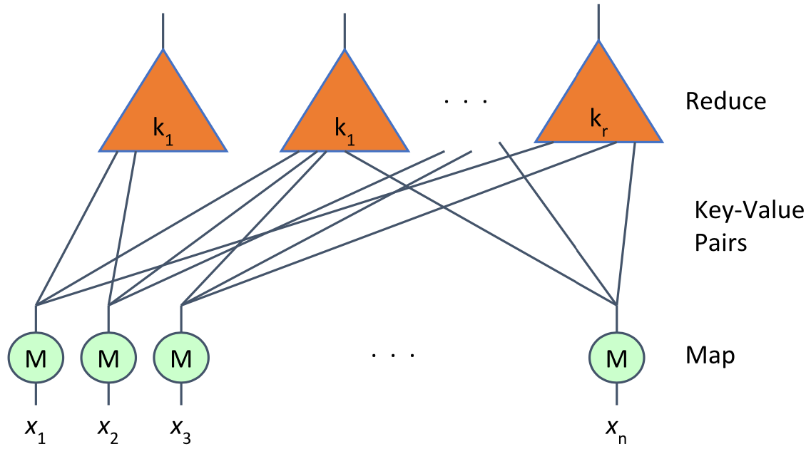
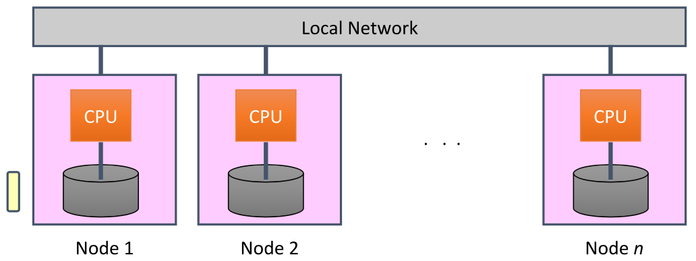
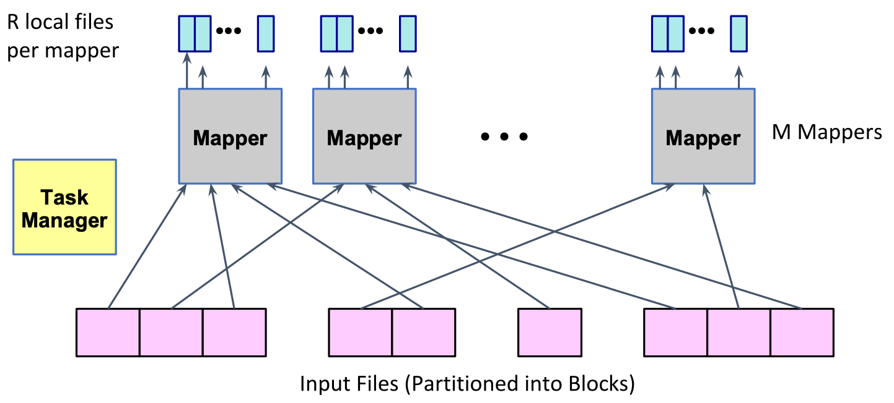
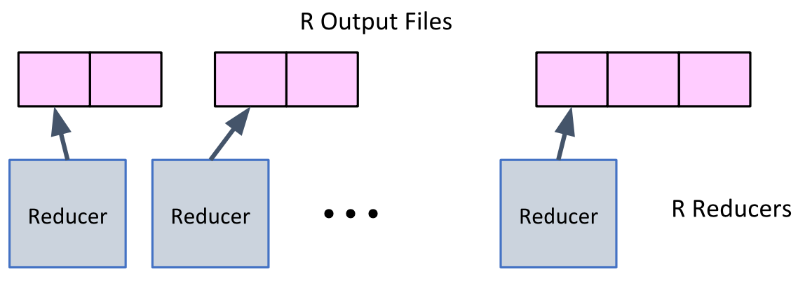

# Lecture16 Cluster Computing: MPI & MapReduce

## High-performance Computing (HPC)

### Typical HPC Machine

* Compute Nodes
  * High-end processors
  * Lots of RAM
* Network
  * Specialized
  * Very high performance
* Storage Server
  * RAID-based disk

### HPC Programming Model

### Message Passing Interface (MPI)

* MPI implementations highly optimized for low latency, high scalability over HPC grids/LANs

### HPC Example: Iterative Simulation

* Conway's Game of Life
  * Cellular automata on a square grid
  * Each cell live or dead (empty)
  * State in next generation depends on number of current neighbors
    * 2 -> stays same
    * 3 -> becomes live
    * Other -> becomes empty

* Shard grid across nodes
* Simulate locally in each subgrid
* Exchange boundary information
* Repeat simulation, exchange steps

### Typical HPC Operation

* Characteristics
  * Long-lived processes
  * Partitioning: exploit spatial locality
  * Hold all program data in memory (no disk access)
  * High bandwidth communication
* Strengths
  * High utilization of resources
  * Effective for many scientific applications
* Weaknesses
  * Requires careful tuning of application to resources
  * Intolerant of any variability

### HPC Fault Tolerance

* Checkpoint
  * Periodically store state of all processes
  * Significant I/O traffic
* Restore
  * When failure occurs
  * Reset state to that of last checkpoint
  * All intervening computation wasted
* Performance Scaling
  * Very sensitive to number of failing components

## Cluster Computing

### Cluster Machine

* Collocate Compute + Storage
  * Medium-performance processors
  * Modest memory
  * A few disks
* Network
  * Conventional Ethernet switches
  * 10s-100 GB/s
* Data-Intensive System Challenge
  * Lots of disks
  * Lots of processors
  * Located in close proximity

### Cluster Programming Model

* Runtime system controls scheduling, load balancing
* Very common model: MapReduce

## MapReduce

* Map computation across many objects
* Flexible aggregation of results
* System solves resource allocation & reliability

* Map: generate <word, count> pairs for all words in document
* Shuffling / Sorting Phase
* Reduce: sum word counts across documents

## Hadoop Project

* Colocate compute and storage (HDFS + MapReduce)
* HDFS Fault Tolerance (3 copies of file)
* Locality-preserving compute job placement prio order

### Hadoop MapReduce API

* Programmer must supply Mapper & Reducer classes
* Mapper
  * Steps through file one line at a time
  * Code generates sequence of <key, value> pairs
  * Default types for keys & values are strings
* Shuffling/Sorting
  * MapReduce's built in aggregation by key
* Reducer
  * Given key + iterator that generates sequence of values
  * Generate one or more <key, value> pairs

### Mapping

* Dynamically map input file blocks onto mappers
* Each generates key/value pairs from its block
* Each writes R files on local file system

### Hashing

* Hash Function h
  * Maps each key K to integer i such that 0 <= i < r
* Mapper Operation
  * Reads input file blocks
  * Generates pairs <K, V>
  * Writes to local file h(K)

### Shuffling

* Each Reducer
  * Handles 1/R of the possible key values
  * Fetches its file from each of M mappers
  * Sorts all of its entries to group values by keys

### Reducing

* Each Reducer
  * Executes reducer function for each key
  * Writes output values to cluster filesystem

### Cluster Scalability

* Framework following distributed system design principles
* Dynamically schedules tasks with state in replicated files
* Provisioning advantages:
  * Can use consumer-grade components
  * Can have heterogenous nodes
* Operational advantages:
  * Minimal staffing
  * No downtime
* Fault Tolerance
  * Assume reliable file system
  * Detect failed worker
    * Heartbeat mechanism
  * Reschedule failed task
* Stragglers
  * Tasks that take long time to execute
  * Might be bug, flaky hardware, or poor partitioning
  * When done with most tasks, reschedule any remaining executing tasks

## MapReduce Characteristics

* Characteristics
  * Commputation broken into many, short-lived tasks
  * Use disk storage to hold intermediate results
  * Failure -> Reschedule task
* Strength
  * Great flexibility in placement, scheduling, and load balancing
  * Can access large data sets
* Weakness
  * Higher overhead
  * Lower raw performance

### MapReduce vs. MPI

* MapReduce provides coarse-grained parallelism
* While MPI provides high communication fine-grained
* Both are examples of scale-out systems
* MPI:
  * Handles communicating components
  * Allows tightly-coupled parallel tasks
  * Good for iterative computations
  * More complex model (explicit messaging)
  * Failure handling left to application
* MapReduce:
  * Simple programming, failure model
  * Good for loosely-coupled, coarse-grain parallel tasks
  * Oriented towards disk-based data
  * Not good for interaction, highly-iterative computation

