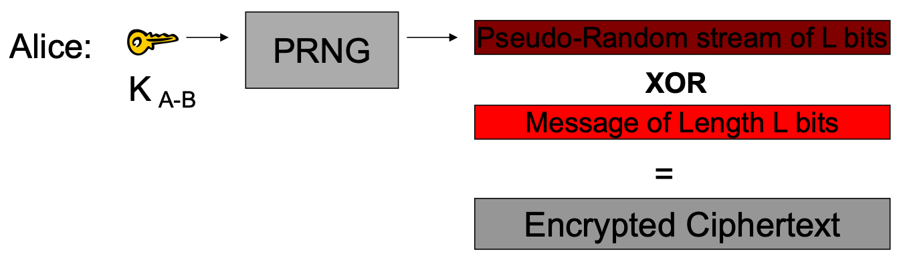
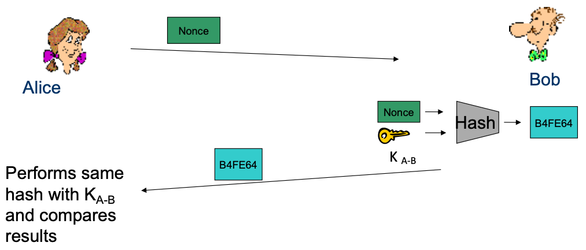
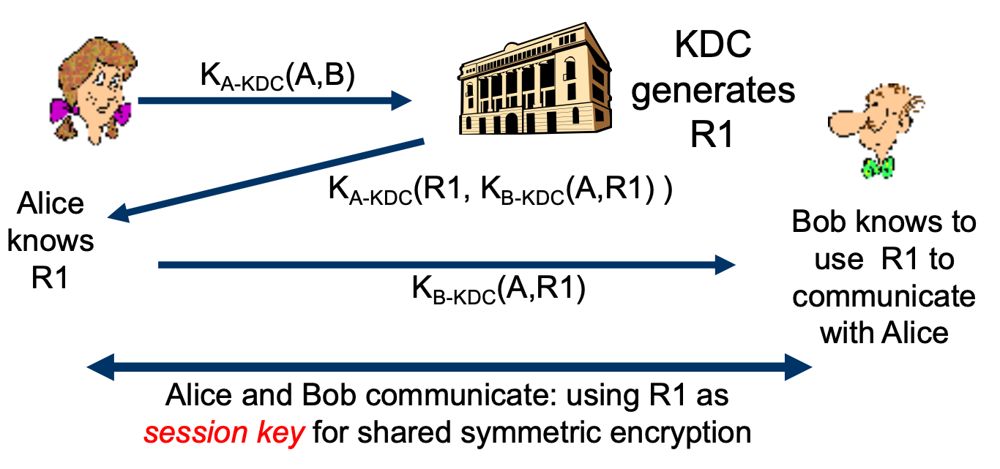

# Lecture 23 Security Protocols I

## Internet Security

### Internet Design Decisions

* Origin as a small and cooperative network -> largely trusted infrastructure
* Global addressing -> every sociopath is your next-door neighbor
* Connection-less datagram service -> can't verify source, hard to protect bandwidth
* Anyone can connect -> anyone can connect
* Millions of hosts run nearly identical software -> single exploit can create epidemic

### Secure Communication Channel

* Authentication (Who am I talking to?)
  * Fabrication
* Confidentiality (Is my data hidden?)
  * Eavesdropping attack
  * e.g., `tcpdump` with promiscuous network interface
* Integrity (Has my data been modified?)
  * Tampering attack
    * Stop the flow of the message
    * Delay and optionally modify the message
    * Release the message again
* Availability (Can I reach the destination?)
  * Destroy hardware (cutting fiber) or software
  * Modify software in a subtle way
  * Corrupt packets in transit
  * Blatant denial of service (DoS):
    * Crashing the server
    * Overwhelm the server (use up its resource)

## Cryptography

### Symmetric Key Cryptography

* Given a key k and a message m
  * Two functions: Encroption(E), Decryption(D)
  * Ciphertext $c = E(k,m)$
  * Plaintext $m = D(k,c)$
  * Both use the same key k and thus both ends have to know a pre-shared key K

#### Symmetric Key: Confidentiality

* Share a key K of L random bits, and a message M also bits long
  * Send the $xor(M,K)$ and then decrypt using $xor(M,K)$ again
* One-time Pad (OTP) is secure but usually impractical
  * Key is as long as the message
  * Keys cannot be reused
* In practical, two types of ciphers are used that require only constant key length
  * **Stream ciphers** (e.g., RC4, A5)
  * **Block ciphers** (e.g., DES, AES, Blowfish)

#### Stream Ciphers

* Use $K_{A-B}$ as PRNG seed, and XOR encrypted text to get the message back (just like an OTP)

#### Block Ciphers

* Break the ciphertext into blocks, feed it through decryption engine using $K_{A-B}$ to recover the message

#### Symmetric Key: Integrity

* Hash function properties
  * Consistent
  * One-way
  * Collision resistant
* **Hash Message Authentication Code (HMAC)**

#### Symmetric Key: Authentication

* HMAC + A **Nonce**
  * A random bitstring used only once

### Asymmetric Key Crypto

* Instead of shared keys, each person has a **key pair**
  * public key $K_B$
  * private key $K_{B^{-1}}$
* The keys are **inverses**, so:
  * $K_{B^{-1}}(K_B(m))=m$
* Given a key k and a message m
  * Two functions: Encryption(E), Decryption(D)
  * Ciphertext $c = E(K_B,m)$
  * Plaintext $m = D(K_{B^{-1}},c)$
  * Encryption and decryption use different keys
* It is believed to be computationally unfeasible to derive $K_{B^{-1}}$ from $K_B$ or to find any way to get M from $K_B(M)$ other than using $K_{B^{-1}}$
* $K_B$ can safely be made public

#### Asymmetric Key: Confidentiality

#### Asymmetric Key: Sign & Verify

* If we are given a message M, and a value S such that $K_B(S) = M$
  * The message must be from Bob, because it must be the case that $S = K_{B^{-1}}(M)$, and only Bob has $K_{B^{-1}}$
* This gives us two primitives:
  * $Sign(M) = K_{B^{-1}}(M) = Signature S$
  * $Verify(S,M) = test(K_B(S)==M)$

#### Asymmetric Key: Integrity & Authentication

* We can use Sign() and Verify() in a similar manner as our HMAC in symmetric schemes

### The Great Divide

|                                           | Symmetric Crypto (Private key) AES | Asymmetric Crypto (Public key) RSA |
| ----------------------------------------- | ---------------------------------- | ---------------------------------- |
| Requires a pre-shared secret?             | Yes                                | No                                 |
| Overall speed of cryptographic operations | Fast                               | Slow                               |

* Symmetric key primitives assumes Alice and Bob had already shared a key
* Asymmetric key primitives assumes Alice knows Bob's public key

## Key Distribution

* Andrew uses Kerberos, which relies on a Key Distribution Center (KDC) to establish shared symmetric keys

### Key Distribution Center (KDC)

* Alice and Bob need shared symmetric key
* KDC: server shares different secret key with each registered users
* Alice and Bob know own symmetric keys, $K_{A-KDC}$, $K_{B-KDC}$, for communicating with KDC

* KDC must always be **online** to support secure communication
* KDC can expose our session keys to others
* **Centralized trust** and point of failure
* In practice, the KDC model is mostly used **within single organization** (e.g., Kerberos) but not more widely
