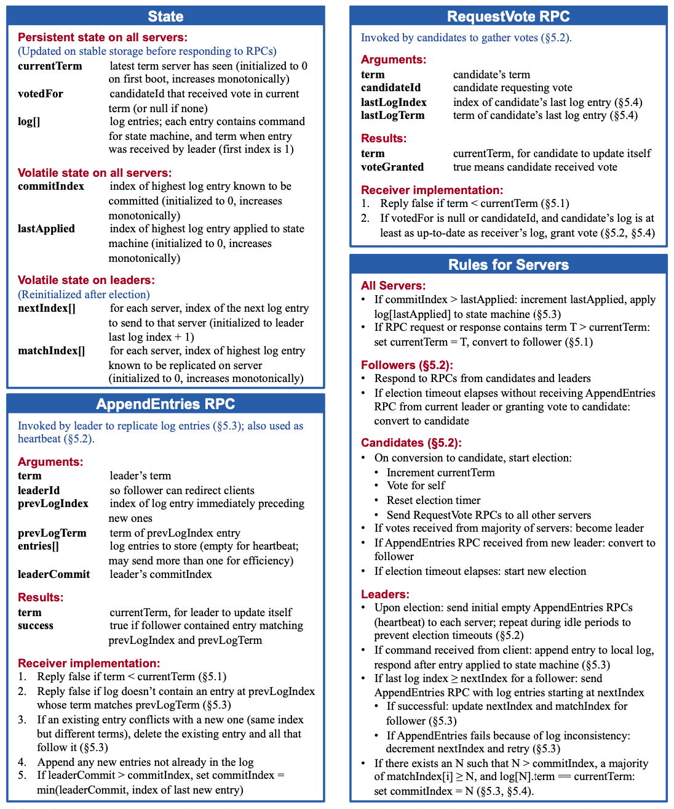
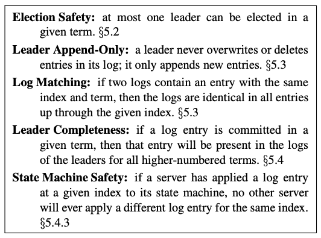

# [Raft](https://raft.github.io/raft.pdf)

## Introduction

* Understandability
* Strong leader: log entries only flow from the leader to other servers
* Leader election: use randomized timers to elect leaders
* Membership changes: joint consensus

## Replicated State Machines

* Used to solve fault tolerance problem
* Implemented using a replicated log
  * Each server stores a log containing a series of commands in order
  * Each log contains the same commands in the same order
* Once commands are properly replicated, each server’s state machine processes them in log order, and the outputs are returned to clients

## What's Wrong with Paxos

* Paxos is exceptionally difficult to understand
* does not provide a good foundation for building practical implementations

## Designing for Understandability

* Problem decomposition
  * Raft seperates leader election, log replication, safety, and membership changes
* Simplify the state space
  * Make the system more coherent and elminate nondeterminism where possible
  * Randomization introduces nondeterminism, but they tend to reduce the state space by handling all possible choices in a similar fashion (choose any; it doesn't matter)

## The Raft Consensus Algorithm

### Raft Basics

* Each server is one of three states: **leader**, **follower**, or **candidate**
  * There is exactly one leader and all others are followers
  * Followers are passive: they issue no requests and redirect client requests to leader
* Raft divides time into **terms** of arbitrary length
  * Terms are numbered with consecutive integers
  * Each term begins with a election
  * If a candidate wins the election, then it serves as leader for the rest of the term
  * If split vote happens, it will end end with no leader and a new term (with a new election) will begin shortly
  * Raft ensures that there is **at most one** leader in a given term
  * Terms act as a **logical clock** and they allow servers to detect obsolete information such as stale leaders
  * Each server stores a current term number, which **increases monotonically** over time
    * Current terms are exchanged whenever servers communicate
    * If one server's current term is smaller than the other's, then it updateass its current term to the larger value
    * If a candidate or leader discovers that its term is out of data it immediately reverts to follower state
    * If a server receives a request with a stale term number, it rejects the request
* Raft servers communicate using remote procedure calls (RPCs)
  * **RequestVote** RPCs are initiated by candidates during elections
  * **AppendEntries** RPCs are initiated by leaders to replicate log entries and provide a form of heartbeat
  * Servers **retry** RPCs if they do not receive a response in a timely manner, and they issue RPCs in **parallel** for best performance

### Leader Election

* Raft uses a **heartbeat** mechanism to trigger leader election
* When servers start up, they begin as followers
* A server remains in follower state as long as it receives valid RPCs from a leader or candidate (until **election timeout**)
* Leaders send periodic heartbeats (AppendEntries RPCs that carry no log entries) to all followers in order to maintain their **authority**
* To begin an election, a follower increments its current term and transitions to candidate state
  * It then votes for itself and issues RequestVote RPCs in parallel to each of the other servers in the cluster
  * A candidate continues in this state until one of three things happens:
    * it wins the election
      * wins a election if it receives votes from a majority of the servers in the full cluster for the same term
      * each server will vote for at most one candidate in a given term, on a first-come-first-served
      * after a server becomes a leader, it sends heartbeat messages to all other servers to establish its authority and prevent new elections
    * another server establishes itself as leader
      * while waiting for votes, a candidate may receive an AppendEntries RPC from another server claiming to be leader
      * If the leader's term is at least as large as the candidate's current term, then the candidate recognizes the leader as legitimate and returns to follower state; otherwise, reject the RPC and continues in candidate state
    * a period of time goes by with no winner
      * when split vote happens, each candidate will time out and start a new election by incrementing its term and initiating another round of RequestVote RPCs
      * Raft uses **randomized election timeouts** to ensure that split votes are rare
      * each candidate restarts its randomized election timeout at the start of an election, and it waits for that timeout to elapse before starting the next election

### Log Replication

* Once a leader has been elected, it begins servicing client requests
  * Each client request contains a command to be executed by the replicated state machines
  * The leader appends the command to its log as a new entry, then issues AppendEntries RPCs in parallel to each of the other servers to replicate the entry
  * When the entry has been safely replicated, the leader applies the entry to its state machine and returns the result of that execution to the client
  * If followers crash or run slowly, or if network packets are lost, the leader retries AppendEntries RPCs indefinitely (even after it has responded to the client) until all followers eventually store all log entries
* Each **log entry** stores a state machine command along with the term number when the entry was received by the leader
  * Each log entry has an integer index identifying its position in the log
* A log entry is **committed** once the leader that created the entry has replicated it on a majority of the servers
  * Also commits all receding entries in the leader's log, including entries created by previous leaders
* The leader keeps track of the highest index it knows to be committed, and it includes that index in future AppendEntries RPCs (including heartbeats) so that the other servers eventually find out
* Once a follower learns that a log entry is committed, it applies the entry to its local state machine (in log order)
* **Log Matching Property**
  * If two entries in different logs have the same index and term, then they store the same command
  * If two entries in different logs have the same index and term, then the logs are identical in all preceding entries
    * When sending an AppendEntries RPC, the leader includes the index and term of the entry in its log that immediately precedes the new entries
    * If the follower does not find an entry in its log with the same index and term, then it refuses the new entries
* Missing and extraneous entries in a log may span multiple terms in followers
* In Raft, the leader handles inconsistencies by **forcing** the followers’ logs to duplicate its own
  * To bring a follower’s log into consistency with its own, the leader must find the latest log entry where the two logs agree, delete any entries in the follower’s log after that point, and send the follower all of the leader’s entries after that point
  * All of these actions happen in response to the **consistency check** performed by AppendEntries RPCs
  * The leader maintains a nextIndex for each follower, which is the index of the next log entry the leader will send to that follower
  * When a leader first comes to power, it initializes all nextIndex values to the index just after the last one in its log

