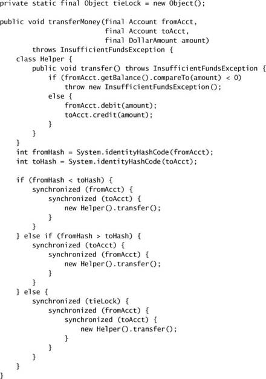
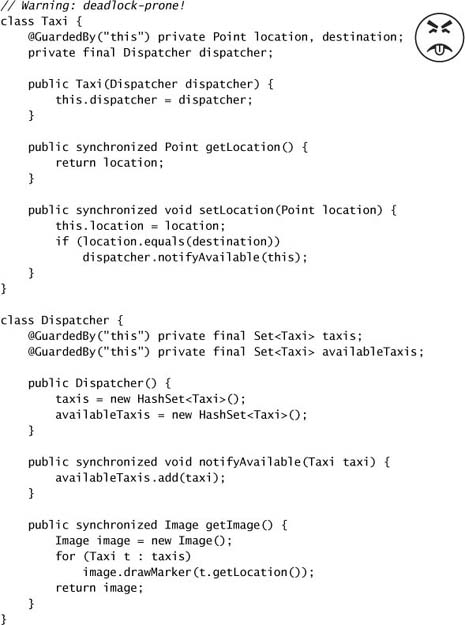
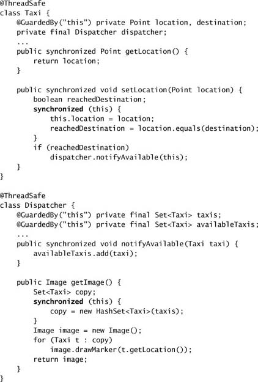

# Chapter 10. Avoiding Liveness Hazards

* *safety* versus *liveness*
* locking => thread safety, may cause *lock-ordering deadlocks*.
* thread pools and semaphores => bound resource consumption, may cause *resource deadlocks*.

## 10.1 Deadlock

* "dining philosophers" problem
* Database systems are designed to detect and recover from deadlock.
  * Searching the *is-waiting-for* graph for cycles => pick a victim and abort that transaction => release the lock, allowing the other transactions to proceed => the application may retry the aborted transaction later.
* The JVM does not recover from deadlock.

### 10.1.1 Lock-ordering Deadlocks

* The deadlock may come about because the two threads attempt to acquire the same locks in a *different order*.
* If you can guarantee that every thread that needs locks L and M at the same time always acquires L and M in the same order, there will be no deadlock.
* Verifying consistent lock ordering requires a global analysis of your program's locking behavior.

### 10.1.2 Dynamic Lock Order Deadlocks

* Deadlock can occur acquire nested in different order dynamically.

* To fix it, we must induce a *consistent* ordering on the locks.
  * `System.identifyHashCode` returns the value returned by `Object.hashCode` => in rare case two objects have the same hash code => still possibility of deadlock => "tie breaking" lock is used.
  * Or, if there is an unique, immutable, comparable key, just order objects by their key.

### 10.1.3 Deadlocks Between Cooperating Objects

* Invoking an *alien method* with a lock held is asking for liveness trouble.
  * The alien method might acquire other locks (risking deadlock) or block for an unexpectedly long time, stalling other threads that need the lock you hold.

### 10.1.4 Open Calls

* open call := calling a method with no locks held
* Using open calls to avoid deadlock => easy to analyze for deadlock-freedom => similar to using encapsulation to provide thread safety.

* In many cases, the loss of atomicity is perfectly acceptable.
* To achieve atomicity, structure a concurrent object so that only one thread can execute the code path following the open call => instead of relying on critical sections of code, it relies on constructing protocols so that other threads don't try to get in.

### 10.1.5 Resource Deadlocks

* Resource pools are usually implemented with semaphores.
* Tasks that wait for the results of other tasks => thread-starvation deadlock.
* Bounded pools and interdependent tasks do not mix well.
