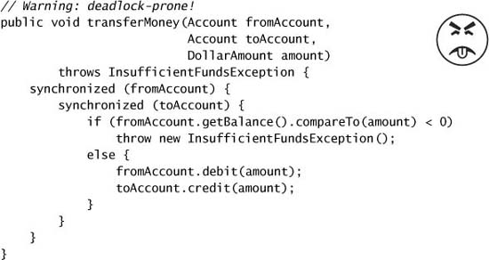

# Chapter 10. Avoiding Liveness Hazards

* *safety* versus *liveness*
* locking => thread safety, may cause *lock-ordering deadlocks*.
* thread pools and semaphores => bound resource consumption, may cause *resource deadlocks*.

## 10.1 Deadlock

* "dining philosophers" problem
* Database systems are designed to detect and recover from deadlock.
  * Searching the *is-waiting-for* graph for cycles => pick a victim and abort that transaction => release the lock, allowing the other transactions to proceed => the application may retry the aborted transaction later.
* The JVM does not recover from deadlock.

### 10.1.1 Lock-ordering Deadlocks

* The deadlock may come about because the two threads attempt to acquire the same locks in a *different order*.
* If you can guarantee that every thread that needs locks L and M at the same time always acquires L and M in the same order, there will be no deadlock.
* Verifying consistent lock ordering requires a global analysis of your program's locking behavior.

### 10.1.2 Dynamic Lock Order Deadlocks

* Deadlock can occur acquire nested in different order dynamically.

* To fix it, we must induce a *consistent* ordering on the locks.
  * `System.identifyHashCode` returns the value returned by `Object.hashCode` => in rare case two objects have the same hash code => still possibility of deadlock => "tie breaking" lock is used.
  * Or, if there is an unique, immutable, comparable key, just order objects by their key.

### 10.1.3 Deadlocks Between Cooperating Objects

* Invoking an *alien method* with a lock held is asking for liveness trouble.
  * The alien method might acquire other locks (risking deadlock) or block for an unexpectedly long time, stalling other threads that need the lock you hold.

### 10.1.4 Open Calls

* open call := calling a method with no locks held
* Using open calls to avoid deadlock => easy to analyze for deadlock-freedom => similar to using encapsulation to provide thread safety.

* In many cases, the loss of atomicity is perfectly acceptable.
* To achieve atomicity, structure a concurrent object so that only one thread can execute the code path following the open call => instead of relying on critical sections of code, it relies on constructing protocols so that other threads don't try to get in.

### 10.1.5 Resource Deadlocks

* Resource pools are usually implemented with semaphores.
* Tasks that wait for the results of other tasks => thread-starvation deadlock.
* Bounded pools and interdependent tasks do not mix well.

## 10.2 Avoiding and Diagnosing Deadlocks

* If you must acquire multiple locks, lock ordering must be a part of your design.
  * => try to minimize the number of potential locking interactions.
  * => follow and document a lock-ordering protocol for locks that may be acquired together.
* Audit your code for deadlock freedom
  * => firstly, identify where multiple locks could be acquired,
  * => then perform a global analysis of all such instances to ensure that lock ordering is consistent across your entire program.
* Using open calls wherever possible simplifies the analysis.

### 10.2.1 Timed Lock Attempts

* Use the timed `tryLock` of the explicit `Lock` classes => detecting and recovering from deadlocks.
  * => let you specify a timeout after which `tryLock` returns failure.
  * => you can regain control when something unexpected happens.
* When a timed lock attempt fails, you do not necessarily know *why*.
  * If a lock times out => you can release the lock, back off and wait for a while => try again, possibly clearing the deadlock condition and allowing the program to recover.
    * This doesn't work if multiple locks are acquired in the nesting of method calls.

### 10.2.2 Deadlock Anaysis with Thread Dumps

* thread dump := a stack trace for each running thread + locking information.
* Before geenerating a thread dump, the JVM searches the is-waiting-for graph for cycles to find deadlocks => will include deadlock information identifying which locks and threads are involved, and where in the program the offending lock acquisitions are.
* To trigger a thread dump
  * => send the JVM process a `SIGQUIT` signal (`kill -3`) on Unix platforms
  * => press the `Ctrl-\` key on Unix or `Ctrl-Break` on Windows platforms.
* Intrinsic locks are associated with the stack frame in which they were acquired; explicit `Lock`s are associated only with the acquiring thread.

## 10.3 Other Liveness Hazards

### 10.3.1 Starvation

* *Starvation* occurs when a thread is perpetually denied access to resources it need in order to make progress; the ost commonly starved resource is CPU cycles.
  * => can be caused by inappropriate use of thread priorities.
    * The thread priorities defined in the Thread API are merely scheduling hints.
    * In most Java applications, all application threads have the same priority, `Thread.NORM_PRIORITY`.
    * => avoid to use thread priorities, which would increase platform dependence.
  * => can be caused by executing nonterminating constructs with a lock held.
    * e.g., infinite loop, resource waits that do not terminate.

### 10.3.2 Poor Responsiveness

* CPU-intensive background tasks => compete for CPU cycles => affect responsiveness.
* Poor lock management => some threads holding locks for a long time => poor responsiveness.

### 10.3.3 Livelock

* *Livelock*: a thread, while not blocked, cannot make progress because it keeps retrying on an operation that will always fail.
  * often comes from overeager error-recovery code that mistakenly treats an unrecoverable error as a recoverable one.
  * also occur when multiple cooperating threads change their state in response to the others.
* *poison message problem*: often occurs in transactional messaging application, where messaging infrastructure rolls back a transaction if a message cannot be processed successfully, and puts it back at the head of the queue.
* The solution => introduce some randomness into the retry mechanism.
  * e.g., random waits, exponential backoff after repeated collisions.
