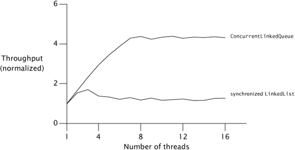
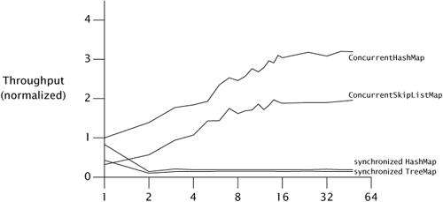

# Chapter 11. Performance and Scalability

* Threads
  * => improve resource utilization
    * => exploit available processing capacity
  * => improve responsiveness
    * => begin processing new tasks immediately while existing still running tasks
* Techniques for analyzing, monitoring, improving concurrent performance => complexity => increase the likelihood of safety and liveness failures.
* Safety always comes first.

## 11.1 Thinking about Performance

* Improving performance means doing more work with fewer resources.
  * e.g., CPU cycles, memory, network bandwidth, I/O bandwidth, database requests, disk space, other resources.
  * Performance limited by availability of a resource => CPU-bound, database-bound.
* Using multiple threads => performance costs like:
  * Overhead associated with coordinating between threads (locking, signaling, memory synchronization).
  * Increased context switching.
  * Thread creation and teardown.
  * Scheduling overhead.
* Using concurreny to achieve better performance.
  * => utilize the processing resources we have more effectively.
  * => enable our program to exploit additional processing resources if they become available.

### 11.1.1 Performance Versus Scalability

* Application performance => service time, throughput, efficiency, scalability.
* *Scalability*: the ability to improve throughput or capacity when additional computing resources are added.
  * Tuning for scalability => do *more* work with *more* resources.
  * => often *increasing* the amount of work done to process each *individual* task.
    * such as dividing tasks into multiple pipelined subtasks.
* Three-tier application model : presentation, business logic, persistence.
* For server applications, "how much" (scalability, throughput, capacity) are of greater concern than "how fast" aspects.
* For interactive applications, latency tends to be more important.

### 11.1.2 Evaluating Performance Tradeoffs

* Avoid premature optimization => most optimizations are often undertaken before a clear set of requirements is available.
* The quest for performance is probably the single greatest source of concurrency bugs.
* Measure, don't guess.

## 11.2 Amdahl's Law

* *Amdahl's law*: how much a program can theoretically be sped up by additional computing resources, based on the proportion of parallelizable and serial components.
* We can achieve a speedup of at most:
  * $$Speedup \le \frac{1}{F+\frac{(1-F)}{N}}$$
  * F := the fraction of the calculation that must be executed serially
  * N := processor number
* Identify the sources of serialization:
  * synchronization to maintain the work queue's integrity in the face of concurrency access
  * accessing any shared data structure => serialization
  * result handling => final merge is a source of serialization

### 11.2.1 Example: Serialization Hidden in Framework

* The synchronized `LinkedList` guards the entire queue state with a single lock that is held for the duration of the `offer` or `remove` call; `ConcurrentLinkedQueue` uses a sophisticated nonblocking queue algorithm that uses atomic references to update individual link pointers.

### 11.2.2 Applying Amdahl's Law Qualitatively

* Amdahl's law => quantifies the possible speedup when more computing resources are available.
* Reducing lock granularity: lock splitting (splitting one lock into two) and lock striping (splitting one lock into many).
  * lock striping seems much more promising.

## 11.3 Costs Introduced by Threads

### 11.3.1 Context Switching

* *context switch*: requires saving the execution context of the currently running thread and restoring the execution context of the newly scheduled thread.
  * => not free; thread scheduling requires manipulating shared data structures in the OS and JVM.
  * => a flurry of cache misses.
* Schedulers => give each runnable thread a certain minimum time quantum => it amortizes the cost of the context switch => improving oeverall throughput.
* more blocking (blocking I/O, waiting for contended locks, or waiting on condition variables) => more context switches than one that is CPU-bound => increasing scheduling overhead and reducing throughput.
* A good rule of thumb := a context switch costs equivalent of 5,000 to 10,000 clock cycles, or several microseconds.

### 11.3.2 Memory Synchronization

* The visibility guarantees provided by `synchronized` and `volatile` may entail using special instructions called *memory barriers* that can flush or invalidate caches, flush hardware write buffers, and stall execution pipelines.
  * The `synchronized` mechanism is optimized for the uncontended case (`volatile` is always uncontended).
* JVMs => optimize away locking that can be proven never to contend.
* JVMs => *escape analysis* => identify when a local object reference is never published to the heap and is therefore thread-local.
* Compilers => *lock coarsening* => the merging of adajacent `synchronized` blocks using the same lock.

### 11.3.3 Blocking

* When locking is contended => the losing thread(s) much block.
* Spin-waiting is preferable for short waits and suspension is preferable for long waits.
  * Most just suspend threads waiting for a lock.
  * Suspending a thread => two additional context switches and all the attendant OS and cache activity.

## 11.4 Reducing Lock Contention

* Reducing lock contention => improve both performance and scalability.
* Exclusive resource lock => serialized, preventing data corruption, safety => limits scalability.
* To reduce lock contention:
  * => Reduce the duration for which locks are held;
  * => Reduce the frequency with which locks are requested; or
  * => Replace exclusive locks with coordination mechanisms that permit greater concurrency.

### 11.4.1 Narrowing Lock Scope ("Get in, Get out")

* Hold lock as briefly as possible.
  * Moving code that doesn't require the lock out of `synchronized` blocks => less serialized code.
  * Delegating all its thread safety obligation to the underlying thread-safe component.

### 11.4.2 Reducing Lock Granularity

* *lock splitting* and *lock striping*: using separate locks to guard multiple independent state variables previously guarded by a single lock.

### 11.4.3 Lock Striping

* *lock striping*: partition locking on a variablesized set of independent objects.
  * => locking the collection for exclusive access is more difficult and costly than witha single lock.

### 11.4.4 Avoiding Hot Fields

* *hot field*: every mutative operation needs to access it.
* For implementing `HashMap`, keeping a separate count to speed up operations like `size` and `isEmpty` works fine for a single-threaded implementation => every operation that modifies the map must now update the shared counter => much harder to improve scalability.
* `ConcurrentHashMap` has `size` enumerate the stripes and add up the number of elements in each stripe, instead of maintaining a global count.

### 11.4.5 Alternatives to Exclusive Locks

* Concurrency-friendly means of managing shared state:
  * using the concurrent collections, read-write locks, immutable objects and atomic variables.
* `ReadWriteLock` enforces a multiple-reader, single-writer locking discipling.
* Atomic variables reduces the cost of updating "hot fields".
  * such as statistics counters, sequence generators, or the reference to the first node in a linked data structure.

### 11.4.6 Monitoring CPU Utilization

* Goal => keep the processors fully utilized.
* **Insufficient load.**
  * You can test by increasing the load and measuring changes in utilization, response time, or service time.
* **I/O-bound.**
  * You can determine whether an application is disk-bound using `iostat` or `perfmon`, and whether is bandwidth-limited by monitoring traffic levels on your network.
* **Externally bound.**
  * You can test by using a profiler or database administration tools to determine how much time is being spent waiting for answers from the external service.
* **Lock contention.**
  * Profiling tools can tell you how much lock contention your application is experiencing and which locks are "hot".
* If CPU sufficiently hot, you can use monitoring tools to infer whether it would benefit from additional CPUs.

### 11.4.7 Just Say No to Object Pooling

* Allocating objects is usually cheaper than synchronizing.
  * Request an object from a pool => some synchronization is necessary to coordinate access to the pool data structure => potential to block.

## 11.5 Example: Comparing Map Performance

* Once contention becomes significant, time per operation is dominated by context switch and scheduling delays, and adding more threads has little effect on throughput.

