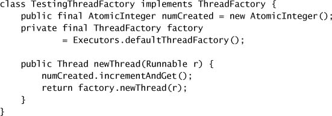

# Chapter 12. Testing Concurrent Programs

* Concurrent programs => nondeterminism => potential interactions, failure models.
* Tests of concurrent classes => safety + liveness.
  * Tests of safety => testing invariants such as assert invariants or execute test code atomically => can introduce timing or synchronization artifacts that can mask bugs that might otherwise manifest themselves.
  * Test of liveness => testing progress and nonprogress => hard to quantify.
* Performance measurement => Throughput + Responsiveness + Sacalability.

## 12.1 Testing for Correctness

* To build a set of test cases for a bounded buffer.
  * `BoundedBuffer` implements a fixed-length array-based queue with blocking `put` and `take` methods controlled by a pair of counting semaphores.
  * The `availableItems` semaphore represents the number of elements taht can be removed from the buffer, and is initially zero.
  * The `availableSpaces` represents how many items can be inserted into the buffer, and is initialized to the size of the buffer.
  * On exit from either the `put` or `take` methods, the sum of counts of both semaphores always equals the bound.

### 12.1.1 Basic Unit Tests

* Sequential tests => disclose when a problem is *not* related to concurrency issues before you start looking for data races.

### 12.1.2 Testing Blocking Operations

* If a method is supposed to block under certain conditions, then a test for that behavior should succeed only if the thread does *not* proceed.
  * => similar to testing throwing an exception.
* Once the method successfully blocks, you have to unblock it => via interruption => start a blocking activity in a separate thread, wait until the thread blocks, interrupt it, and then assert the blocking operation completed => requires the blocking methods to respond to interruption by returning early or throwing `InterruptedException`.
  * You have to make an arbitrary decision about how long the few instructions being executed could possibly take, and wait longer than that.
* An approach to testing blocking operations.
  * It creates a taker thread that attempts to `take` an element from an empty buffer.
  * If `take` succeeds, it registers failure; if correctly blocked, it will throw `InterruptedException`, and the `catch` block for this exception treats this as success and lets the thread exit.
  * The main test runner thread then attempts to `join` with the taker thread and verifies that the join returned successfully by calling `Thread.isAlive`; if the taker thread responded to the interrupt, the `join` should complete quickly.
  * The timed `join` ensures that the test completes even if `take` gets stuck in some unexpected way.
  * The same approach can be used to test that the taker thread unblocks after an element is placed in the queue by the main thread.

* The result of `Thread.getState` should not be used for concurrency control, and is of limited usefulness for testing.
  * Its primary utility is as a source of debugging information.

### 12.1.3 Testing Safety

* To test a concurrent class performing correctly => multiple threads performing `put` and `take` operations over some amount of time and then test that nothing went wrong.
* Identify easily checked properties => checking the test property does not require any synchronization.

### 12.1.4 Testing Resource Management

* Test it does *not* do things it is *not* supposed to do.
* Undesirable memory retention can be easily tested with heap-inspection tools that measure application memory usage.

### 12.1.5 Using Callbacks

* Callbacks to client-provided code can be helpful in constructing test cases; callbacks are often made at known points in an object's lifecycle that are good opportunities to assert invariants.
* Testing a thread pool => testing a number of elements of execution policy => additional threads are created and idle threads get reaped when they are supposed to.
  * Use a custom thread factory to instrument thread creation.
  * If the core pool size is smaller than the maximum size, the thread pool should grow as demand for execution increases.
  * Submitting long-running tasks to thez pool makes the number of executing tasks stay constant for long enough to make a few assertions.

### 12.1.6 Generating More Interleavings

* Increase the number of interleavings => use `Thread.yield` to encourage more switches during operations that access shared state.
  * => platform-specific because JVM is free to treat `Thread.yield` as no-op.
  * => may activate timing-sensitive bugs in code.