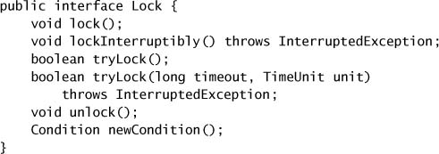
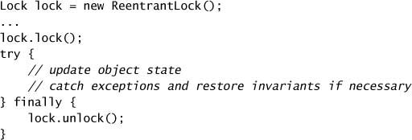
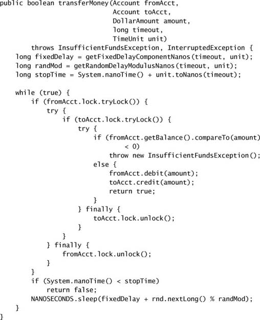
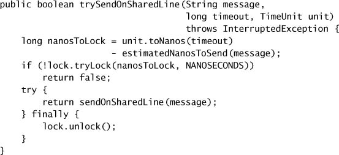
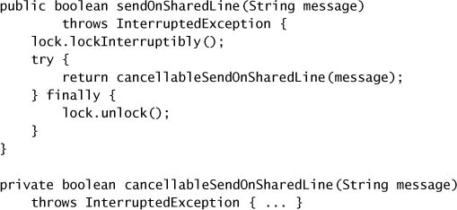

# Chapter 13. Explicit Locks

* Before Java 5.0, `synchronized` and `volatile` are for coordinating access to shared data.
* Java 5.0, `ReentrantLock` => alternative with advanced features for when intrinsic locking proves too limited.

## 13.1 `Lock` and `ReentrantLock`

* `Lock` offers a choice of unconditional, polled, timed, and interruptible lock acquisition, and all lock and unlock operations are explicit.
  * => provide the same memory-visibility semantics as intrinsic locks.

* `ReentrantLock` implements `Lock`, providing the same mutual exclusion and memory-visibility guarantees as `synchronized`.
  * => the same memory semantics as `synchronized` block, and offers reentrant locking semantics like `synchronized`.
* Intrinsic locking's limitations
  * => not possible to interrupt a thread waiting to acquire a lock
  * => not possible to attempt to acquire a lock without being willing to wait for it forever.
  * => must be released in the same block of code in which they are acquired => simplifying coding with exception handling, but impossible to use non-block-structured locking disciplines.
* The canonical form of using a `Lock`.
  * => the lock *must* be released in a `finally` block.
  * => additional `try-catch` or `try-finally` blocks for inconsistent object states.

### 13.1.1 Polled and Timed Lock Acquisition

* Timed and polled locking => probabalistic deadlock avoidance.
  * => regain control => can try again.
* Avoiding lock-ordering deadlock using `tryLock`.
  * Use `tryLock` to attempt to acquire locks, but back off and retry if they cannot be acquired at the same time.

* Locking with a time budget.
  * Supply a timeout corresponding to the remaining time in the budget when calling a blocking method => incorporate exclusive locking to a time-limited activity.

### 13.1.2 Interruptible Lock Acquisition

* Interruptible lock acquisition.
  * => allow locking to be used within cancellable activities.
  * The timed `tryLock` is also responsive to interruption and so can be used when you need both timed and interruptible lock acquisition.

### 13.1.3 Non-block-structured Locking

* Automatic lock release => simplifying analysis and prevents potential coding errors.
* Reducing lock granularity => enhance scalability.
  * Lock striping => allowing different hash chains in a hash-based collection to use different locks.
  * Use a separate lock for each link node, allowing different threads to operate independently on different portions of the list.
